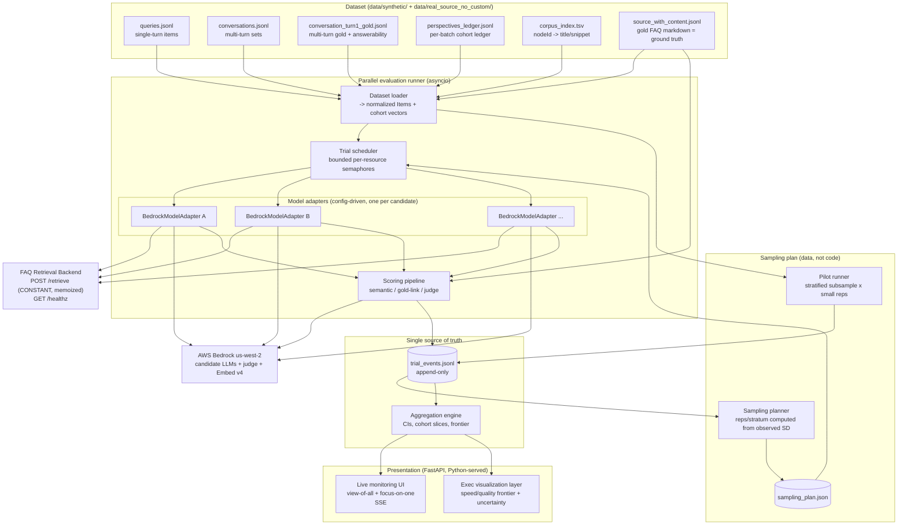
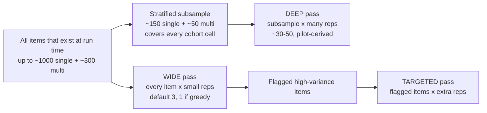

# Design Document: model-bakeoff-eval-dashboard

## Sourcing note (read first)

This is a non-trivial design: it spans architecture, a statistical sampling
methodology, library/framework selection, and a data/retrieval strategy. The
global steering rule (`prefer-rigor-and-internal-best-practices.md`) asks that
such work be grounded in current Amazon-internal primary sources — BuilderHub
(`docs.hub.amazon.dev`), internal code search (`code.amazon.com`), and AWS
Prescriptive Guidance — consulted through the internal search tools.

**Those internal search tools are not available in this execution environment,
so no Amazon-internal source could be consulted.** Per the steering rule's
"When Searches Return Nothing Authoritative" clause, the fast-moving parts of
this design — RAG evaluation metrics, LLM-as-judge calibration, and
confidence-interval methodology — are instead grounded in current *external*
literature and are flagged inline as **general industry practice, not
Amazon-internal guidance**. Before any number from this harness is used to
defend a decision to an executive audience, the evaluation-metric and
judge-calibration choices below should be re-validated against internal
guidance.

External sources cited (all public, accessed via web search):
- RAGAS, automated reference-free RAG evaluation — [arXiv 2309.15217](https://arxiv.org/abs/2309.15217)
- ARES, automated RAG evaluation framework — [arXiv 2311.09476](https://arxiv.org/html/2311.09476v2)
- LLM-as-a-judge biases (position, verbosity, self-enhancement) and mitigations — [arXiv 2306.05685](https://arxiv.org/abs/2306.05685v2)
- Bias-mitigation strategies in LLM-as-judge pipelines — [arXiv 2604.23178](https://arxiv.org/abs/2604.23178)
- Two-stage / cluster bootstrap for nested data — [scipy.stats.bootstrap docs](https://docs.scipy.org/doc/scipy-1.16.1/reference/generated/scipy.stats.bootstrap.html)

Content from these sources was rephrased for compliance with licensing
restrictions.

---

## Overview

**The purpose of this feature is to choose which LLM to use as the "brain" of a
Slack bot — not to prove a 95% accuracy figure.** It is a model-selection
decision, made as carefully as the data allows. The infrastructure and the
statistical machinery are deliberately built to be reusable later for the much
harder "prove 95% accuracy" argument, but that proof is explicitly **out of
scope now**. Every design decision below is in service of a *defensible choice*
on the balance of two dimensions — **speed** and **quality** — and nothing more.

The feature is three tightly-coupled parts, unified by **one shared per-trial
event/data model** (the `TrialEvent`). The data model is designed first and
deliberately, because all three parts derive from it:

1. **Parallel evaluation runner / orchestrator** — runs every candidate model
   against the synthetic eval corpus, maximally in parallel, repeating each
   item per a pilot-derived plan, and emitting one structured `TrialEvent` per
   trial to an append-only log.
2. **Live-updating monitoring UI** — a "view of all" (every model at once:
   running averages, throughput, status) and a "focus on one" (drill into a
   single model), updating live as trials land, with data visualizations that
   build out as runs progress.
3. **Executive-facing visualization layer** — for an Amazon executive /
   just-below-executive audience. Massive, nuanced data made clear, visual,
   dynamic, interactive, and **above all accurate**. This is the highest-stakes
   deliverable: the finished product shown last.

Retrieval is **not** under test. The existing FAQ Retrieval Backend
(`POST /retrieve`, `GET /healthz`) is a *constant shared substrate*: every
candidate model is handed the identical ranked fragments. The backend memoizes
per `(query, filters, candidate_n, top_k)`, so replaying the same synthetic
query across trials and across models makes **zero** extra retrieval Bedrock
calls. What we compare is what each model *does* with that constant context.

The statistical spine separates **between-item variance** (the corpus's breadth
of distinct items — the real "perspective" sample, and the dominant source of
power for aggregate and cohort means) from **within-item run-to-run variance**
(repetitions of the same item — which estimate *model jitter only* and add no
perspectives). A tiered design serves both, and rep counts are chosen **by
pilot, not by gut**.

This harness is a throwaway: it lives a couple of days on macOS, a local Python
venv, and a Docker Qdrant container. No Brazil package, no npm/npx. The UI is
Python-served and dependency-light.

## Goals

- Produce a defensible **speed vs. quality** comparison across N candidate
  "brain" models on whatever subset of the synthetic corpus exists at run time,
  sliceable by every cohort dimension, with a confidence interval on every
  reported mean.
- Treat quality as **accuracy + user-interaction quality**, measured by a
  *layered* model (semantic similarity, gold-link/retrieval-style correctness,
  LLM-as-judge for the squishy dimensions) reported as a small set of
  defensible sub-scores — **above all accuracy** — never one opaque number.
- Score **answerability** (full / partial / none) as a first-class dimension,
  rewarding correct abstention on unanswerable items and penalizing
  fabrication.
- Make repetition count and temperature **pilot-driven and configuration-
  driven**, so the pilot's measured within-item SD configures the full run; no
  hardcoded rep counts from intuition.
- Persist every trial as an append-only event so runs are **replayable** and
  resumable, and so the live UI and exec viz both derive from one source of
  truth.
- Make the model-adapter abstraction **config-driven**, so adding or removing a
  candidate Bedrock model is a config edit, never a code change.
- Be **reusable**: the same schema and aggregation engine that answers "which
  model" today can support "is the chosen model 95% accurate" later by changing
  the sampling plan, not the code.

## Non-Goals

- **Not** re-evaluating, tuning, or re-implementing retrieval. The two-stage
  retrieval funnel is a constant shared substrate consumed over HTTP.
- **Not** proving a 95% accuracy claim, and **not** optimizing for rare
  catastrophic-failure detection. We want a defensible **mean with an
  understanding of tails** and clear per-model / per-cohort strengths and
  weaknesses. Choosing, not proving.
- **Not** a production service. Operational hardening beyond "runs reliably for
  a few days on a dev box" is out of scope.
- **Not** a managed human-annotation platform. Human calibration of the judge
  is a small, scoped step, not a labeling pipeline.

## Glossary

- **Item** — one distinct synthetic record: a single-turn query
  (`queries.jsonl`) or a multi-turn set (`conversations.jsonl`). The unit of
  the *perspective sample*. Target: ~1000 single-turn + ~300 multi-turn.
- **Trial** — one execution of one model against one item (for multi-turn, one
  full conversation playthrough) at a chosen temperature: a `(model, item, rep)`
  tuple. Emits exactly one `TrialEvent`.
- **Rep** — a repetition index for a given `(model, item)`. Reps estimate
  within-item (run-to-run) variance only.
- **Cohort cell / stratum** — a cell in the cohort design (geography ×
  proficiency × disposition × channel × entry_route × momentary_state ×
  answerability × intent_shape × turn_type), collapsed where cells are sparse.
- **Pass** — `PILOT`, `WIDE` (all items, few reps), `DEEP` (stratified
  subsample, many reps), or `TARGETED` (flagged high-variance items, extra
  reps).
- **WIDE / DEEP** — the two production passes; see Statistical Methodology.

---

## Architecture

### High-level component diagram



### Key architectural decisions

**AD-1 — One append-only event log is the single source of truth.** Every trial
writes exactly one `TrialEvent` (a JSON line) to
`data/bakeoff/trial_events.jsonl`, mirroring the existing `data/results.jsonl`
convention. The live UI, the aggregation engine, and the exec viz are all
*derived* from this log. Rationale: replayability (re-run aggregation without
re-running models), crash-resumability (resume by diffing planned trials against
completed `trial_id`s in the log), and a single auditable record behind every
number an executive sees. There is no database: append-only JSONL plus in-memory
aggregation is sufficient at this scale (N_models × ≤1300 items × reps lands in
the low hundreds of thousands of lines worst case).

**AD-2 — Retrieval is called through the existing HTTP contract and is held
identical across reps and models.** The runner never re-implements retrieval; it
POSTs to `/retrieve` and records the returned `fragments` + `timings` +
`confidence` verbatim into the event. Because the backend memoizes per
`(query, filters, candidate_n, top_k)`, every rep of the same item — across all
models — reuses one retrieval result. This is exactly what makes retrieval a
*constant* rather than a confound. The event records `cache_hit` so cold vs.
cached retrieval timings are never conflated in speed reporting (AD-2 feeds the
speed model directly).

**AD-3 — Concurrency is `asyncio` with per-resource bounded semaphores.** The
workload is I/O-bound (HTTP to `/retrieve`, Bedrock `InvokeModel*` for
generation, Bedrock for judge and embeddings). A single event loop with a
separate concurrency cap per downstream resource (per candidate model, judge,
embeddings, retrieval) maximizes parallelism while respecting each backend's
throughput/throttle limits. CPU-bound scoring (cosine math, nDCG) is offloaded
via `asyncio.to_thread` so it never blocks the loop. Rationale: avoids GIL
contention (no CPU-bound model work in-process), avoids multiprocessing
serialization we don't need, and gives one place to enforce backpressure.

**AD-4 — The live UI is FastAPI + Server-Sent Events (SSE), served by the
harness itself.** The harness is already Python; FastAPI lets the runner and the
UI share one process and one view of the event stream. SSE (not WebSockets) is
chosen because the data flow is one-directional (server → browser: "a trial
completed, here are updated aggregates"); SSE is simpler, auto-reconnects, rides
plain HTTP, and needs no client library. The few control actions
(pause/abort/focus-model) are ordinary POST endpoints. **No npm/npx:** the
frontend is hand-written `index.html` + vanilla JS, with a charting library
(Plotly or Vega-Lite) loaded from a vendored local `.js` file via a `<script>`
tag — no build step, no node toolchain.

**AD-5 — The exec viz is generated by the same Python/FastAPI app, not a
separate stack.** It reads the aggregation engine's output and renders an
interactive speed/quality frontier plus cohort breakdowns. Same dependency-light
constraint. The exec layer can additionally export a **static, self-contained
HTML** snapshot (charts inlined) so the deliverable can be shown or emailed
without the harness running — this matches the existing precedent of
`cohort_sunburst.html` / `cohort_alluvial_preview.html` already in
`data/synthetic/`.

**AD-6 — Scoring is a pipeline of independent, individually-cached scorers.**
Each quality dimension (semantic similarity, gold-link correctness,
judge-graded) is a separate scorer with its own cache keyed by a content hash.
Re-running one scorer (e.g. swapping the judge model) never re-runs the
candidate models or the other scorers, and expensive scorers (judge) run at
lower concurrency than cheap ones (cosine).

**AD-7 — The sampling plan is data, not code.** A `SamplingPlan` (reps per
stratum, temperature, pass membership, target CI width) is produced by the pilot
and serialized to `data/bakeoff/sampling_plan.json`. The full run reads it.
Changing the experiment (more reps on multi-turn, a different temperature) means
editing that file or re-running the pilot — never editing the runner.

**AD-8 — The model-adapter abstraction is config-driven over Bedrock.**
Candidate "brain" models are entries in `data/bakeoff/models.yaml`: model id,
Bedrock API style (Converse vs InvokeModel), prompt template id, decoding
params, concurrency cap. Adding/removing a candidate is a config edit. The judge
is just another adapter entry, flagged `role: judge` and excluded from the
candidate set (AD-12 in scoring: judge ≠ candidate).

---

## Data Models

> Designed first — the runner, live UI, and exec viz all depend on this shared
> model.

The data model is the contract. The runner produces it; the aggregation engine,
live UI, and exec viz consume it. It is designed before any component so the
three parts cannot drift. All on-disk shapes below match the **actual files on
disk** as inspected (`queries.jsonl`, `conversations.jsonl`,
`conversation_turn1_gold.jsonl`, `perspectives_ledger.jsonl`,
`corpus_index.tsv`, `source_with_content.jsonl`, `results.jsonl`).

Implementation language is **Python 3.10+**. Models are expressed as
`pydantic.BaseModel` (validation + JSON (de)serialization for free; already a
natural fit for FastAPI). Field names that mirror on-disk JSON keep those exact
keys.

### Input schemas (read-only, exactly as on disk)

```python
# --- data/synthetic/queries.jsonl : one single-turn item per line ----------
class QueryRecord(BaseModel):
    id: str                      # e.g. "b0-q01"
    batch: int                   # e.g. 0
    persona: str                 # "Nigeria(Lagos) | broken | terse"
    channel: str                 # "mobile-thumb" | "voice-transcribed" | ...
    entry_route: str             # "slack" | "quicksuite"
    momentary_state: str         # neutral|frustrated|anxious|rushed|confused
    query: str                   # the user utterance
    wants: str                   # concise ideal-answer summary (similarity ref)
    gold_node_ids: list[str]     # nodeId UUIDs into the gold FAQ corpus
    answerability: str           # "full" | "partial" | "none"
    intents: int                 # e.g. 1
    intent_shape: str            # single|multi|unanswerable|vague
    label_note: str              # human rationale (display/debug only)

# --- data/synthetic/conversations.jsonl : one multi-turn set per line -------
class ConversationTurn(BaseModel):
    turn: int                    # 1-based
    relationship: str            # "opening" | "drill_down" | "callback" | ...
    momentary_state: str
    response_dependent: bool     # does this turn depend on the bot's reply?
    depends_on_turn: int | None
    user_utterance: str
    wants: str                   # per-turn ideal-answer summary

class ConversationRecord(BaseModel):
    set_id: str                  # e.g. "c0-s01"
    batch: int
    persona_tag: str
    session_channel: str
    entry_route: str
    turn_count: int
    edge_profile: list[str]      # e.g. ["drill_down", "callback"]
    turns: list[ConversationTurn]

# --- data/synthetic/conversation_turn1_gold.jsonl ---------------------------
# Gold links + answerability for (at least) turn 1 of each multi-turn set.
class ConversationGold(BaseModel):
    set_id: str
    turn: int
    gold_node_ids: list[str]
    answerability: str

# --- data/synthetic/perspectives_ledger.jsonl : per-batch cohort ledger -----
class PerspectiveLedgerRow(BaseModel):
    batch: int
    persona: str
    origin: str                  # "Nigeria (Lagos)"
    native_language: str         # "Yoruba / Nigerian English"
    proficiency: str             # broken|uneven|functional|near-native|fluent...
    disposition: str             # terse|chatty|formal|suspicious|...
    query_count: int
    answerability_dist: dict[str, int]   # {"full": 10, "partial": 7, "none": 3}

# --- data/synthetic/corpus_index.tsv : nodeId -> title/snippet (TSV) --------
class CorpusIndexRow(BaseModel):
    nodeId: str
    title: str
    snippet: str

# --- data/real_source_no_custom/source_with_content.jsonl : gold FAQ corpus -
# The markdown field is the GROUND-TRUTH "ideal response" source for semantic
# similarity and for the judge's evidence anchoring. Many extra columns exist
# on disk; only the load-bearing ones are modeled, the rest pass through.
class GoldSource(BaseModel):
    nodeId: str
    title: str
    status: str                  # "DRAFT" | "PUBLISHED" (corpus is mostly DRAFT)
    geography: str               # "Global" | regional
    markdown: str                # full ground-truth content
    contentUrl: str
    model_config = ConfigDict(extra="ignore")
```

### The normalized `Item` (the runner's unit of work)

The loader joins the above into one uniform shape so single-turn and multi-turn
trials flow through identical machinery. The **cohort vector** is the key
derived structure — every aggregation slice keys off it.

```python
class CohortKey(BaseModel):
    """One sliceable position in the cohort design. Every field is a known,
    enumerable axis so cells can be enumerated for stratification."""
    geography: str               # parsed from persona/origin (ledger)
    native_language: str
    proficiency: str             # broken|uneven|functional|near-native|fluent
    disposition: str             # terse|chatty|formal|suspicious|over-polite|...
    channel: str                 # mobile-thumb|voice-transcribed|desktop-careful|...
    entry_route: str             # slack|quicksuite
    momentary_state: str         # neutral|frustrated|anxious|rushed|confused
    answerability: str           # full|partial|none
    intent_shape: str            # single|multi|unanswerable|vague
    turn_type: str               # "single" | "multi"

class GoldFragment(BaseModel):
    node_id: str
    title: str
    markdown: str | None         # full ground-truth content if resolvable
    snippet: str | None          # from corpus_index.tsv if markdown absent

class ItemTurn(BaseModel):
    turn: int
    user_utterance: str
    wants: str
    momentary_state: str
    response_dependent: bool
    depends_on_turn: int | None
    gold: list[GoldFragment]     # resolved gold for this turn (turn1 known; later turns may be empty)
    answerability: str

class Item(BaseModel):
    item_id: str                 # QueryRecord.id or ConversationRecord.set_id
    turn_type: str               # "single" | "multi"
    batch: int
    cohort: CohortKey
    # Single-turn convenience (None for multi):
    query: str | None
    wants: str | None
    answerability: str | None
    gold: list[GoldFragment]     # turn-1 / single-turn gold
    # Multi-turn:
    turns: list[ItemTurn]        # [] for single-turn
    # Provenance for display/debug:
    persona: str
    label_note: str | None
    retrieval_filters: dict[str, str] = {}   # hard filters to pass to /retrieve (usually empty here)
```

### The shared `TrialEvent` (THE central contract)

One `TrialEvent` per trial, appended to `data/bakeoff/trial_events.jsonl`. This
is the object the runner emits and the UI/aggregation/exec layers all read.
Designed so that **every number an executive eventually sees is traceable to one
event line**.

```python
class RetrievalStageTimings(BaseModel):
    """Verbatim from POST /retrieve `timings`. Retrieval is constant; logged for
    completeness and to separate retrieval time from generation time."""
    embed_query_ms: float
    bm25_vectorize_ms: float
    hybrid_search_ms: float
    rerank_ms: float
    total_ms: float

class RetrievedFragment(BaseModel):
    id: str                      # nodeId
    fusion_score: float
    confidence: float            # Rerank 3.5 relevanceScore (relative, not calibrated)
    # text/metadata intentionally NOT copied in full to keep events small;
    # the id is enough to re-resolve content from the gold corpus.

class GenerationTimings(BaseModel):
    """Owned by each candidate harness — the real speed differentiator."""
    ttft_ms: float | None        # time to first token (None if non-streaming)
    generation_ms: float         # first token -> last token (or full call if non-streaming)
    end_to_end_ms: float         # retrieval + generation, as the user feels it
    output_tokens: int | None
    input_tokens: int | None

class SemanticScore(BaseModel):
    cosine_to_wants: float | None      # answer vs `wants` summary (Embed v4)
    cosine_to_gold_markdown: float | None  # answer vs concatenated gold markdown
    embed_model_id: str

class GoldLinkScore(BaseModel):
    """Did the answer rely on / cite the correct gold node(s)?"""
    gold_node_ids: list[str]
    cited_node_ids: list[str]          # if the model cited; else attributed via semantic match
    attribution_method: str            # "explicit_citation" | "semantic_attribution"
    precision: float | None            # of gold-node usage
    recall: float | None
    # Retrieval-ceiling context (property of the constant substrate, not the model):
    retrieval_recall_at_k: float | None
    retrieval_mrr: float | None
    retrieval_ndcg_at_k: float | None

class AbstentionScore(BaseModel):
    """First-class scoring of the answerability dimension."""
    answerability: str                 # full|partial|none (from the item)
    abstained: bool                    # did the model decline/escalate?
    abstention_correct: int | None     # 1 if behavior matched answerability; 0 if not; None if N/A
    fabricated_on_unanswerable: bool | None  # the most expensive error class

class JudgeDimension(BaseModel):
    name: str                          # faithfulness|correctness|completeness|tone|voice|helpfulness|state_appropriateness
    mean: float                        # mean over k judge samples (anchored rubric, 1-5 normalized to 0-1)
    sd: float                          # judge's own variance on THIS answer (a measured quantity)
    k_samples: int
    evidence_spans: list[str] = []     # quoted fragment spans supporting faithfulness

class JudgeScore(BaseModel):
    judge_model_id: str
    rubric_id: str                     # which rubric version (anchored, locked)
    dimensions: list[JudgeDimension]
    position_debiased: bool            # presentation order randomized/balanced

class QualityScores(BaseModel):
    semantic: SemanticScore
    gold_link: GoldLinkScore
    abstention: AbstentionScore
    judge: JudgeScore | None           # None if judge not run for this trial
    composite: float | None            # transparent weighted blend (weights from plan)
    composite_weights_id: str | None   # which weight set produced `composite`

class TrialStatus(str, Enum):
    OK = "ok"
    RETRIEVAL_ERROR = "retrieval_error"
    GENERATION_ERROR = "generation_error"
    SCORING_ERROR = "scoring_error"
    TIMEOUT = "timeout"
    SKIPPED = "skipped"

class TrialEvent(BaseModel):
    # --- identity / dedup key ---
    schema_version: str = "1.0"
    trial_id: str                      # sha1(model_id|item_id|rep|temperature|pass)
    run_id: str                        # one bake-off run (groups events)
    pass_name: str                     # PILOT|WIDE|DEEP|TARGETED
    # --- what was run ---
    model_id: str
    item_id: str
    turn_type: str                     # single|multi
    rep: int
    temperature: float
    cohort: CohortKey                  # denormalized onto the event for cheap slicing
    # --- retrieval (constant substrate) ---
    retrieval_cache_hit: bool          # cold vs cached — never conflate in speed stats
    retrieval_timings: RetrievalStageTimings | None
    retrieved_fragments: list[RetrievedFragment]
    # --- generation (the differentiator) ---
    generation_timings: GenerationTimings | None
    answer_text_hash: str              # sha1 of answer; full text stored out-of-line (see AD-1 note)
    answer_text_ref: str | None        # path/offset to full answer in answers store
    # multi-turn: per-turn answers captured; summary timing rolls up
    per_turn: list[dict] = []          # [{turn, answer_hash, ttft_ms, generation_ms, abstained}]
    # --- quality ---
    quality: QualityScores | None
    # --- bookkeeping ---
    status: TrialStatus
    error: str | None
    started_at: str                    # ISO8601
    completed_at: str                  # ISO8601
    harness_version: str
```

**Design notes on the event:**
- The `cohort` is **denormalized onto every event** so the aggregation engine
  and live UI can slice without re-joining to the dataset. Storage cost is
  trivial at this scale and the simplicity is worth it.
- **Full answer text is stored out-of-line** (`answer_text_ref` →
  `data/bakeoff/answers/<run_id>/<trial_id>.txt`), with only a hash in the
  event. This keeps `trial_events.jsonl` compact and fast to tail for the live
  UI, while preserving the full text for the judge, for audit, and for the exec
  viz's "show me an example answer" drill-down.
- `retrieval_cache_hit` is load-bearing for the speed model: cold retrieval pays
  the Bedrock embed+rerank latency once; cached replays are near-instant. Speed
  reporting separates "cold end-to-end" from "warm end-to-end (steady state)."
- `judge.dimensions[*].sd` makes **judge variance a measured, stored quantity**,
  carried separately from model within-item variance — they are different noise
  sources and must never be summed blindly.

### Output / derived schemas (produced by the aggregation engine)

```python
class CI(BaseModel):
    point: float
    lo: float
    hi: float
    method: str                  # "cluster_bootstrap" | "normal_approx"
    confidence: float = 0.95
    n_items: int                 # distinct items behind this estimate (small-n flag source)
    n_trials: int

class MetricAggregate(BaseModel):
    metric: str                  # "composite" | "cosine_to_wants" | "abstention_correct" | "ttft_ms_p50" | ...
    ci: CI
    n_items: int
    within_item_sd: float | None # measured model jitter (DEEP/pilot)
    between_item_sd: float | None

class CohortAggregate(BaseModel):
    model_id: str
    cohort_filter: dict[str, str]  # which axes are pinned ({} = aggregate)
    metrics: list[MetricAggregate]
    n_items: int
    small_n: bool                # True when n_items below the display threshold

class PairedDiff(BaseModel):
    """Model-vs-model on the SAME items (paired removes between-item variance)."""
    metric: str
    model_a: str
    model_b: str
    mean_diff: float
    ci: CI
    n_paired_items: int

class FrontierPoint(BaseModel):
    model_id: str
    speed_axis: float            # e.g. warm end-to-end p50 (ms), lower better
    speed_whisker_hi: float      # p90
    quality_axis: float          # composite point estimate
    quality_ci_lo: float
    quality_ci_hi: float
    on_pareto_front: bool
```

### Persistence layout

```
data/bakeoff/
  models.yaml                 # candidate + judge config (AD-8)
  sampling_plan.json          # pilot output: reps/stratum, temperature (AD-7)
  trial_events.jsonl          # append-only single source of truth (AD-1)
  answers/<run_id>/<trial_id>.txt   # full answer text, out-of-line
  cache/
    semantic/<hash>.json      # per-scorer caches (AD-6)
    judge/<hash>.json
  aggregates/<run_id>.json    # last materialized aggregation snapshot (optional)
  exports/<run_id>.html       # static self-contained exec snapshot (AD-5)
```
---

## Statistical Methodology

This section is the scientific spine. It is grounded in standard sampling and
variance-decomposition theory; the specific CI formulas are **general
statistical practice, not Amazon-internal guidance**.

### The two variances, and why we never conflate them

For a metric `Y` (say the judge-graded composite) observed on model `m`, item
`i`, repetition `r`:

```
Y[m,i,r] = mu[m] + a[m,i] + e[m,i,r]
           \____/   \_____/   \______/
           model    item      run-to-run
           mean     effect    noise
```

- `a[m,i] ~ (0, sigma_between^2)` — the **between-item** component. Item `i`
  ("Nigeria / broken / terse / frustrated / unanswerable") is genuinely harder
  or easier than item `j`. This variance is real signal about the *population of
  perspectives*. **This breadth is where nearly all statistical power for
  aggregate and cohort means comes from**, and the corpus is being built
  precisely to maximize it (toward 1000 single-turn + 300 multi-turn spanning
  the rich cohort design).
- `e[m,i,r] ~ (0, sigma_within^2)` — the **within-item** component. The same
  model on the same item at the same temperature gives slightly different
  answers across reps. This is **model jitter only**; it tells us nothing about
  the perspective population. Reps estimate this and only this.

For the mean of a cohort with `n` distinct items and `R` reps each, the variance
of the estimated mean is approximately:

```
Var(Ybar) ~= sigma_between^2 / n  +  sigma_within^2 / (n * R)

SE(Ybar)  ~= sqrt( sigma_between^2 / n  +  sigma_within^2 / (n * R) )
```

The first term **does not depend on `R` at all**. With `n` ~ 1000 the
between-item term dominates, so **breadth beats depth** for the exec-facing
means and cohort conclusions. This single equation is why the design is tiered:
spend the budget covering items broadly (drives the first term down via large
`n`), and spend a smaller, targeted budget on reps where we specifically need
the second term and a `sigma_within` estimate.

### Tiered / nested-stratified design



- **WIDE pass** — every item that exists, small reps (**default 3; 1 if the
  decoding is greedy / temp≈0**, since at temp 0 reps buy almost nothing).
  Purpose: tight **aggregate** and **cohort** CIs via large `n`. This is where
  the dominant statistical power lives.
- **DEEP pass** — a **stratified subsample (~150 single-turn + ~50 multi-turn)**
  chosen to cover every cohort cell, run at **many reps (~30-50, pilot-derived)**.
  Purpose: a clean estimate of `sigma_within` per stratum, plus a qualitative
  read on consistency and tail behavior (best/worst answer a model gives to the
  same item).
- **TARGETED pass** (optional) — items the WIDE pass flags as high-variance (per-
  item rep SD above a threshold) get extra reps, because individually unstable
  items are the ones most likely to flip a decision.

**Multi-turn gets a few more reps per item than single-turn — but not 50 across
the board.** There are only ~300 multi-turn sets vs ~1000 single-turn, so
multi-turn has less between-item averaging available and its aggregate CI is
wider for the same per-item precision; multi-turn trials are also costlier
(multiple generation + judge calls per set). The per-stratum rep configuration
(AD-7) assigns multi-turn strata a somewhat higher `R` to keep their CIs
comparable, sized from the multi-turn `sigma_within` the pilot measures
separately — still well short of 50 everywhere.

### The pilot step — reps and temperature are chosen, not guessed

**This is mandatory: rep counts are NOT hardcoded from intuition.** The harness
derives them from a pilot.

Pilot procedure:

1. Draw a **stratified subsample** covering every cohort cell — reuse the DEEP
   subsample (~50 stratified items is the working target).
2. Run each candidate model on that subsample at **~5-10 reps** at the planned
   sampling **temperature ≈ 0.2**.
3. From the pilot events, **measure** observed within-item SD
   (`sigma_within_hat`) per key metric (judge composite, semantic similarity,
   the accuracy sub-scores) and **per stratum** (so single-turn and multi-turn
   get separate estimates).
4. **Compute the reps needed** to hit a target CI half-width `w`. For a cohort
   mean over `n` items at confidence `1-alpha`:

   ```
   choose smallest R such that
     z_{1-alpha/2} * sqrt( sigma_between_hat^2 / n
                           + sigma_within_hat^2 / (n * R) ) <= w
   ```

   Solve for `R` from the measured `sigma_within_hat`, the cohort's `n`, the
   target `w`, and `sigma_between_hat` (also estimable from the pilot's
   item-to-item spread). For aggregate means `R` comes out near 1-3 (the between
   term dominates); for the smallest cohort cells `R` is larger. The planner
   takes the **max required R per stratum** and clamps to a budget ceiling.
5. Write per-stratum reps + the confirmed temperature to `sampling_plan.json`.
   The WIDE/DEEP run consumes that plan.

**Temperature ≈ 0.2 is a planned starting point the pilot confirms or
overrides.** Temperature strongly affects within-item variance:
**greedy / temp≈0 ⇒ reps buy almost nothing ⇒ go wide; temp > 0 ⇒ reps matter
more.** Rationale for 0.2: low enough that the bot behaves near-deterministically
(a desirable production trait for an FAQ assistant), high enough that we can
still observe and *measure* run-to-run variance instead of pretending it is
zero. If the pilot finds `sigma_within` negligible at 0.2 for all metrics, WIDE
reps collapse toward 1 and the budget shifts entirely to breadth; if a candidate
is pathologically unstable at 0.2, that instability is itself a finding.

This makes the experiment **self-sizing**: the data tells the harness how many
reps it needs, and the config-driven runner just consumes that answer.

### Confidence intervals and reporting (accuracy of reported numbers is paramount)

- Every reported mean (aggregate, per-model, per-cohort, per-model-per-cohort)
  **carries a CI. A point estimate is never shown without its CI** — this is a
  hard rule, enforced in the aggregation layer (a bare mean is not a valid
  renderable; the renderer requires a `CI`).
- **Default CI method: nonparametric cluster bootstrap at the item level** —
  resample items with replacement, then within each resampled item resample its
  reps (the two-stage / cluster bootstrap that mirrors the nested sampling
  design). Rationale: it respects the structure (the item is the primary
  sampling unit) and makes no normality assumption about bounded/skewed metrics
  like a 0-1 judge score or a 0/1 abstention indicator. **This is general
  statistical practice, not Amazon-internal guidance**
  ([cluster bootstrap, scipy.stats.bootstrap](https://docs.scipy.org/doc/scipy-1.16.1/reference/generated/scipy.stats.bootstrap.html)).
- A closed-form **normal-approx CI** using the variance decomposition above is
  also computed (cheap to update incrementally), used for the live UI's running
  estimates. The **bootstrap CI is the one shown in the exec viz.**
- **Model-vs-model comparisons are reported as a CI on the paired per-item
  difference** (same items, same constant retrieval → pairing removes
  between-item variance from the comparison, far more powerful than comparing
  two independent means). The exec frontier shows whether models' quality
  intervals separate; the paired-difference CI is the rigorous backing.
- **Unanswerable items are their own stratum**, never averaged into "accuracy."
  Blending the ~17% unanswerable (where correct = abstain) with answerable
  accuracy produces a meaningless number.
- **Small-n honesty:** any cohort cell below a display threshold (default
  `n_items < 30`) is flagged `small_n` and rendered with a visible warning and a
  wider/greyed interval. Cohort-level CIs are framed as **descriptive** ("where
  is this model weak?"), not a battery of confirmatory hypothesis tests — we are
  building a defensible mean with strengths/weaknesses, not running a
  significance gauntlet.
- **Run-with-whatever-exists:** the corpus is mid-build (PROGRESS.md: 14/50
  batches; 280/1000 single-turn, 84/300 multi-turn). The harness loads whatever
  subset exists at run time, and every CI reflects the actual `n` available. The
  exec viz always states the corpus snapshot (`n_items` per cohort, build date)
  so conclusions are honest about the sample behind them.

---

## Quality Measurement (layered — a small set of defensible sub-scores, above all accuracy)

Quality = **accuracy + user-interaction quality**. We go deeper than raw string
similarity, using modern ML/NLP tooling, and report a small set of defensible
sub-scores rather than one opaque number. The metric choices (semantic
similarity, retrieval-aligned correctness, LLM-as-judge rubric scoring) reflect
**current general industry practice for RAG evaluation, not Amazon-internal
guidance** — see [RAGAS (arXiv 2309.15217)](https://arxiv.org/abs/2309.15217)
and [ARES (arXiv 2311.09476)](https://arxiv.org/html/2311.09476v2). Content was
rephrased for compliance with licensing restrictions.

### Layer A — Semantic / embedding similarity to the ideal answer

The reference is the data we already have, per item:
- the **`wants`** field (a concise ideal-answer summary), and
- the full **`markdown`** content of the gold FAQ fragments named by
  `gold_node_ids` (resolved from `source_with_content.jsonl`) — the
  ground-truth source.

Embed the model's answer and each reference with the **same Embed v4 substrate**
the retrieval backend uses (Bedrock `us.cohere.embed-v4:0`, 1536-dim) and take
cosine similarity (`cosine_to_wants`, `cosine_to_gold_markdown`). Cheap,
deterministic, judge-independent. Explicitly **not trusted alone** (high cosine
can co-occur with subtle factual error), but it is a fast guardrail and a
cross-check against judge drift.

### Layer B — Gold-link / retrieval-style correctness

Did the model's answer rely on / cite the **correct gold node(s)**?

- If the model emits citations, take `cited_node_ids` directly. Otherwise,
  attribute each answer sentence to the fragment whose text it best matches
  semantically (`attribution_method = "semantic_attribution"`).
- Compute **precision/recall of gold-node usage** against `gold_node_ids`. A
  model that ignored the gold fragment sitting in its context and answered from
  parametric memory scores low here even if the words sound plausible.
- **Retrieval-ceiling context** (a property of the constant substrate, logged
  once per item, not a model differentiator): precision@k, recall@k, **MRR**,
  **nDCG@k** of the `/retrieve` ranking vs `gold_node_ids`. If gold was never
  retrieved, no model can ground on it and that item's accuracy ceiling is
  capped — surfaced so a model is not blamed for a retrieval miss.
- This layer directly supports the **answerability classes** (full / partial /
  none), including correctly abstaining on `none` (unanswerable) items.

### Layer C — LLM-as-judge for the squishy dimensions

A fixed judge model scores each answer on **anchored rubric** dimensions, split
into an **accuracy rubric** and a **user-interaction rubric**:

- Accuracy rubric: **faithfulness/groundedness** (every claim supported by
  retrieved context — penalizes hallucination), **correctness** (matches the
  ideal substance), **completeness vs answerability**.
- Interaction rubric: **tone**, **voice**, **helpfulness**, **appropriateness to
  the user's `momentary_state` and persona** (e.g. an anxious user's correct
  answer delivered curtly scores lower on empathy than the same answer delivered
  reassuringly — scored against the item's labeled `momentary_state`).

Judges are **subjective and noisy, and the design says so plainly.** Mitigations
(all **current general industry practice on LLM-as-judge, not Amazon-internal
guidance** — [MT-Bench/Chatbot Arena (arXiv 2306.05685)](https://arxiv.org/abs/2306.05685v2),
[bias-mitigation strategies (arXiv 2604.23178)](https://arxiv.org/abs/2604.23178)):

- **Rubric anchoring** — each score point has a concrete written anchor, not a
  bare 1-5 scale.
- **Evidence-anchored** — the judge must quote the supporting fragment span for
  its faithfulness score, attaching the score to evidence rather than vibes.
- **Multiple judge samples (`k`)** — report the judge's own mean and SD per
  answer, so **judge variance is a measured, stored quantity** (carried
  separately from model jitter).
- **Position / order debiasing** — when the judge sees model-answer vs ideal,
  presentation order is randomized/balanced to cancel position bias.
- **Human calibration set** — a small human-labeled set (a few dozen items
  spanning strata and answerability) is scored by the judge; report judge↔human
  agreement (Cohen's κ / Krippendorff's α). Dimensions with poor agreement are
  reported low-confidence or dropped. This is what makes the judge defensible to
  an exec.
- **Judge ≠ candidate** — the judge model is held fixed and is not one of the
  graded candidates, to avoid self-preference bias.

### Answerability handling (first-class)

- `answerability == "none"`: correct behavior is **graceful refusal /
  escalation**, not fabrication. `abstention_correct ∈ {0,1}`; a separate
  **fabrication-rate-on-unanswerable** metric is surfaced per model —
  hallucination on an unanswerable item is the most expensive error for a real
  FAQ bot.
- `answerability == "partial"`: reward answering the answerable part *and*
  flagging the gap; penalize over-claiming and over-refusing.
- `answerability == "full"`: standard accuracy; *unwarranted* refusal is
  penalized.

Answerable-accuracy and unanswerable-abstention are reported as **separate
axes** — a model can be great at one and dangerous at the other, and blending
them hides exactly the risk an exec needs to see.

### Composite quality score

A transparent **weighted composite** of the sub-scores, with weights stored in
the plan (`composite_weights_id`), not hard-coded, so the exec discussion can
re-weight live ("what if tone matters more than completeness?"). The composite
is always shown **alongside its components**, never instead of them: the
composite is for ranking and the frontier; the components are the "why." **Above
all, accuracy** carries the dominant default weight.

### Speed

- From `/retrieve` `timings`: `embed_query_ms`, `bm25_vectorize_ms`,
  `hybrid_search_ms`, `rerank_ms`, `total_ms` (constant across models; logged to
  separate retrieval time from generation time, and split by
  `retrieval_cache_hit` so cold vs warm are never conflated).
- Owned by each candidate harness (the differentiator): **TTFT**, total
  generation latency, output tokens, and **end-to-end wall-clock** as the user
  feels it.
- Latency is reported as a **distribution (median + p90/p95)**, never a lone
  mean (latency is right-skewed; the tail is what users feel). The speed axis of
  the exec frontier uses warm-steady-state p50 with a p90 whisker.
---

## Components and Interfaces

### Component 1: Dataset loader

**Purpose**: Read the on-disk synthetic files and gold corpus into normalized
`Item` objects with a uniform `CohortKey`, regardless of single- vs multi-turn,
and work with **whatever subset exists at run time**.

**Responsibilities**:
- Join `queries.jsonl` / `conversations.jsonl` to their gold
  (`conversation_turn1_gold.jsonl`, single-turn `gold_node_ids`) and
  answerability labels.
- Derive each item's `CohortKey` from the persona/ledger
  (`perspectives_ledger.jsonl` → origin, native_language, proficiency,
  disposition) plus the explicit per-item fields (channel, entry_route,
  momentary_state, answerability, intent_shape) and turn_type.
- Resolve `gold_node_ids` to `GoldFragment`s: prefer full `markdown` from
  `source_with_content.jsonl`; fall back to `corpus_index.tsv` title/snippet.
- Validate gold-link integrity (PROGRESS.md asserts "0 invalid gold nodeIds");
  fail loudly on a dangling nodeId.

```python
class DatasetLoader:
    def __init__(self, synthetic_dir: Path, gold_corpus_path: Path,
                 corpus_index_path: Path, ledger_path: Path) -> None: ...

    def load_items(self) -> list[Item]:
        """Load every single- and multi-turn item that currently exists on disk."""

    def resolve_gold(self, node_ids: list[str]) -> list[GoldFragment]:
        """nodeId -> GoldFragment (full markdown if available, else snippet)."""

    def cohort_cells(self, items: list[Item]) -> list[CohortKey]:
        """Enumerate non-empty cohort cells (collapsing sparse cells) for stratification."""

    def corpus_snapshot(self) -> dict:
        """{'n_single': int, 'n_multi': int, 'batches_done': int, 'loaded_at': iso}
        — surfaced verbatim in the exec viz so conclusions cite their sample."""
```

### Component 2: Sampling planner + pilot

**Purpose**: Turn pilot measurements into a `SamplingPlan`. Rep counts are
computed, never guessed (see Methodology → pilot step).

```python
class SamplingPlan(BaseModel):
    run_id: str
    temperature: float                     # confirmed/overridden by pilot
    reps_by_stratum: dict[str, int]        # cohort-cell key -> WIDE reps
    deep_reps_by_stratum: dict[str, int]   # DEEP reps (more for multi-turn)
    deep_subsample_item_ids: list[str]     # ~150 single + ~50 multi, covers all cells
    target_ci_halfwidth: float
    composite_weights_id: str
    budget_ceiling_reps: int

class Pilot:
    def select_subsample(self, items: list[Item], n_single: int = 50,
                         n_multi: int = 0) -> list[Item]:
        """Stratified draw covering every cohort cell (reused as DEEP subsample)."""

    def run(self, models: list[ModelConfig], subsample: list[Item],
            reps: int = 10, temperature: float = 0.2) -> None:
        """Emit pilot TrialEvents to the log."""

class Planner:
    def measure_variances(self, run_id: str) -> dict[str, VarianceEstimate]:
        """From pilot events: sigma_within_hat and sigma_between_hat per
        (metric, stratum), single- and multi-turn separated."""

    def compute_reps(self, variances: dict, cohorts: list[CohortKey],
                     target_w: float, alpha: float = 0.05) -> SamplingPlan:
        """Solve  z*sqrt(s_b^2/n + s_w^2/(n*R)) <= w  for R per stratum;
        take max-required-R per stratum, clamp to budget ceiling."""
```

### Component 3: Model adapter (config-driven, over Bedrock)

**Purpose**: One uniform interface in front of every candidate "brain" model and
the judge, so adding/removing a candidate is a `models.yaml` edit (AD-8).

```python
class ModelConfig(BaseModel):
    model_id: str                  # Bedrock model id / inference-profile id
    display_name: str
    api_style: str                 # "converse" | "invoke_model"
    role: str = "candidate"        # "candidate" | "judge"
    prompt_template_id: str
    max_tokens: int
    concurrency: int               # per-resource semaphore size (AD-3)
    streaming: bool = True         # enables real TTFT capture

class ModelAdapter(Protocol):
    async def generate(self, prompt: str, temperature: float
                       ) -> "GenerationResult": ...

class GenerationResult(BaseModel):
    answer_text: str
    ttft_ms: float | None
    generation_ms: float
    input_tokens: int | None
    output_tokens: int | None
    cited_node_ids: list[str] = []   # if the prompt asks the model to cite

class BedrockModelAdapter:
    """Wraps bedrock-runtime Converse/ConverseStream (or InvokeModel) in us-west-2.
    Streaming path captures true TTFT at first content delta."""
    def __init__(self, cfg: ModelConfig, region: str = "us-west-2") -> None: ...
    async def generate(self, prompt: str, temperature: float) -> GenerationResult: ...
```

> **Security note:** all candidate and judge calls go to AWS Bedrock in
> `us-west-2` using the harness's existing local credentials (same posture as
> the retrieval backend's Embed/Rerank calls). No new network-exposed endpoint
> is introduced except the **local** FastAPI UI, which binds to `127.0.0.1`
> only and is unauthenticated by design — it must not be bound to `0.0.0.0`.
> This is called out explicitly: the live UI has no auth, so it stays
> loopback-only.

### Component 4: Retrieval client (constant substrate)

```python
class RetrievalClient:
    """Thin client over the existing FAQ Retrieval Backend. Never reimplements
    retrieval. Records fragments + timings + confidence + cache_hit verbatim."""
    def __init__(self, base_url: str) -> None: ...
    async def retrieve(self, query: str, filters: dict[str, str] | None,
                       candidate_n: int | None, top_k: int | None
                       ) -> "RetrievalResponse": ...
    async def healthz(self) -> dict: ...

class RetrievalResponse(BaseModel):
    fragments: list[RetrievedFragment]
    timings: RetrievalStageTimings
    cache_hit: bool
```

### Component 5: Scoring pipeline (independent, cached scorers — AD-6)

```python
class Scorer(Protocol):
    name: str
    async def score(self, item: Item, turn: ItemTurn | None,
                    answer: str, fragments: list[RetrievedFragment]
                    ) -> dict: ...

class SemanticScorer:   # Layer A — Embed v4 cosine vs `wants` and gold markdown
    async def score(self, ...) -> dict: ...   # -> SemanticScore fields

class GoldLinkScorer:   # Layer B — gold-node precision/recall + retrieval ceiling
    async def score(self, ...) -> dict: ...   # -> GoldLinkScore fields

class AbstentionScorer: # answerability: abstain-correct, fabrication-on-none
    def score(self, ...) -> dict: ...         # -> AbstentionScore fields

class JudgeScorer:      # Layer C — anchored rubric, k samples, position-debiased
    def __init__(self, judge_adapter: ModelAdapter, rubric_id: str,
                 k_samples: int) -> None: ...
    async def score(self, ...) -> dict: ...   # -> JudgeScore fields

class ScoringPipeline:
    """Runs scorers with per-scorer concurrency and per-scorer content-hash cache."""
    async def score_trial(self, item: Item, answer: str,
                          fragments: list[RetrievedFragment]) -> QualityScores: ...
```

### Component 6: Trial scheduler / orchestrator (asyncio — AD-3)

```python
class TrialScheduler:
    def plan_trials(self, items: list[Item], models: list[ModelConfig],
                    plan: SamplingPlan) -> list["TrialSpec"]:
        """Expand (model x item x rep x pass) into TrialSpecs per the plan."""

    def pending(self, specs: list[TrialSpec], log_path: Path) -> list[TrialSpec]:
        """Resume: drop specs whose trial_id already appears in the event log (AD-1)."""

    async def run(self, specs: list[TrialSpec]) -> None:
        """Execute with bounded per-resource semaphores; emit one TrialEvent each."""

class TrialSpec(BaseModel):
    trial_id: str
    run_id: str
    pass_name: str
    model_id: str
    item_id: str
    rep: int
    temperature: float
```

### Component 7: Aggregation engine

```python
class AggregationEngine:
    def __init__(self, event_log: Path) -> None: ...

    def aggregate(self, metric: str, group_by: list[str],
                  ci_method: str = "cluster_bootstrap") -> list[CohortAggregate]:
        """Item-level cluster bootstrap by default; a bare mean is never returned
        without a CI."""

    def paired_diff(self, metric: str, model_a: str, model_b: str
                    ) -> PairedDiff:
        """Per-item paired difference (same items, same constant retrieval)."""

    def frontier(self, speed_metric: str, quality_metric: str
                 ) -> list[FrontierPoint]:
        """Speed/quality points + Pareto-front flag for the exec viz."""

    def incremental_update(self, event: TrialEvent) -> None:
        """O(1) running mean/var (normal-approx CI) for the live UI."""
```

### Component 8: Live monitoring UI (FastAPI + SSE — AD-4)

**Purpose**: "view of all" (every model at once: running averages, throughput,
status) and "focus on one" (drill into a single model), updating live, with
visualizations that build out as runs progress.

**Endpoints**:
- `GET /` — single-page app (vanilla JS, vendored chart lib; no build step).
- `GET /events` — **SSE** stream; pushes `trial_completed` + updated aggregates.
- `GET /api/overview` — all-models snapshot (running means + CIs, throughput
  trials/min, completed/total, status per model).
- `GET /api/model/{model_id}` — focus view (per-cohort running means, latency
  distribution, recent example answers).
- `POST /api/control` — `{action: pause|resume|abort|focus}` (ordinary POST, not
  stream traffic).

Binds to `127.0.0.1` only (see Component 3 security note).

### Component 9: Executive visualization layer (highest-stakes — AD-5)

**Purpose**: the finished product. Massive, nuanced data shown clearly, visually,
dynamically, interactively, and **above all accurately**, for an Amazon
executive / just-below-executive audience.

**Principles (accuracy guardrails, enforced in code where possible)**:
- **Never a point estimate without its CI.** The render layer rejects a bare
  mean.
- **Small-n cells are visibly flagged** (`small_n`, n labelled) and de-emphasized.
- The headline is a **speed/quality frontier**: each model a point at (warm p50
  end-to-end latency, composite quality), with a quality CI band and a p90 speed
  whisker, Pareto front highlighted. Whether models' quality intervals separate
  is the decision signal; the paired-difference CI is the backing.
- **Drill-downs**: per-cohort heatmaps (quality by geography × momentary_state,
  by answerability, etc.), answerable-accuracy vs unanswerable-abstention as
  **separate axes**, and "show me an example answer" pulling real text from the
  answers store.
- **Honesty furniture**: every view states the corpus snapshot (`n_items`, build
  date), the CI method, and that judge-based dimensions carry judge↔human
  agreement and judge SD. Softer-confidence dimensions (tone/voice) are visually
  marked as such.
- Exportable as a **static self-contained HTML** snapshot (charts inlined) for
  showing/emailing without the harness running (precedent:
  `data/synthetic/cohort_sunburst.html`).

---

## Low-Level Design — Key algorithms with formal specifications

Notation: Python type hints + structured pseudocode for the algorithm bodies.

### Algorithm 1: `run_trial` (one trial → one TrialEvent)

```python
async def run_trial(spec: TrialSpec, item: Item,
                    adapter: ModelAdapter, retrieval: RetrievalClient,
                    scoring: ScoringPipeline) -> TrialEvent: ...
```

**Preconditions**
- `spec.trial_id == sha1(model_id|item_id|rep|temperature|pass_name)` (stable
  dedup key).
- `item` is fully resolved (gold fragments attached; cohort vector complete).
- For multi-turn, `item.turns` is non-empty and ordered by `turn`.

**Postconditions**
- Returns exactly one `TrialEvent` with `status` set; on any failure, `status`
  is the matching error variant and `error` is populated (the trial is *never*
  silently dropped — a failed trial is a recorded event, so resume and
  accounting stay correct).
- Retrieval fields reflect the **constant** substrate: on a cache hit, timings
  are recorded with `retrieval_cache_hit = true`.
- The full answer text is written to the answers store and referenced by
  `answer_text_ref`; only its hash is inlined.

```pascal
ALGORITHM run_trial(spec, item, adapter, retrieval, scoring)
BEGIN
  started ← now()
  TRY
    // Single-turn and multi-turn share the path; multi-turn loops turns.
    IF item.turn_type = "single" THEN
      ret ← AWAIT retrieval.retrieve(item.query, item.retrieval_filters, n, k)
      gen ← AWAIT adapter.generate(prompt(item, ret.fragments), spec.temperature)
      quality ← AWAIT scoring.score_trial(item, NULL, gen.answer_text, ret.fragments)
      per_turn ← []
    ELSE
      ctx ← empty_dialogue()
      FOR each t IN item.turns ORDERED BY t.turn DO
        // response_dependent turns consume the prior bot answer from ctx
        ret_t ← AWAIT retrieval.retrieve(t.user_utterance, item.retrieval_filters, n, k)
        gen_t ← AWAIT adapter.generate(prompt(t, ret_t.fragments, ctx), spec.temperature)
        ctx.append(user=t.user_utterance, bot=gen_t.answer_text)
        per_turn.append(score_and_time(t, gen_t, ret_t))
      END FOR
      ret  ← last_turn_retrieval        // representative for the rolled-up event
      gen  ← roll_up(per_turn)          // TTFT/total summarized across turns
      quality ← aggregate_turn_quality(per_turn)   // turn-1 gold drives gold-link
    END IF

    answer_ref ← write_answer_out_of_line(spec, gen.answer_text)
    RETURN TrialEvent(status=OK, retrieval_cache_hit=ret.cache_hit,
                      retrieval_timings=ret.timings, retrieved_fragments=ret.fragments,
                      generation_timings=gen.timings, quality=quality,
                      answer_text_hash=sha1(gen.answer_text), answer_text_ref=answer_ref,
                      per_turn=per_turn, started_at=started, completed_at=now(), ...)
  CATCH RetrievalError AS e   -> RETURN TrialEvent(status=RETRIEVAL_ERROR, error=str(e), ...)
  CATCH GenerationError AS e  -> RETURN TrialEvent(status=GENERATION_ERROR, error=str(e), ...)
  CATCH ScoringError AS e     -> RETURN TrialEvent(status=SCORING_ERROR, error=str(e), ...)
  CATCH TimeoutError          -> RETURN TrialEvent(status=TIMEOUT, ...)
END
```

### Algorithm 2: `compute_reps` (pilot variances → reps per stratum)

```python
def compute_reps(variances: dict[tuple[str, str], VarianceEstimate],
                 cohorts: list[CohortKey], target_w: float,
                 alpha: float = 0.05, budget_ceiling: int = 50) -> dict[str, int]: ...
```

**Preconditions**
- For each `(metric, stratum)`, `variances` holds `sigma_within_hat >= 0` and
  `sigma_between_hat >= 0`, measured from pilot events with `>= 2` reps and
  `>= 2` items in that stratum.
- `target_w > 0`; `0 < alpha < 1`.

**Postconditions**
- Returns `reps[stratum] >= 1` for every stratum present.
- For each stratum, the returned `R` is the **smallest** integer satisfying the
  CI-width constraint for that stratum's `n`, **or** `budget_ceiling` if the
  constraint cannot be met within budget (in which case the stratum is flagged
  budget-limited).
- Greedy/temp≈0 strata (measured `sigma_within_hat ≈ 0`) yield `R = 1`.

```pascal
ALGORITHM compute_reps(variances, cohorts, target_w, alpha, budget_ceiling)
BEGIN
  z ← quantile_normal(1 - alpha/2)
  reps ← {}
  FOR each stratum IN strata(cohorts) DO
    n   ← count_distinct_items(stratum)
    s_b ← max over key metrics of sigma_between_hat[metric, stratum]
    s_w ← max over key metrics of sigma_within_hat[metric, stratum]
    // Solve for smallest R s.t.  z*sqrt(s_b^2/n + s_w^2/(n*R)) <= target_w
    base ← s_b^2 / n
    IF z*sqrt(base) <= target_w THEN
      // between-item term alone already meets target: reps add ~nothing
      R ← 1
    ELSE IF s_w = 0 THEN
      R ← 1                       // reps cannot help; need more ITEMS, not reps
      flag stratum as breadth_limited
    ELSE
      needed ← s_w^2 / ( n * ((target_w/z)^2 - base) )   // may be > budget or <=0
      R ← (needed <= 0) ? budget_ceiling : ceil(needed)
      IF R > budget_ceiling THEN R ← budget_ceiling; flag stratum budget_limited
    END IF
    reps[stratum] ← max(R, 1)
  END FOR
  RETURN reps
END
```

**Loop invariant**: after processing each stratum, `reps[stratum] ∈ [1,
budget_ceiling]` and equals the smallest rep count meeting the target CI width
for that stratum unless it is explicitly flagged breadth- or budget-limited.

### Algorithm 3: `cluster_bootstrap_ci` (item-level nested bootstrap)

```python
def cluster_bootstrap_ci(trials: list[TrialEvent], metric_fn: Callable[[TrialEvent], float],
                         n_resamples: int = 9999, confidence: float = 0.95,
                         rng: Random = ...) -> CI: ...
```

**Preconditions**
- `trials` are all `status == OK` and share the grouping being estimated.
- `metric_fn(t)` is finite for every `t`; the metric is well-defined on a single
  trial (e.g. composite, cosine, 0/1 abstention).
- `n_items := |distinct item_id in trials| >= 2`.

**Postconditions**
- Returns a `CI` with `lo <= point <= hi`, `method = "cluster_bootstrap"`,
  `n_items`, `n_trials` populated.
- The resampling is **two-stage**: resample items with replacement, then within
  each drawn item resample its reps with replacement — mirroring the nested
  design ([cluster bootstrap](https://docs.scipy.org/doc/scipy-1.16.1/reference/generated/scipy.stats.bootstrap.html)).
- `point` is the observed item-mean-of-rep-means (equal weight per item, so
  high-rep items don't dominate).

```pascal
ALGORITHM cluster_bootstrap_ci(trials, metric_fn, B, confidence, rng)
BEGIN
  by_item ← group trials by item_id
  items   ← keys(by_item)                 // primary sampling units
  ASSERT |items| >= 2
  point   ← mean over i in items of ( mean over t in by_item[i] of metric_fn(t) )
  stats   ← array[B]
  FOR b IN 1..B DO
    resampled_items ← sample_with_replacement(items, |items|, rng)
    acc ← []
    FOR i IN resampled_items DO
      reps_i ← by_item[i]
      drawn  ← sample_with_replacement(reps_i, |reps_i|, rng)
      acc.append( mean over t in drawn of metric_fn(t) )   // item-mean
    END FOR
    stats[b] ← mean(acc)                  // equal weight per item
  END FOR
  lo ← percentile(stats, 100*(1-confidence)/2)
  hi ← percentile(stats, 100*(1+confidence)/2)
  RETURN CI(point=point, lo=lo, hi=hi, method="cluster_bootstrap",
            confidence=confidence, n_items=|items|, n_trials=|trials|)
END
```

### Algorithm 4: `aggregate_se_normal` (incremental normal-approx for the live UI)

```python
def aggregate_se_normal(sigma_between: float, sigma_within: float,
                        n_items: int, reps: int) -> float: ...
```

**Postcondition**: returns `sqrt(sigma_between^2 / n_items + sigma_within^2 /
(n_items * reps))` — the closed form from the methodology, used for O(1)
incremental running CIs as events stream into the live UI. Documented as the
*fast* estimate; the exec viz uses the bootstrap.

---

## Correctness Properties

These are the invariants the implementation must uphold. They are stated as
universal-quantification properties and map directly to the property-based tests
(Hypothesis) in the Testing Strategy. They are the backbone of the "accuracy of
reported numbers is paramount" requirement.

### Property 1: CI containment

For every aggregate produced by the aggregation engine, `∀ aggregate:
aggregate.ci.lo <= aggregate.ci.point <= aggregate.ci.hi`. A bare mean without a
CI is never renderable.

**Validates: Requirements 16.2, 16.3**

### Property 2: No point estimate without uncertainty

`∀ value shown in the exec viz that is a mean: it carries a CI`, and `∀ cohort
cell c: c.n_items < 30 ⇒ c.small_n = true` and is rendered de-emphasized with
`n` labelled.

**Validates: Requirements 16.1, 16.8, 19.2, 19.3**

### Property 3: Bootstrap monotonicity in confidence

`∀ sample S, ∀ c1 < c2: width(bootstrap_ci(S, c1)) <= width(bootstrap_ci(S,
c2))` (higher confidence never produces a narrower interval), and a constant
metric yields a zero-width interval at the point.

**Validates: Requirements 16.5, 16.6**

### Property 4: Item is the sampling unit

`∀ aggregate: aggregate.ci.point` weights each distinct item equally
(item-mean-of-rep-means), so an item with more reps does not dominate the
estimate. The bootstrap resamples items first, reps second.

**Validates: Requirements 13.2, 13.3**

### Property 5: Reps are bounded and monotonic in within-item variance

`∀ stratum: 1 <= compute_reps(...)[stratum] <= budget_ceiling`; increasing
measured `sigma_within` never decreases required `R`; `sigma_within = 0 ⇒ R =
1`; tightening `target_w` never decreases `R`.

**Validates: Requirements 15.4, 15.5, 15.6, 15.7**

### Property 6: Trial identity / idempotent resume

`∀ trial: trial_id = sha1(model_id|item_id|rep|temperature|pass_name)` is a pure
function of its inputs, and `pending(specs, log)` after a completed run returns
`∅` (no trial is run twice, none is silently dropped — failures are recorded
events).

**Validates: Requirements 6.1, 6.2, 6.3, 6.4**

### Property 7: Event round-trips losslessly

`∀ TrialEvent e: parse(serialize(e)) == e`. The append-only log is the single
source of truth, so serialization must be lossless.

**Validates: Requirements 5.2**

### Property 8: Retrieval is constant

`∀ model m1, m2, ∀ item i, ∀ reps r1, r2: the retrieval fragments fed to
(m1,i,r1) == those fed to (m2,i,r2)` (guaranteed by memoization on `(query,
filters, candidate_n, top_k)`). Any difference in outcome is attributable to the
model, never to retrieval.

**Validates: Requirements 4.2, 4.3**

### Property 9: Answerability is never blended

`∀ reported accuracy figure: items with answerability == "none" are excluded
from it and reported on a separate abstention axis`. Fabrication on an
unanswerable item is always counted in `fabricated_on_unanswerable`.

**Validates: Requirements 11.3, 11.4, 11.5**

### Property 10: Cold vs warm speed never conflated

`∀ speed aggregate: trials with retrieval_cache_hit == false are not mixed into
a steady-state (warm) latency figure without being labelled`.

**Validates: Requirements 7.4**

### Property 11: Judge variance is carried, not hidden

`∀ judge-scored dimension d: d.sd and d.k_samples are present`, and judge
variance is never summed into model within-item variance as if it were the same
source.

**Validates: Requirements 10.2, 10.3**

---

## Error Handling

| Scenario | Condition | Response | Recovery |
|---|---|---|---|
| Retrieval backend down | `/retrieve` connection refused / `/healthz` fails | Trial → `RETRIEVAL_ERROR` event; scheduler backs off that resource | Resume re-runs only the missing `trial_id`s (AD-1) |
| Bedrock throttling | `ThrottlingException` from candidate/judge/embed | Exponential backoff + jitter inside the adapter; respect per-resource semaphore | Transparent retry; if exhausted → `GENERATION_ERROR` event |
| Bedrock auth expired | credentials rejected | Fail fast with the README's `ada` hint surfaced in logs and the live UI status | User refreshes creds; resume |
| Dangling gold nodeId | `gold_node_ids` references missing `nodeId` | Loader fails loudly (integrity gate, matches PROGRESS.md "0 invalid") | Fix data; reload |
| Partial corpus | Fewer items than target on disk | Proceed with whatever exists; record `corpus_snapshot` | None needed — by design |
| Judge disagreement high | judge↔human κ below threshold on a dimension | That dimension reported low-confidence or dropped; flagged in exec viz | Re-calibrate / swap judge (re-run judge scorer only, AD-6) |
| Crash mid-run | process dies | Append-only log is intact up to last flushed line | `pending()` diffs planned vs logged trial_ids and resumes |
| Small cohort cell | `n_items < 30` | `small_n` flag; widened/greyed interval; visible warning | Gather more items in that cell |

**Atomicity**: each `TrialEvent` is serialized to a single line and appended with
a single `write()` under an `asyncio.Lock`; partial lines are impossible. On
load, a trailing malformed line (from a hard kill mid-write) is detected and
truncated.

---

## Testing Strategy

### Unit testing
- **Dataset loader**: golden-file tests against small fixtures derived from the
  real `queries.jsonl` / `conversations.jsonl` shapes; assert cohort-vector
  derivation, gold resolution (markdown-then-snippet fallback), and the
  integrity gate (a dangling nodeId must raise).
- **Adapters**: mock `bedrock-runtime`; assert TTFT is captured at the first
  content delta on the streaming path and that `models.yaml` round-trips.
- **Scorers**: deterministic fixtures — known answer vs known gold markdown →
  expected cosine band; citation/attribution precision/recall on hand-built
  cases; abstention scoring across full/partial/none.

### Property-based testing
**Library: Hypothesis** (Python). Properties to assert:
- `cluster_bootstrap_ci`: for any non-degenerate sample, `lo <= point <= hi`;
  widening `confidence` never narrows the interval; permuting trial order leaves
  the CI unchanged (within RNG seed); a constant metric yields a zero-width CI at
  `point`.
- `compute_reps`: output always in `[1, budget_ceiling]`; monotonic —
  increasing measured `sigma_within` never decreases required `R`; `sigma_within
  = 0` ⇒ `R = 1`; tighter `target_w` never decreases `R`.
- `trial_id` is a pure function of its inputs (stable dedup); `pending()` after a
  full run returns empty.
- `TrialEvent` round-trips through JSON serialization without loss
  (`parse(dump(e)) == e`).

### Integration testing
- End-to-end on a tiny fixture corpus (a handful of items spanning
  full/partial/none and single/multi) against a **stubbed** `/retrieve` and a
  **stubbed** Bedrock adapter: assert one `TrialEvent` per planned trial, resume
  re-runs zero trials, and the aggregation engine produces CIs with the expected
  `n_items`.
- A **pilot smoke test**: run the pilot on the fixture, confirm a
  `sampling_plan.json` is produced with `reps_by_stratum` all `>= 1`.

---

## Performance Considerations

- **Retrieval memoization is the dominant speed lever**: replaying a query
  across reps/models costs zero extra retrieval Bedrock calls. The runner orders
  trials so the first touch of each `(query, filters)` warms the cache, then
  reps/other models ride the cache. Cold vs warm timings are kept separate
  (`retrieval_cache_hit`).
- **Concurrency is bounded per resource** (AD-3) to extract parallelism without
  tripping Bedrock throttling; caps live in `models.yaml`.
- **Scoring caches** (AD-6) keyed by content hash mean re-running aggregation or
  swapping the judge does not re-invoke models.
- **Scale estimate**: N_models × ≤1300 items × reps. WIDE at 3 reps × say 4
  models × 1300 ≈ 15.6k trials; DEEP at ~40 reps × 4 × 200 ≈ 32k trials. Low
  hundreds of thousands of event lines worst case — comfortably in-memory for
  aggregation; JSONL streaming keeps the live UI responsive.

## Security Considerations

- The only network-exposed surface is the **local FastAPI UI**, which binds to
  `127.0.0.1` and is **unauthenticated by design**. This is acceptable only
  because it is loopback-only on a dev box; it must never bind `0.0.0.0`. Flagged
  explicitly per security-awareness.
- Bedrock calls use existing local credentials (us-west-2), same posture as the
  retrieval backend. No new credential handling.
- The synthetic corpus and gold FAQ markdown are internal content; the
  throwaway harness keeps them local (no external egress beyond Bedrock and the
  local retrieval backend). The exec HTML export inlines only aggregates and a
  bounded set of example answers — review before sharing outside the team.

## Dependencies

Local Python venv (no Brazil, no npm/npx):
- `fastapi`, `uvicorn` — UI + SSE (Python-served).
- `pydantic` — the data model / validation.
- `httpx` — async client for `/retrieve` and any HTTP needs.
- `boto3` (bedrock-runtime) — candidate models, judge, Embed v4.
- `numpy` — variance math and bootstrap.
- `hypothesis`, `pytest`, `pytest-asyncio` — tests.
- A vendored charting JS lib (Plotly or Vega-Lite) loaded via local `<script>` —
  **no build step, no node toolchain**.
- Reuses the existing FAQ Retrieval Backend over HTTP (`POST /retrieve`,
  `GET /healthz`) — not re-implemented.
- Reuses Qdrant + the retrieval backend's Bedrock Embed v4 / Rerank 3.5 stack
  indirectly (only through `/retrieve`).

---

## Open questions for requirements derivation

These surfaced during design and should be pinned down when deriving
requirements:

1. **Candidate model list** — which Bedrock models are the competitors? (Drives
   nothing structurally — AD-8 makes it config — but the requirements should
   name them or state "TBD, config-driven.")
2. **Target CI half-width `w`** — the exec-facing precision target that the
   pilot sizes reps against. A concrete default (e.g. ±0.03 on the 0-1
   composite) is needed.
3. **Composite weights** — default weighting of accuracy vs interaction
   sub-scores (accuracy dominant; exact numbers).
4. **Judge model choice** and the size of the human calibration set.
5. **Multi-turn gold beyond turn 1** — only turn-1 gold exists on disk
   (`conversation_turn1_gold.jsonl`); confirm later turns are scored by
   semantic+judge only (no gold-link) or whether later-turn gold will arrive.
