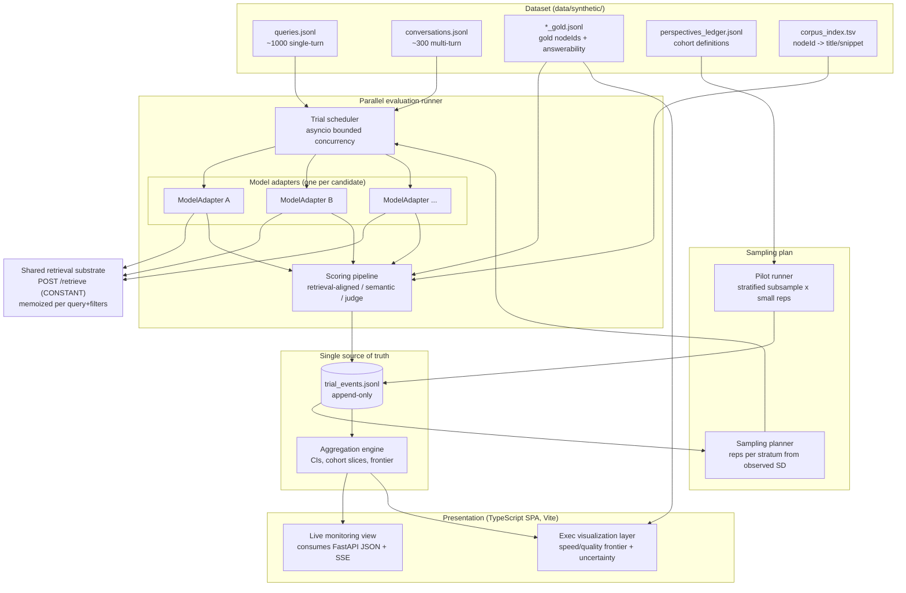
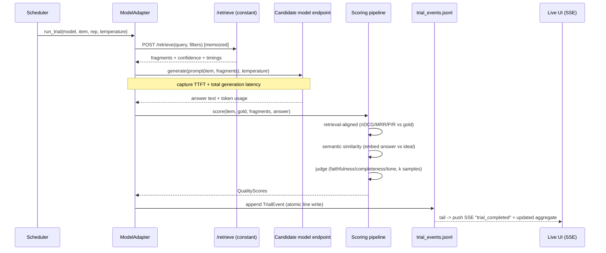
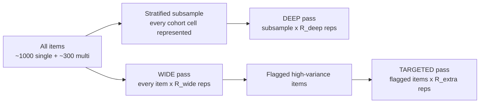
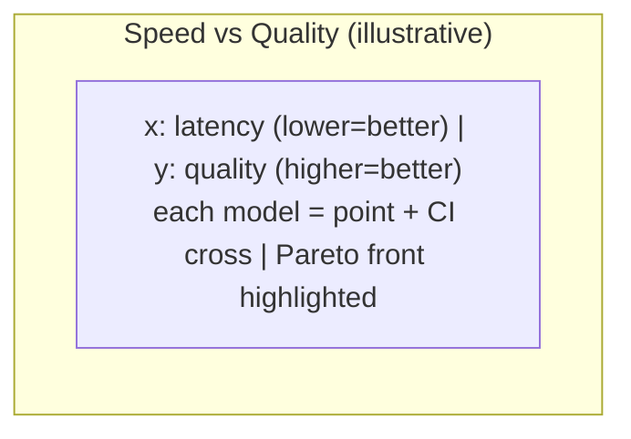

# Design Document: model-bakeoff-harness

## Sourcing note (read first)

This is a non-trivial design (architecture, statistical methodology, library
selection, data/retrieval strategy). The global steering rule asks that such
work be grounded in current Amazon-internal primary sources (BuilderHub,
internal code search, AWS Prescriptive Guidance) via the internal search tools.
**Those internal tools are not available in this execution environment, so no
Amazon-internal source could be consulted.** The fast-moving parts of this
design — RAG evaluation metrics, LLM-as-judge calibration, and confidence-
interval methodology — are instead grounded in current *external* literature and
flagged inline as **general industry practice, not Amazon-internal guidance**.
Before this design is used to defend a number to an exec audience, the
evaluation-metric and judge-calibration choices should be re-validated against
internal guidance.

---

## Overview

We are choosing which model should be the brain of a Slack FAQ bot. We are
**not** proving a "95% accurate" claim. That distinction drives every decision
in this document: the harness optimizes for a *defensible model-selection
decision* on the balance of **speed** and **quality**, while being built as
reusable, scientifically sound infrastructure that can *later* support the
rigorous accuracy argument without being rebuilt.

The harness is three coupled parts hanging off **one shared per-trial event
schema** (the `TrialEvent`, persisted append-only to JSONL — the single source
of truth):

1. **Parallel evaluation runner** — runs multiple candidate models against the
   synthetic dataset, maximally in parallel, repeating each item according to a
   per-stratum repetition plan, and emitting one `TrialEvent` per trial.
2. **Live-updating monitoring UI** — a lightweight local web app (FastAPI +
   Server-Sent Events + a single-page frontend) that shows all models at once or
   focuses on one, with running averages, per-model status/progress, and live
   updates as trials complete.
3. **Executive-facing visualization layer** — for an Amazon exec / just-below-
   exec audience: complex, nuanced data shown clearly, dynamically,
   interactively, and above all *accurately* — every number carries its
   uncertainty, and the speed/quality tradeoff is made legible as a frontier.

Retrieval is **not** under test. The existing `POST /retrieve` backend is a
constant shared substrate: every candidate model receives the identical ranked
fragments (memoized per distinct query+filters, so replaying a query across
trials costs zero extra Bedrock calls). What we compare is what each model
*does* with that constant context — its generation quality and its speed.

The statistical spine separates **between-item variance** (the ~1000 single-turn
+ ~300 multi-turn distinct items — the perspective sample, and the dominant
source of power for aggregate and cohort means) from **within-item run-to-run
variance** (repetitions of the same item — which estimates model stochasticity
only). A tiered design serves both: a **WIDE** pass (every item × small reps)
for tight aggregate/cohort CIs, and a **DEEP** pass (a stratified subsample
covering every cohort cell × more reps) to characterize within-item variance and
tails. Repetition counts and temperature are chosen **by pilot, not by gut**.

## Goals

- Produce a defensible **speed vs. quality** comparison across N candidate
  models on the synthetic dataset, sliceable by every cohort dimension, with
  confidence intervals on every reported mean.
- Treat quality as **accuracy + user-interaction quality**, measured by a
  layered model (retrieval-aligned scoring, semantic similarity, LLM-as-judge),
  not a single brittle exact-match number.
- Score the **answerability** dimension correctly: reward graceful
  refusal/escalation on unanswerable items, penalize fabrication.
- Make repetition count and temperature **pilot-driven and parameterized**, so
  the pilot's measured within-item SD configures the full run.
- Persist every trial as an append-only event so runs are **replayable** and the
  UI and aggregations derive from one source of truth.
- Be **reusable**: the same schema and aggregation engine that answers "which
  model" today can answer "is the chosen model 95% accurate" later, by changing
  the sampling plan, not the code.

## Non-Goals

- Not re-evaluating or tuning retrieval. The two-stage retrieval funnel is a
  constant.
- Not chasing rare catastrophic-failure rates. We build a **mean with
  understanding of tails and strengths/weaknesses**, not a six-sigma tail
  estimate. (The DEEP pass characterizes tails qualitatively; it is not powered
  to estimate a 1-in-10,000 failure rate.)
- Not a production service. This is a throwaway local harness (local venv +
  Qdrant container, no Brazil; the Python backend uses no npm/npx — the
  TypeScript dashboard does use npm + Vite to build, which is fine and separate).
  Operational hardening beyond "it
  runs reliably for a few days on a laptop/dev box" is out of scope.
- Not a human-labeling platform. Human calibration of judges is a small,
  scoped step, not a managed annotation pipeline.

## Glossary

- **Item** — one distinct synthetic record: a single-turn query (`queries.jsonl`)
  or a multi-turn set (`conversations.jsonl`). The unit of the *perspective
  sample*. ~1000 single-turn + ~300 multi-turn at target.
- **Trial** — one execution of one model against one item at a chosen
  temperature: one `(model, item, rep)` tuple. Emits exactly one `TrialEvent`.
- **Rep** — a repetition index for a given `(model, item)`. Reps estimate
  within-item variance.
- **Stratum** — a cell in the cohort design (e.g. geography × proficiency ×
  state × entry_route × answerability × turn_type). Used for stratified
  subsampling and per-stratum rep configuration.
- **Pass** — WIDE (all items, few reps), DEEP (stratified subsample, more reps),
  or TARGETED (flagged high-variance items, extra reps).
- **Cohort dimension** — a single sliceable axis: geography, language
  proficiency, tone/voice, entry route, momentary state, answerability,
  turn type (single vs multi).

---

## Architecture

### High-level component diagram



### Key architectural decisions

**AD-1 — One append-only event log is the single source of truth.**
Every trial writes one `TrialEvent` (a JSON line) to `data/bakeoff/trial_events.jsonl`,
mirroring the existing `data/results.jsonl` convention. The UI, aggregations,
and exec viz are all *derived* from this log. Rationale: replayability (re-run
aggregation without re-running models), crash-resumability (resume by diffing
planned trials against completed `trial_id`s in the log), and a single
auditable record behind every number an exec sees. There is no database; JSONL +
in-memory aggregation is sufficient at this scale (N_models × ~1300 items ×
reps ≈ low hundreds of thousands of lines worst case).

**AD-2 — Retrieval is called through the existing HTTP contract and memoized
there.** The runner never re-implements retrieval; it POSTs to `/retrieve` and
records the returned `fragments` + `timings` + `confidence` verbatim into the
event. Because the backend already memoizes per `(query, filters, candidate_n,
top_k)`, every rep of the same item reuses one retrieval result — retrieval is
held *identical* across reps and across models, which is exactly what makes it a
constant rather than a confound.

**AD-3 — Concurrency is `asyncio` with per-resource bounded semaphores, not
threads or processes.** The workload is I/O-bound (HTTP to `/retrieve`, HTTP to
model endpoints, HTTP to judge endpoints). A single event loop with separate
concurrency caps per downstream resource (model endpoint, judge endpoint,
embedding endpoint) maximizes parallelism while respecting each backend's rate
limits. Rationale: avoids GIL contention of threads for CPU work we don't have,
avoids the serialization cost of multiprocessing for data we don't need to move,
and gives one place to enforce backpressure. CPU-bound scoring (embedding
similarity, nDCG math) is offloaded to a small thread pool via
`asyncio.to_thread` so it doesn't block the loop.

**AD-4 — Python is the backend (FastAPI + SSE JSON API); the dashboard is a
separate TypeScript single-page app.** The harness runner lives in Python, so
FastAPI exposes the runner's state and the derived aggregates over a JSON +
Server-Sent-Events HTTP API. SSE (not WebSockets) is chosen because the data
flow is **one-directional** (server → browser: "a trial completed, here are
updated aggregates"); SSE is simpler, auto-reconnects, rides plain HTTP, and the
few control actions we need (pause/abort/focus-model) are ordinary POST
endpoints, not stream traffic.

The **frontend is a TypeScript app, built with Vite**, kept in `bakeoff/ui/` and
treated as a first-class client of the Python API — *not* a hand-written
vanilla-JS file. Rationale (this supersedes the earlier no-build-step stance):
the audience is an Amazon exec / just-below-exec and the deliverable is
*decision-grade interactive data visualization* — a speed/quality frontier with
2-D uncertainty crosses, a Pareto front, live composite re-weighting, cohort
heatmaps with CI-encoded opacity, and drill-down. The TypeScript visualization
ecosystem (D3 / Observable Plot / visx, with type-checked data contracts to the
API) is materially better suited to this than anything Python renders to a
browser or than untyped vanilla JS, and type-checking the API payload shapes
removes a whole class of "the chart silently rendered the wrong field" errors
that matter precisely because *accuracy is the headline requirement*. The
`no-npm/npx` constraint is **scoped to the Python backend** (it stays a lean
local venv + Qdrant, no Node in its runtime path); it does **not** apply to the
frontend build, which legitimately uses npm + Vite. The two halves are
decoupled: the backend serves JSON/SSE and the built static assets; the frontend
is developed and built independently and consumes the documented API. (See
"Frontend stack" under the live UI component.)

**AD-5 — Scoring is a pipeline of independent, individually-cached scorers.**
Each quality dimension (retrieval-aligned, semantic similarity, judge-graded) is
a separate scorer with its own cache keyed by content hash. This lets us re-run
one scorer (e.g. swap the judge model) without re-running models or other
scorers, and lets expensive scorers (judge) run at lower concurrency than cheap
ones (nDCG).

**AD-6 — The sampling plan is data, not code.** A `SamplingPlan` object
(reps-per-stratum, temperature, pass membership) is produced by the pilot and
serialized to `data/bakeoff/sampling_plan.json`. The full run reads it. Changing
the experiment (more reps on multi-turn, a different temperature) is editing
that file or re-running the pilot — never editing the runner.

### Process / control flow for one trial



---

## Statistical methodology

This section is the scientific spine. It is grounded in standard sampling /
variance-decomposition theory; the specific CI formulas below are **general
statistical practice, not Amazon-internal guidance**.

### The two variances, and why we never conflate them

For a metric `Y` (say, the judge-graded quality score) observed on model `m`,
item `i`, repetition `r`, model the observation as:

```
Y[m,i,r] = mu[m] + a[m,i] + e[m,i,r]
           \____/   \_____/   \______/
           model    item      run-to-run
           mean     effect    noise
```

- `a[m,i] ~ (0, sigma_between^2)` — the **between-item** component. Item `i`
  ("Nigeria / broken / terse / frustrated / unanswerable") is genuinely harder
  or easier than item `j`. This variance is real signal about the *population of
  perspectives* and is the dominant driver of how precisely we can estimate an
  aggregate or cohort mean.
- `e[m,i,r] ~ (0, sigma_within^2)` — the **within-item** component. The same
  model on the same item at temperature 0.2 gives slightly different answers
  across reps. This is *model stochasticity only*. It tells us nothing about the
  perspective population.

**The cardinal rule:** the precision of an aggregate or cohort mean is driven by
the number of **distinct items** sampled, *not* by the number of reps. Reps
shrink only the `sigma_within^2 / R` term, which is already small relative to
`sigma_between^2 / n_items` once `R` is modest. Piling on reps buys almost
nothing for aggregate CIs; sampling more *items* (which the dataset already
gives us — ~1000 + ~300) is what buys precision. Reps exist to (a) shrink the
residual within term a little and (b) **measure** `sigma_within` so we can report
model stochasticity and detect high-variance items.

For the mean of a cohort with `n` distinct items and `R` reps each, the variance
of the estimated mean is approximately:

```
Var(Ybar_cohort) ~= sigma_between^2 / n  +  sigma_within^2 / (n * R)
```

The first term does not depend on `R` at all. This single equation is why the
design is **tiered**: spend the budget on covering items broadly (WIDE → drives
the first term down via large `n`), and spend a *smaller* targeted budget on reps
where we specifically need the second term and a `sigma_within` estimate (DEEP).

### Tiered / nested-stratified design



- **WIDE pass** — every item, `R_wide` reps (default small, e.g. 2, pilot-
  confirmed). Purpose: tight **aggregate** and **cohort** CIs via large `n`.
  This is where the dominant statistical power lives. `R_wide >= 2` (not 1) so
  that *some* within-item signal exists for every item and a per-item variance is
  estimable everywhere.
- **DEEP pass** — a stratified subsample that guarantees coverage of every
  cohort cell (geography × proficiency × state × entry_route × answerability ×
  turn_type, collapsed where cells are too sparse), `R_deep` reps (default
  larger, e.g. 8–12, pilot-confirmed). Purpose: a clean estimate of
  `sigma_within` per stratum and a qualitative read on tails (best/worst answers
  the same model gives to the same item).
- **TARGETED pass** (optional) — items flagged by the WIDE pass as high-variance
  (per-item rep SD above a threshold) get `R_extra` additional reps. Purpose:
  pin down the variance of items that are individually unstable, since those are
  the ones most likely to flip a decision.

**Multi-turn items get more reps per item than single-turn.** There are only
~300 multi-turn sets vs ~1000 single-turn, so multi-turn has *less* between-item
averaging available — its aggregate CI is wider for the same per-item precision.
Multi-turn trials are also costlier (multiple generation+judge calls per set).
To keep multi-turn cohort CIs comparable to single-turn, the per-stratum rep
configuration assigns multi-turn strata a higher `R`. This is exactly the
per-stratum rep control AD-6 provides; the pilot measures multi-turn
`sigma_within` separately and sizes its reps to a comparable target CI width.

### The pilot step (reps and temperature are chosen, not guessed)

**Temperature default is ~0.2, and it is a starting point the pilot confirms or
overrides.** Rationale for 0.2: low enough that the bot behaves near-
deterministically (a desirable production trait for an FAQ assistant), high
enough that we still observe and can measure real run-to-run variance rather than
pretending it is zero. The pilot can override it: if observed `sigma_within` at
0.2 is negligible for all metrics, we may hold it; if a candidate is
pathologically unstable at 0.2, that is itself a finding.

Pilot procedure:

1. Draw a **stratified subsample** of items covering every cohort cell (reuse the
   DEEP subsample, or a subset of it).
2. Run each candidate model on that subsample at `R_pilot` reps (e.g. 10) at the
   candidate temperature (0.2).
3. From the pilot events, **measure** observed within-item SD (`sigma_within_hat`)
   per key metric (judge quality, semantic similarity, the accuracy composite)
   and **per stratum** (so multi-turn and single-turn get separate estimates).
4. **Compute reps needed** to hit a target CI half-width `w` for each pass, using
   the variance equation above. For a cohort mean over `n` items at confidence
   `1-alpha`:

   ```
   required R  s.t.  z * sqrt( sigma_between^2 / n + sigma_within^2 / (n*R) ) <= w
   ```

   Solve for `R` given measured `sigma_within_hat`, the cohort's `n`, the target
   `w`, and `sigma_between_hat` (also estimable from the pilot's item-to-item
   spread). In practice for aggregate means `R` will come out near 1–2 (the
   between term dominates); for the *smallest* cohort cells `R` will be larger.
   The planner takes the **max required R per stratum** and clamps to a budget
   ceiling.
5. Write the resulting per-stratum reps + confirmed temperature to
   `sampling_plan.json`. The full WIDE/DEEP run consumes that plan.

This makes the experiment self-sizing: the data tells us how many reps it needs,
and the harness is parameterized so that answer just flows into the full run.

### Confidence intervals and reporting

- Every reported mean (aggregate, per-model, per-cohort, per-model-per-cohort)
  carries a CI. **Default CI method: nonparametric bootstrap resampling at the
  *item* level** (resample items with replacement, then within each resampled
  item resample reps), because (a) it respects the nested structure — the item is
  the primary sampling unit — and (b) it makes no normality assumption about
  bounded/skewed metrics like a 0–1 judge score or a 0/1 abstention-correctness
  indicator. The cluster bootstrap at the item level is the defensible default
  here; **this is general statistical practice, not Amazon-internal guidance.**
- A closed-form normal-approx CI using the variance decomposition above is also
  computed and stored, as a fast sanity check and for the live UI's running
  estimates (cheap to update incrementally). The bootstrap CI is the one shown in
  the exec viz.
- **Model-vs-model comparisons** are reported as a CI on the *paired difference*
  per item (same items, same retrieval → paired design removes between-item
  variance from the comparison, which is far more powerful than comparing two
  independent means). The exec frontier shows whether models' quality intervals
  separate; the paired-difference CI is the rigorous backing.
- **Unanswerable items are reported as their own stratum**, never silently
  averaged into "accuracy". Mixing the ~17% unanswerable (where correct = refuse)
  with answerable accuracy produces a meaningless blended number. See scoring.
- **Multiplicity honesty:** when slicing many cohorts we are doing many
  comparisons; the design states up front that cohort-level CIs are
  *descriptive* (where is this model weak?) not a battery of confirmatory
  hypothesis tests, and the exec viz labels them as such. We are building a mean
  with understanding of strengths/weaknesses, not running a significance gauntlet.

---

## Quality measurement (layered, not a single brittle number)

Quality = **accuracy** + **user-interaction quality**. Neither is a single
number. The RAG-evaluation metric choices below (faithfulness, context
precision/recall, nDCG/MRR, semantic similarity, LLM-as-judge rubric scoring)
reflect **current general industry practice for RAG evaluation, not Amazon-
internal guidance** — see [Evaluation of RAG survey (arXiv 2405.07437)](https://arxiv.org/html/2405.07437v2)
and [RAGAS / automated RAG eval (arXiv 2309.15217)](https://arxiv.org/abs/2309.15217).
Content was rephrased for compliance with licensing restrictions.

### Layer A — Retrieval-aligned accuracy (did the answer rest on the gold fragments?)

Every record carries `gold_node_ids` (the ideal FAQ fragments) and an
`answerability` label. Retrieval is constant, but *whether the model's answer
actually grounds itself in the gold fragments* is a per-model signal. Two
sub-measurements:

1. **Retrieval ranking quality vs gold** (a property of the constant substrate,
   logged once per item for context, not a model differentiator): precision@k,
   recall@k, **MRR**, **nDCG@k** of the `/retrieve` fragment ranking against
   `gold_node_ids`. This characterizes the ceiling — if gold fragments were not
   retrieved at all, no model can ground on them, and that item's accuracy
   ceiling is capped. We surface this as context so a model is not blamed for a
   retrieval miss.
2. **Answer grounding vs gold** (the model differentiator): did the model's
   answer actually use the gold fragments that *were* retrieved? Measured by
   attributing answer claims to fragments (citation overlap if the model cites;
   otherwise semantic attribution of answer sentences to fragment text) and
   computing precision/recall of gold-fragment usage. A model that ignored the
   gold fragment sitting in its context and answered from parametric memory
   scores low here even if the words sound right.

### Layer B — Semantic similarity to the ideal response

Embed the model's answer and the stored ideal/gold response, compare (cosine).
Uses the **same Embed v4 substrate** the retrieval backend uses, for
consistency. This is a cheap, deterministic, judge-independent signal that
catches gross divergence and corroborates the judge. It is explicitly *not*
trusted alone — high embedding similarity can co-occur with subtle factual
errors — but it is a fast guardrail and a cross-check on judge drift.

### Layer C — LLM-as-judge graded scoring

A judge model scores each answer against the ideal response and the answerability
label on a small set of **anchored rubric dimensions**:

- **Faithfulness / groundedness** — is every claim supported by the retrieved
  context? (penalizes hallucination)
- **Correctness** — does it match the ideal response's substance?
- **Completeness vs answerability** — for `full` it should fully answer; for
  `partial` it should answer what is answerable and flag the gap; for `none` see
  abstention scoring below.

Judges are **subjective and noisy, and the design says so plainly.** Mitigations,
all drawn from **current general industry practice on LLM-as-judge, not Amazon-
internal guidance** ([locked rubrics & evidence-anchored scoring, arXiv 2601.08654](https://arxiv.org/html/2601.08654);
[position-bias mitigation via balanced permutation, arXiv 2602.02219](https://arxiv.org/html/2602.02219v1);
[four-step judge calibration workflow, Label Studio](https://labelstud.io/learningcenter/how-to-use-llm-as-judge-for-agent-evaluation)):

- **Rubric anchoring** — each score point has a concrete, written anchor
  ("5 = every claim grounded and the gap explicitly named; 1 = fabricates a
  policy not in context"), not a bare 1–5 scale.
- **Evidence-anchored** — the judge must quote the supporting fragment span for
  its faithfulness score, forcing the score to attach to evidence rather than
  vibes.
- **Multiple judge samples** — `k` judge samples per answer (k pilot-chosen);
  report the judge's own mean and SD per answer so **judge variance is a measured
  quantity in the event**, not an invisible assumption. Judge variance is carried
  separately from model within-item variance — they are different sources.
- **Position / order debiasing** — when the judge sees model answer vs ideal, the
  presentation order is randomized/balanced to cancel position bias.
- **Human calibration set** — a small human-labeled set (a few dozen items
  spanning strata and answerability) is scored by the judge; we report
  judge↔human agreement (e.g. Cohen's/Krippendorff). If agreement is poor on a
  dimension, that dimension is reported as low-confidence or dropped. This is the
  step that makes the judge *defensible* to an exec: we can show it tracks humans
  where it matters.
- **Judge != candidate** — the judge model is held fixed and is not one of the
  candidates being graded, to avoid self-preference bias.

### Answerability handling (the ~17% unanswerable items)

This is scored as a **first-class dimension**, not folded into accuracy:

- For `answerability == "none"`: correct behavior is **graceful refusal /
  escalation** ("I don't have that; here's who to ask"), *not* fabrication.
  Define `abstention_correct ∈ {0,1}`: 1 if the model abstained/escalated, 0 if
  it fabricated an answer. **Hallucination on an unanswerable item is the most
  expensive error for a real FAQ bot** and is surfaced explicitly (a
  "fabrication rate on unanswerable" metric per model).
- For `answerability == "partial"`: reward answering the answerable part *and*
  flagging the unanswerable part; penalize both over-claiming and over-refusing.
- For `answerability == "full"`: standard accuracy, and *unwarranted* refusal is
  penalized (a model that refuses answerable questions is useless).

The exec viz reports answerable-accuracy and unanswerable-abstention as
**separate axes**, because a model can be great at one and dangerous at the other,
and blending them hides exactly the risk an exec needs to see.

### Composite quality score

A transparent, **weighted composite** of the layers, with weights stored in the
plan (not hard-coded) so the exec discussion can re-weight live ("what if tone
matters more than completeness?"). The composite is always shown *alongside* its
components, never instead of them — the design's stance is that the composite is
for ranking and the frontier, and the components are for the "why".

### User-interaction quality (the squishy dimensions)

Tone, voice, empathy appropriate to the item's `momentary_state`
(neutral/frustrated/anxious/rushed/confused), clarity, and actionability.
Measured by an LLM-as-judge **rubric** distinct from the accuracy rubric, with
the same anchoring/multi-sample/calibration mitigations. The design is honest
that these are the *most* subjective metrics: they are always reported with
judge SD and judge↔human agreement, and the exec viz flags them visually as
softer-confidence than accuracy/speed. State-appropriateness is scored *against
the item's labeled momentary_state* — e.g. an anxious user's correct answer
delivered curtly scores lower on empathy than the same answer delivered
reassuringly.

### Speed

Per-trial latency, captured at every stage:

- From `/retrieve` `timings`: `embed_query_ms`, `bm25_vectorize_ms`,
  `hybrid_search_ms`, `rerank_ms`, `total_ms` (retrieval stage — constant across
  models, logged for completeness and to separate retrieval time from generation
  time in end-to-end figures).
- Owned by each candidate harness (the differentiator): **TTFT** (time to first
  token), **total generation latency**, tokens generated, and **end-to-end
  wall-clock** (retrieval + generation) as the user would feel it.
- Latency is reported as a **distribution** (median + p90/p95), never a lone
  mean, because latency is right-skewed and the tail is what users feel. The
  speed axis of the exec frontier uses median with a p90 whisker.

---

## Components and Interfaces

### Component 1: Dataset loader

**Purpose**: Read `queries.jsonl`, `conversations.jsonl`, the `*_gold.jsonl`
files, `perspectives_ledger.jsonl`, and `corpus_index.tsv` into normalized
`Item` objects with a uniform cohort vector, regardless of single- vs multi-turn.

**Responsibilities**:
- Join queries/conversations to their gold links and answerability labels.
- Derive the cohort vector per item from the persona tag + explicit fields
  (geography, proficiency, tone/disposition, entry_route, momentary_state,
  answerability, turn_type).
- Resolve `gold_node_ids` to titles/snippets via `corpus_index.tsv` for scoring
  and display.
- Validate gold-link integrity (PROGRESS.md tracks "0 invalid gold nodeIds" — the
  loader enforces it and fails loudly on a dangling nodeId).

```python
class DatasetLoader:
    def load_items(self) -> list[Item]: ...
    def resolve_gold(self, node_ids: list[str]) -> list[GoldFragment]: ...
    def cohort_cells(self) -> list[CohortKey]:
        """Enumerate non-empty cohort cells for stratification."""
```

### Component 2: Sampling planner + pilot

**Purpose**: Turn pilot measurements into a `SamplingPlan`.

**Responsibilities**:
- Build the stratified subsample (every cohort cell represented; collapse sparse
  cells).
- Run the pilot (small reps on the subsample) and persist its events.
- Estimate `sigma_within` (per stratum) and `sigma_between` from pilot events.
- Compute required reps per stratum for the target CI width; clamp to budget.
- Assign higher reps to multi-turn strata to equalize CI width.
- Emit `sampling_plan.json`.

```python
class SamplingPlanner:
    def build_subsample(self, items: list[Item]) -> StratifiedSubsample: ...
    def estimate_variances(self, pilot_events: list[TrialEvent]) -> VarianceModel: ...
    def required_reps(self, vm: VarianceModel, target_ci_halfwidth: float,
                      budget: Budget) -> SamplingPlan: ...
```

### Component 3: Model adapters

**Purpose**: One adapter per candidate model. Uniform interface; each owns its
own prompt assembly, endpoint call, temperature handling, and latency capture.

**Responsibilities**:
- Build the generation prompt from the item (and prior turns for multi-turn) +
  the constant retrieved fragments.
- Call the model endpoint, streaming so TTFT is measurable.
- Capture TTFT, total generation latency, token usage.
- Return a normalized `ModelResponse`. Adapters do **not** score.

```python
class ModelAdapter(Protocol):
    name: str
    async def generate(self, item: Item, fragments: list[Fragment],
                       temperature: float) -> ModelResponse: ...
```

This Protocol is the seam that makes the harness reusable: adding a candidate is
implementing one adapter; nothing else in the system changes.

### Component 4: Retrieval client (shared substrate wrapper)

**Purpose**: Thin async client over the existing `POST /retrieve` and
`GET /healthz`. Does not re-implement retrieval.

**Responsibilities**:
- POST query+filters, return `fragments` + `confidence` + `timings` verbatim.
- Rely on the backend's built-in memoization (same query+filters across reps and
  models → one Bedrock call). Optionally keep a local result cache too, keyed
  identically, for replay without the backend running.
- Healthcheck gate before a run starts.

```python
class RetrievalClient:
    async def retrieve(self, query: str, filters: dict | None) -> RetrievalResult: ...
    async def healthz(self) -> HealthStatus: ...
```

### Component 5: Scoring pipeline

**Purpose**: Compute the layered quality scores for one trial. Each scorer is
independent and individually cached (AD-5).

```python
class Scorer(Protocol):
    name: str
    async def score(self, ctx: ScoringContext) -> dict[str, float]: ...

# Concrete scorers:
#   RetrievalAlignedScorer  -> precision@k, recall@k, mrr, ndcg, grounding_p/r
#   SemanticSimilarityScorer -> cosine(answer, ideal) via Embed v4
#   JudgeScorer             -> faithfulness, correctness, completeness,
#                              tone, empathy, clarity, actionability,
#                              abstention_correct  (+ per-dim judge mean & SD)
class ScoringPipeline:
    async def score_trial(self, item, gold, fragments, response) -> QualityScores: ...
```

### Component 6: Trial scheduler / runner

**Purpose**: Expand the `SamplingPlan` into the full set of trials, run them with
bounded per-resource concurrency, write each `TrialEvent`, and stream completion
events to the UI. Resumable.

**Responsibilities**:
- Compute the planned trial set = Σ over (pass, model, item, rep).
- Diff against `trial_id`s already in `trial_events.jsonl`; run only the missing
  ones (crash-resume).
- Enforce separate concurrency caps per downstream resource via semaphores.
- Append each completed `TrialEvent` atomically (single `write()` of one line).
- Publish a completion signal to the SSE broker.

```python
class TrialScheduler:
    def planned_trials(self, plan: SamplingPlan, models: list[ModelAdapter]) -> Iterable[TrialSpec]: ...
    async def run(self, plan: SamplingPlan, models: list[ModelAdapter]) -> None: ...
    def resume_point(self, events_path: Path) -> set[TrialId]: ...
```

### Component 7: Aggregation engine

**Purpose**: Derive all reported statistics from the event log. Pure function of
the events (no hidden state), so it can run live (incremental) or batch (full
bootstrap).

**Responsibilities**:
- Group events by (model), (model, cohort cell), (pass).
- Compute means, item-level cluster-bootstrap CIs, latency distributions
  (median/p90/p95), paired model-vs-model difference CIs.
- Decompose variance into between-item vs within-item vs judge components.
- Flag high-variance items for the TARGETED pass.
- Build the speed/quality frontier data structure.

```python
class AggregationEngine:
    def aggregate(self, events: list[TrialEvent], group_by: list[str]) -> list[Aggregate]: ...
    def bootstrap_ci(self, events: list[TrialEvent], metric: str,
                     level: float = 0.95, n_boot: int = 2000) -> CI: ...
    def paired_diff_ci(self, events, model_a, model_b, metric) -> CI: ...
    def frontier(self, events: list[TrialEvent]) -> list[FrontierPoint]: ...
```

### Component 8: Live monitoring UI (FastAPI + SSE backend, TypeScript SPA)

**Purpose**: Watch the run live.

**Responsibilities & views**:
- **All-models overview**: a row per model with status (queued/running/done),
  progress (trials done / planned, per pass), and current running-average quality
  + speed with live CIs.
- **Single-model focus**: drill into one model — per-cohort running averages,
  recent trials, live latency distribution, current high-variance flags.
- **Run controls**: pause / resume / abort, and "focus model" — ordinary POST
  endpoints (AD-4).
- Streams updates via SSE as each `TrialEvent` lands; the browser updates
  in-place. Running CIs use the cheap closed-form normal-approx (the expensive
  bootstrap is for the exec viz / final report).

**Frontend stack (TypeScript SPA built with Vite — AD-4)**: a TypeScript
single-page app under `bakeoff/ui/`, built with Vite, consuming the FastAPI
JSON/SSE API. Charting via the TS visualization ecosystem (D3 / Observable Plot
/ visx). Type-checked API-payload interfaces mirror the backend's `Aggregate` /
`FrontierPoint` / model-status shapes, so a field rename on the backend is a
compile error in the client rather than a silently-wrong chart. The backend
serves the built static bundle (from `bakeoff/ui/dist/`) at `/` and the live API
under `/api/...`; in development the Vite dev server proxies to the backend. The
`no-npm` rule applies only to the Python backend runtime, not to this frontend
build (AD-4). No Node is required to *run* the harness backend; Node + npm are
required only to build/develop the dashboard.

```python
# FastAPI surface
GET  /                      # serves index.html (SPA)
GET  /api/models            # model list + status + progress
GET  /api/aggregate         # query: group_by, metric, cohort filters
GET  /api/stream            # text/event-stream (SSE): trial_completed events
POST /api/control/pause
POST /api/control/resume
POST /api/control/abort
GET  /healthz               # harness health (separate from backend /healthz)
```

### Component 9: Executive visualization layer

**Purpose**: Decision-grade visuals for an Amazon exec / just-below-exec
audience. Same FastAPI app, a distinct set of views built for *narrative
clarity and defensibility* rather than live monitoring. See the dedicated
"Executive visualization design" section below.

---

## Data Models

The `TrialEvent` is the spine. Everything upstream produces it; everything
downstream (UI, aggregations, exec viz) consumes it. It is append-only JSONL at
`data/bakeoff/trial_events.jsonl`. Types are shown as Python
dataclasses/`TypedDict`-style for precision; on disk they are one JSON object per
line.

### The shared per-trial event schema (`TrialEvent`)

```python
from dataclasses import dataclass, field

@dataclass(frozen=True)
class CohortKey:
    geography: str            # e.g. "Nigeria (Lagos)"
    proficiency: str          # broken | functional | near-native | fluent | uneven
    tone: str                 # disposition/voice, e.g. "terse", "chatty"
    entry_route: str          # slack | quicksuite
    momentary_state: str      # neutral | frustrated | anxious | rushed | confused
    answerability: str        # full | partial | none
    turn_type: str            # single | multi

@dataclass(frozen=True)
class StageTimings:           # mirrors /retrieve "timings" verbatim + generation
    embed_query_ms: float
    bm25_vectorize_ms: float
    hybrid_search_ms: float
    rerank_ms: float
    retrieval_total_ms: float
    ttft_ms: float            # generation: time to first token (model-owned)
    generation_total_ms: float
    end_to_end_ms: float      # retrieval_total_ms + generation_total_ms

@dataclass(frozen=True)
class RetrievalRecord:        # the CONSTANT substrate, captured per trial
    fragment_ids: list[str]   # ranked nodeIds returned by /retrieve
    confidence: list[float]   # per-fragment relevanceScore (relative, not calibrated)
    cache_hit: bool

@dataclass(frozen=True)
class AccuracyScores:
    # retrieval ranking vs gold (substrate ceiling, context only)
    precision_at_k: float
    recall_at_k: float
    mrr: float
    ndcg_at_k: float
    # answer grounding vs gold (model differentiator)
    grounding_precision: float
    grounding_recall: float
    # semantic similarity to ideal response
    semantic_similarity: float
    # answerability behavior
    abstention_correct: int | None   # 1/0 for answerability == none/partial; None for full
    unwarranted_refusal: int | None  # 1/0 for answerability == full

@dataclass(frozen=True)
class JudgeScores:
    faithfulness: float
    correctness: float
    completeness: float
    tone: float
    empathy: float
    clarity: float
    actionability: float
    # judge-variance bookkeeping (k samples per dimension)
    judge_sample_count: int
    judge_dim_sd: dict[str, float]   # per-dimension SD across the k judge samples
    judge_model: str

@dataclass(frozen=True)
class QualityScores:
    accuracy: AccuracyScores
    judge: JudgeScores
    composite: float                 # transparent weighted composite
    composite_weights_version: str   # which weight set produced `composite`

@dataclass(frozen=True)
class TrialEvent:
    # --- identity ---
    trial_id: str            # deterministic hash(model, item_id, rep, pass, plan_version)
    schema_version: str      # event schema version, for forward-compat
    plan_version: str        # which sampling_plan.json produced this trial
    # --- what was run ---
    model: str
    item_id: str             # e.g. "b0-q01" or "c0-s01"
    turn_type: str           # single | multi
    pass_name: str           # wide | deep | targeted | pilot
    rep: int
    temperature: float
    cohort: CohortKey
    # --- inputs captured for replay/audit ---
    query: str               # for multi-turn: the resolved turn-1 (or focal turn) query
    gold_node_ids: list[str]
    answerability: str
    retrieval: RetrievalRecord
    # --- outputs ---
    answer_text: str
    token_usage: dict[str, int]      # prompt/completion/total
    timings: StageTimings
    quality: QualityScores
    # --- provenance ---
    started_at: str          # ISO 8601
    completed_at: str
    error: str | None        # set (and other fields best-effort) if the trial failed
```

**Validation rules**:
- `trial_id` is deterministic and unique; re-running a planned trial overwrites
  nothing — the resume logic skips any `trial_id` already present.
- `gold_node_ids` must all resolve in `corpus_index.tsv` (loader-enforced).
- `abstention_correct` is populated **iff** `answerability in {none, partial}`;
  `unwarranted_refusal` iff `answerability == full`. The aggregation engine
  refuses to average accuracy across answerability classes (it slices first).
- `timings.end_to_end_ms == retrieval_total_ms + generation_total_ms` (asserted).
- `retrieval.fragment_ids` is identical for all reps of the same item (the
  substrate is constant); the engine asserts this invariant and flags violations
  (would indicate a retrieval cache miss/nondeterminism — a bug, not a finding).

### `SamplingPlan` (produced by the pilot, consumed by the runner)

```python
@dataclass(frozen=True)
class StratumPlan:
    cohort_predicate: dict           # which items match this stratum
    passes: dict[str, int]           # {"wide": R_wide, "deep": R_deep, ...} reps
    rationale: str                   # e.g. "multi-turn: R raised to equalize CI"

@dataclass(frozen=True)
class SamplingPlan:
    plan_version: str
    temperature: float               # pilot-confirmed (default starts ~0.2)
    target_ci_halfwidth: float
    confidence_level: float          # e.g. 0.95
    strata: list[StratumPlan]
    budget: dict                     # caps: max trials, max judge calls, etc.
    pilot_variance_model: dict       # sigma_within/sigma_between estimates per stratum
    composite_weights: dict[str, float]
```

### `Aggregate` (produced by the aggregation engine, consumed by both UIs)

```python
@dataclass(frozen=True)
class CI:
    point: float
    low: float
    high: float
    method: str          # "cluster_bootstrap" | "normal_approx"

@dataclass(frozen=True)
class Aggregate:
    group: dict[str, str]            # e.g. {"model": "A", "answerability": "none"}
    metric: str                      # e.g. "composite", "abstention_correct", "end_to_end_ms"
    n_items: int                     # distinct items (between-item power)
    n_trials: int                    # total reps
    mean_ci: CI
    variance_decomp: dict            # {"between": x, "within": y, "judge": z}
    latency_quantiles: dict | None   # {"p50":..,"p90":..,"p95":..} for latency metrics

@dataclass(frozen=True)
class FrontierPoint:
    model: str
    quality: CI                      # composite quality with CI
    speed_p50_ms: float
    speed_p90_ms: float
    on_pareto_front: bool
```

### On-disk layout

```
data/bakeoff/
  sampling_plan.json        # the plan (pilot output)
  trial_events.jsonl        # append-only source of truth (all passes)
  pilot_events.jsonl        # pilot trials (kept separate; feeds variance model)
  cache/
    retrieval/              # optional local mirror of /retrieve results
    judge/                  # judge-score cache keyed by content hash
    embeddings/             # semantic-similarity embedding cache
  reports/
    aggregate_<plan_version>.json   # materialized aggregates for the exec viz
```

---

## Executive visualization design

**Audience framing (this is the design constraint, not decoration).** The
viewer is an Amazon exec or just-below-exec: numerate, time-poor, allergic to
hand-waving, and accountable for the decision. They do not want a model
leaderboard with one bold number; they want to *defend* a model choice to their
own leadership. So the visualization layer's job is: make a complex, nuanced
speed/quality tradeoff legible in seconds, let them interrogate it interactively
for the next ten minutes, and **never show a number that can't be defended.**
Every point carries its uncertainty; every claim traces back to the event log.

Design principles baked into every view:

1. **Uncertainty is always on screen.** No bare point estimates. Means render
   with their CI (whisker/band); a model whose CI overlaps another's is shown as
   *not yet distinguished*, not ranked above it. This is the single most
   important accuracy guarantee for this audience.
2. **Decision-first, drill-down second.** The landing view answers "which model,
   and what's the tradeoff" in one screen. Everything else is one click down.
3. **Speed and quality are never collapsed into one score by default.** They are
   shown as a frontier (below). A blended score exists but is opt-in and always
   shows its weights.
4. **The squishy is visibly squishier.** Tone/empathy/interaction metrics are
   rendered with a visual treatment that signals lower confidence (e.g. lighter
   fill + judge-SD band + judge↔human agreement badge), so no one mistakes a
   subjective rubric score for a hard measurement.

### Primary view — the Speed/Quality Frontier

The hero visualization. A scatter where:

- **x-axis = speed** (end-to-end latency, median; p90 shown as a horizontal
  whisker so the tail is visible — fast-on-average-but-spiky reads as a wide
  whisker).
- **y-axis = quality** (composite, with a vertical CI band).
- Each model is one point with a 2-D uncertainty cross (speed whisker × quality
  band). The **Pareto frontier** is drawn: models not dominated on both axes are
  connected; dominated models are visually de-emphasized.
- The exec sees instantly: "Model A is a bit slower but clearly higher quality;
  Model B is fast but its quality CI overlaps C, so B-vs-C is a coin flip on
  quality and should be decided on speed."



Interactions: hover a point → its CI, n_items, n_trials, and the variance
breakdown. Toggle the metric driving "quality" (composite / accuracy-only /
interaction-only). Re-weight the composite with sliders → the frontier animates,
so the exec can ask "what if tone matters more" and watch the ranking respond.

### Secondary view — Cohort heatmap (where each model is strong/weak)

A model × cohort-dimension grid (e.g. rows = models, columns = momentary_state or
geography or proficiency), cells colored by quality with the CI encoded as cell
opacity/texture (wide CI = faded, so thin-data cells don't masquerade as strong
signal). This is the "strengths and weaknesses" view: it surfaces, e.g., "Model A
leads overall but collapses on `frustrated` + `broken`-proficiency users," which
is exactly the nuance a single number hides. Clicking a cell drills to the
underlying trials and example answers.

### Tertiary view — Answerability / safety panel

A dedicated panel for the answerability dimension, because for an FAQ bot the
**fabrication-on-unanswerable rate** is a safety/trust metric an exec must see
separately. Two side-by-side bars per model: answerable-accuracy and
unanswerable-abstention-correctness, each with CI. A model that hallucinates on
unanswerable questions is flagged regardless of its headline quality — this is
the "don't ship the confident liar" guardrail made visible.

### Supporting view — Example inspector

Any aggregate drills down to **real example answers** (best/typical/worst by
score), side-by-side with the ideal response and the gold fragments. Execs trust
numbers they can spot-check; this closes the loop from "Model A scores 4.2 on
faithfulness" to "here's an answer that earned a 2 and why." This is also the
honesty mechanism for the judge: the exec can read the judge's quoted evidence.

### Reproducibility / provenance footer

Every exported chart carries the `plan_version`, `n_items`, total trials, judge
model + judge↔human agreement, CI method, and date. The visualization is a view
over `trial_events.jsonl`; "show me the data behind this" resolves to specific
event lines. This is what makes the whole thing defensible rather than
decorative.

### Tech choice for the exec layer

Served by the same FastAPI app under distinct routes (`/exec/...` for data,
served as part of the same TypeScript SPA), reading materialized
`reports/aggregate_<plan_version>.json`. Same TypeScript/Vite stack as the live
UI (AD-4): an interactive, type-checked client. Interactivity (re-weighting,
drill-down, hover-CI) is the reason this is a web app and not static PNGs — the
audience needs to interrogate, not just look. For a leave-behind, any view
exports to a static HTML snapshot that
keeps the provenance footer.

---

## Algorithmic pseudocode with formal specifications

Low-level design for the load-bearing algorithms. Python, async where I/O-bound.
Each carries preconditions, postconditions, and loop invariants.

### Function: `run_trial` — execute one trial end-to-end

```python
async def run_trial(model: ModelAdapter, item: Item, rep: int, pass_name: str,
                    temperature: float, retr: RetrievalClient,
                    scoring: ScoringPipeline, plan_version: str) -> TrialEvent:
    """Run one (model, item, rep) trial and return a fully-scored TrialEvent."""
```

**Preconditions:**
- `item.gold_node_ids` all resolve in the corpus index (loader-enforced).
- `retr` is healthy (`/healthz` passed at run start).
- `temperature == plan.temperature` for the active plan.
- `0 <= rep < planned_reps(item.stratum, pass_name)`.

**Postconditions:**
- Returns a `TrialEvent` with a deterministic `trial_id` and `error is None` on
  success; on failure returns a `TrialEvent` with `error` set and best-effort
  partial fields (the trial is recorded as attempted, never silently dropped).
- `event.retrieval.fragment_ids` equals the substrate's result for
  `(item.query, item.filters)` — identical across all reps of this item.
- `event.timings.end_to_end_ms == retrieval_total_ms + generation_total_ms`.
- Exactly one line is appended to `trial_events.jsonl` by the caller (this
  function is pure w.r.t. the log; the scheduler owns the write).

**Loop invariants:** none (no loops).

```python
    started = now_iso()
    try:
        r = await retr.retrieve(item.query, item.filters)        # memoized, constant
        resp = await model.generate(item, r.fragments, temperature)  # captures TTFT
        quality = await scoring.score_trial(item, item.gold, r.fragments, resp)
        return TrialEvent(
            trial_id=trial_id(model.name, item.id, rep, pass_name, plan_version),
            ...,
            retrieval=RetrievalRecord(r.fragment_ids, r.confidence, r.cache_hit),
            answer_text=resp.text, timings=merge_timings(r.timings, resp.timings),
            quality=quality, error=None, completed_at=now_iso())
    except Exception as ex:
        return TrialEvent(..., error=repr(ex), completed_at=now_iso())
```

### Function: `schedule_run` — bounded-concurrency parallel execution, resumable

```python
async def schedule_run(plan: SamplingPlan, models: list[ModelAdapter],
                       events_path: Path, broker: SSEBroker) -> None:
    """Run every planned trial not already in the log, maximally in parallel."""
```

**Preconditions:**
- `plan` is valid and its `plan_version` matches the events being resumed (or the
  log is empty / a different plan_version is being started fresh).
- Per-resource concurrency caps are configured.

**Postconditions:**
- For every `TrialSpec` in `planned_trials(plan, models)`, exactly one
  `TrialEvent` with the matching `trial_id` exists in `events_path` (whether it
  was already there on entry or appended during this call).
- No `trial_id` appears twice in the log.
- Every appended event was streamed to `broker` exactly once.

**Loop invariants (over the trial loop):**
- `done` = set of `trial_id`s present in the log = trials with a durable event.
- At all times, `in_flight <= cap` for each resource semaphore.
- `done ∪ in_flight ∪ pending == planned`, and these three are disjoint
  (every planned trial is in exactly one state).

```python
    done = resume_point(events_path)                  # trial_ids already durable
    pending = [t for t in planned_trials(plan, models) if t.trial_id not in done]
    sem = {res: asyncio.Semaphore(cap[res]) for res in RESOURCES}

    async def worker(spec: TrialSpec):
        async with sem[spec.model_resource], sem["judge"], sem["embed"]:
            ev = await run_trial(...spec...)
            append_line(events_path, ev)              # atomic single-line write
            broker.publish("trial_completed", summarize(ev))

    # invariant holds at entry: done from log, pending disjoint, nothing in flight
    await asyncio.gather(*(worker(t) for t in pending))
    # postcondition: every planned trial now has exactly one durable event
```

### Function: `estimate_required_reps` — pilot → reps per stratum

```python
def estimate_required_reps(pilot_events: list[TrialEvent], strata: list[Stratum],
                           target_w: float, z: float, budget: Budget,
                           ) -> dict[StratumId, dict[str, int]]:
    """From pilot variance, compute reps per stratum per pass to hit CI width target."""
```

**Preconditions:**
- `pilot_events` contains >= 2 reps for every stratum in `strata` (so a
  within-item SD is estimable per stratum).
- `target_w > 0`, `0 < z` (z-multiplier for the confidence level).

**Postconditions:**
- Returns `R[stratum][pass] >= 2` for every stratum (floor of 2 so within-item
  signal always exists), each chosen as the smallest `R` satisfying the CI-width
  target given that stratum's measured `sigma_within` and `sigma_between` and its
  `n_items`, then clamped so total trials <= `budget.max_trials`.
- Multi-turn strata receive `R >=` their single-turn counterpart for the same
  target (equalizing CI width given fewer items).

**Loop invariant (over strata):**
- For every stratum processed so far, `R[s]` is the minimal rep count meeting the
  target before budget clamping; running `total_trials` is the exact sum of
  `R[s] * n_items[s]` over processed strata.

```python
    R = {}
    total = 0
    for s in strata:                                  # invariant maintained each iter
        sw = within_sd(pilot_events, s)               # sigma_within_hat
        sb = between_sd(pilot_events, s)              # sigma_between_hat
        n  = s.n_items
        # smallest R with  z*sqrt(sb^2/n + sw^2/(n*R)) <= target_w
        need = ceil( sw**2 / (n * ((target_w/z)**2 - sb**2 / n)) ) \
               if (target_w/z)**2 > sb**2 / n else MAX_REPS  # between-term alone too big
        R[s.id] = {p: clamp(max(2, need), 2, MAX_REPS) for p in s.passes}
        total += R[s.id]["wide"] * n
    return budget_clamp(R, total, budget)
```

Note the structural insight encoded in `need`: if `sigma_between^2 / n` alone
already exceeds the target variance `(target_w/z)^2`, **no number of reps can hit
the target** — only more *items* can. The function returns `MAX_REPS` and the
planner surfaces this as "this cohort cannot reach target width with available
items; report the wider achievable CI honestly." That is the methodology
refusing to fake precision.

### Function: `cluster_bootstrap_ci` — item-level resampling CI

```python
def cluster_bootstrap_ci(events: list[TrialEvent], metric: str,
                         level: float = 0.95, n_boot: int = 2000) -> CI:
    """Two-stage bootstrap CI: resample items, then reps within items."""
```

**Preconditions:**
- All `events` share the grouping that defines this aggregate (e.g. one model,
  one cohort).
- `metric` is present on every event (or has a defined extractor).
- `n_boot >= 1000` (default 2000) for stable interval endpoints.

**Postconditions:**
- Returns `CI(point, low, high, method="cluster_bootstrap")` where `point` is the
  item-mean-of-rep-means (so each item is weighted equally regardless of its rep
  count), and `[low, high]` are the `alpha/2` and `1-alpha/2` percentiles of the
  bootstrap distribution of that statistic.
- Respects nesting: items (not trials) are the primary resampling unit, so the CI
  reflects between-item variance as the dominant term.

**Loop invariant (over bootstrap iterations):**
- After `b` iterations, `boot_stats` holds exactly `b` resampled statistics, each
  computed from a full item-level resample of size `n_items`.

```python
    by_item = group_rep_means_by_item(events, metric)    # {item_id: mean_over_reps}
    items = list(by_item.keys())
    point = mean(by_item.values())                       # equal weight per item
    boot_stats = []
    for _ in range(n_boot):                              # invariant: len == iters so far
        sample = [by_item[choice(items)] for _ in items]  # resample items w/ replacement
        boot_stats.append(mean(sample))
    lo, hi = percentile(boot_stats, [alpha/2, 1-alpha/2])
    return CI(point, lo, hi, "cluster_bootstrap")
```

### Function: `score_answerability` — abstention-aware accuracy

```python
def score_answerability(answer: str, answerability: str,
                        judge: JudgeScorer) -> dict:
    """Score behavior on the answerability dimension; never blend classes."""
```

**Preconditions:** `answerability in {"full", "partial", "none"}`.

**Postconditions:**
- `answerability == "none"`  → returns `{abstention_correct ∈ {0,1}}`; 1 iff the
  answer refuses/escalates without fabricating. Fabrication → 0 (and contributes
  to the model's fabrication-on-unanswerable rate).
- `answerability == "partial"` → returns `{abstention_correct ∈ {0,1}}` rewarding
  answer-the-answerable-and-flag-the-gap.
- `answerability == "full"` → returns `{unwarranted_refusal ∈ {0,1}}`; 1 iff the
  model refused an answerable question.
- The aggregation engine keys these into separate strata and **never averages
  across answerability classes** (enforced by `AggregationEngine.aggregate`
  refusing a group spanning multiple answerability values for an accuracy metric).

**Loop invariants:** none.
```

---

## Example Usage

End-to-end operator flow, from pilot to exec viz. All local; no Brazil, no npm.

```python
# 0. Ensure the shared retrieval substrate is up (the constant).
#    ./run.sh  (separate process; harness only calls POST /retrieve)

# 1. Load and normalize the dataset.
loader = DatasetLoader(data_dir="data/synthetic/")
items = loader.load_items()                      # ~1000 single + ~300 multi, cohort-tagged

# 2. Register candidate models (each is one adapter; adding a model = one class).
models = [ModelAdapterA(), ModelAdapterB(), ModelAdapterC()]

# 3. PILOT: small reps on a stratified subsample at the starting temperature.
planner = SamplingPlanner(items)
subsample = planner.build_subsample()            # every cohort cell represented
await schedule_run(plan=planner.pilot_plan(temperature=0.2, reps=10, subsample=subsample),
                   models=models, events_path="data/bakeoff/pilot_events.jsonl",
                   broker=broker)

# 4. SIZE THE RUN from measured variance (reps chosen, not guessed).
plan = planner.required_reps(
    pilot_events=read_events("data/bakeoff/pilot_events.jsonl"),
    target_ci_halfwidth=0.05, confidence_level=0.95,
    budget=Budget(max_trials=200_000, max_judge_calls=400_000))
plan.write("data/bakeoff/sampling_plan.json")
#   -> WIDE: all items x R_wide(=2);  DEEP: subsample x R_deep(=10);
#      multi-turn strata get higher R to equalize CIs; temperature confirmed/overridden.

# 5. FULL RUN: maximally parallel, resumable, live UI streaming.
#    (Live UI at http://localhost:8090/ ; exec viz at /exec)
await schedule_run(plan=plan, models=models,
                   events_path="data/bakeoff/trial_events.jsonl", broker=broker)

# 6. AGGREGATE + FRONTIER for the exec decision.
engine = AggregationEngine()
events = read_events("data/bakeoff/trial_events.jsonl")
frontier = engine.frontier(events)               # speed/quality Pareto, with CIs
by_cohort = engine.aggregate(events, group_by=["model", "momentary_state"])
safety = engine.aggregate(events, group_by=["model", "answerability"])  # never blended

# 7. Re-run ONE scorer without re-running models (caches make this cheap):
#    swap the judge model, re-score from stored answers, re-aggregate.
```

Resume after a crash is automatic: re-invoking step 5 diffs `planned_trials`
against `trial_id`s already in the log and runs only what is missing.

---

## Correctness Properties

Universal statements the implementation must satisfy. Each maps to a test in the
testing strategy.

### Property 1: Retrieval is constant per item

∀ trials `t1, t2` with `t1.item_id == t2.item_id` ⇒
`t1.retrieval.fragment_ids == t2.retrieval.fragment_ids`. The substrate is held
constant across reps and models; a violation is a bug.

**Validates: Requirements 2.3, 14.1**

### Property 2: Every planned trial is recorded exactly once

∀ `spec ∈ planned_trials(plan, models)`,
`count(events where trial_id == spec.trial_id) == 1` after a completed run. No
planned trial is silently dropped; failures are recorded with `error` set.

**Validates: Requirements 7.3, 7.5, 14.1**

### Property 3: Resume is idempotent

Running `schedule_run` twice on the same plan produces the same set of
`trial_id`s and runs zero new trials the second time.

**Validates: Requirements 7.4, 12.3, 13.1, 14.1, 14.3**

### Property 4: Accuracy is never averaged across answerability classes

Any aggregate of an accuracy metric whose group spans more than one
`answerability` value is rejected by the engine.

**Validates: Requirements 5.4, 9.7, 14.1**

### Property 5: Timings are consistent

∀ events without error,
`end_to_end_ms == retrieval_total_ms + generation_total_ms` (within float eps).

**Validates: Requirements 8.4, 14.1**

### Property 6: CIs widen as items shrink, not as reps shrink

For fixed `sigma`s, the computed CI half-width is monotonically decreasing in
`n_items` and only weakly decreasing in `R` (the `1/(n*R)` term). A test asserts
adding reps to a cohort shrinks its CI far less than adding items would.

**Validates: Requirements 9.2, 14.1**

### Property 7: Bootstrap point estimate weights items equally

The CI `point` equals the mean over items of (mean over that item's reps),
independent of how many reps each item happens to have.

**Validates: Requirements 9.2, 14.1**

### Property 8: required_reps floors at 2 and refuses the impossible

∀ strata, returned `R >= 2`; and when `sigma_between^2 / n` alone exceeds the
target variance, the function signals "unreachable" rather than returning a
finite `R` that does not actually meet the target.

**Validates: Requirements 6.4, 6.5, 14.1**

### Property 9: Aggregations are a pure function of the event log

Running the aggregation engine twice on the same events yields identical
aggregates (no hidden state, deterministic given a fixed bootstrap seed).

**Validates: Requirements 9.1, 14.1**

### Property 10: No number reaches the exec viz without a CI

Every `FrontierPoint` and every cohort cell carries a populated `CI` (or is
explicitly marked insufficient-data); the viz layer rejects an `Aggregate`
lacking `mean_ci`.

**Validates: Requirements 9.8, 11.1, 13.4, 14.1**

---

## Error Handling

### Scenario 1: A single trial fails (model timeout, judge error, malformed output)
**Condition**: One `run_trial` raises.
**Response**: Return a `TrialEvent` with `error` set and best-effort partial
fields; record it. The run continues. The failed `trial_id` is *not* added to the
durable "done" set for completed-without-error, so a later resume can retry it.
**Recovery**: Re-running the plan retries errored trials (configurable: retry-on-
resume vs leave-recorded-as-failed). The UI shows a per-model error count.

### Scenario 2: Retrieval backend is down or unhealthy
**Condition**: `/healthz` fails at run start, or `/retrieve` errors mid-run.
**Response**: Run start is gated on `/healthz` (fail fast with a clear message).
Mid-run retrieval errors mark affected trials errored and back off; if the error
rate crosses a threshold the run auto-pauses (a systemic problem, not a per-trial
blip).
**Recovery**: Bring the backend up, resume — only missing trials run.

### Scenario 3: Judge instability / low judge↔human agreement
**Condition**: A judge dimension shows high sample SD or poor agreement on the
calibration set.
**Response**: That dimension is reported as low-confidence (visually softened in
the exec viz) or excluded from the composite; the composite-weights version
records the exclusion.
**Recovery**: Re-run only the JudgeScorer (cached models/answers) with a revised
rubric or different judge model; re-aggregate. No model re-runs.

### Scenario 4: A cohort cell is too thin to estimate
**Condition**: A stratified cell has too few items for a meaningful CI.
**Response**: Collapse sparse cells per the stratification rules; if still thin,
the cell renders as insufficient-data (faded, labeled), never as a confident
value. `required_reps` flags cells that cannot reach target width.
**Recovery**: Operator decision — accept the wider honest CI, or (future) collect
more items for that cohort.

### Scenario 5: Crash mid-run
**Condition**: Process dies.
**Response**: The append-only log is the durable record; partially-written final
line (if any) is detected and discarded on next read (JSONL line parse guard).
**Recovery**: Resume diffs the log against the plan; only missing trials run
(Property 3).

### Scenario 6: Plan changed after some trials ran
**Condition**: `plan_version` differs from events in the log.
**Response**: Trials are keyed by `plan_version`; a new plan's trials have new
`trial_id`s and accumulate alongside the old (or in a fresh log file). The engine
never mixes plan versions in one aggregate without an explicit override.

---

## Testing Strategy

### Unit testing
- **Statistics**: `cluster_bootstrap_ci` against known distributions (CI coverage
  ≈ nominal level on synthetic data with known mean); `estimate_required_reps`
  against the closed-form variance equation and the "unreachable" branch;
  variance decomposition recovers planted `sigma_between` / `sigma_within`.
- **Scoring**: nDCG/MRR/precision/recall against hand-computed gold rankings;
  abstention scoring on fixtures for each answerability class (fabrication on
  `none` → `abstention_correct == 0`).
- **Schema**: `TrialEvent` round-trips JSONL losslessly; validation rules fire on
  malformed events.
- **Scheduler**: resume diffing on a fixture log (Property 2, 3).

### Property-based testing
Property tests target the universal properties above. **Library: Hypothesis**
(the standard Python PBT library; this is a Python harness).
- Generate random event logs (varying items, reps, models) and assert: bootstrap
  point weights items equally (Property 7); aggregations are pure/deterministic
  given a seed (Property 9); CI half-width monotonicity in `n_items` vs `R`
  (Property 6); `required_reps >= 2` and unreachable-detection (Property 8);
  accuracy-never-blended-across-answerability rejection (Property 4); timings
  consistency holds for all generated non-error events (Property 5).

### Integration testing
- A mock model adapter (deterministic, configurable latency/quality) + a mock
  `/retrieve` + a stub judge → run a small plan end-to-end, assert every planned
  trial recorded once, resume runs zero new trials, aggregates and frontier
  materialize.
- Live-UI smoke: start a small run, connect an SSE client, assert one
  `trial_completed` event per appended `TrialEvent` (Property: streamed exactly
  once).

### Calibration testing (judge defensibility)
- Score the human-labeled calibration set with the judge; assert judge↔human
  agreement is computed and surfaced. This is a *reporting* test (we report the
  agreement honestly), not a pass/fail gate on agreement.

---

## Performance Considerations

- **Parallelism is the headline performance feature.** Maximally-parallel
  asyncio with per-resource semaphores (AD-3) saturates each downstream
  (model/judge/embed) up to its rate limit without overrunning any one.
- **Retrieval memoization** (existing backend) collapses all reps × all models of
  one item to a single Bedrock retrieval call. Scorer caches (judge, embeddings)
  collapse repeated scoring of identical content.
- **Cost/latency dominated by generation + judge calls**, not retrieval. The
  `k` judge samples × dimensions is the largest call multiplier; `k` is
  pilot-chosen to balance judge-variance estimation against cost, and the judge
  cache prevents re-paying on re-aggregation.
- **Scale estimate**: N_models (~3) × ~1300 items × R (mostly 2, DEEP subset
  ~10) ≈ low-tens-of-thousands of generation trials; judge calls ≈ that × k ×
  dimensions. Comfortable for JSONL + in-memory aggregation on a dev box. Bootstrap
  (2000 resamples × cohorts) is the heaviest pure-CPU step; it runs at report time,
  not live, and is parallelizable across cohorts.
- **Live UI** uses cheap incremental normal-approx CIs; the expensive bootstrap
  is reserved for the exec/report layer.

---

## Security Considerations

- **Local, throwaway harness.** No new network-exposed production surface. The
  FastAPI app binds to **localhost only** by default; it is an operator tool, not
  a service. It has **no authentication**, which is acceptable *only* because it
  is bound to loopback on the operator's machine — this is called out explicitly
  so it is a conscious choice. If it is ever bound to a non-loopback interface,
  auth must be added first.
- **Bedrock credentials** are reused from the existing backend's environment
  (the harness calls `/retrieve`, not Bedrock directly, for retrieval; semantic-
  similarity embedding and judge calls do hit model endpoints and use the same
  credential chain). No new secrets are introduced; none are written to the event
  log. Answer text and queries are synthetic, so the log carries no real PII.
- **Untrusted content**: model answers and judge outputs are treated as data, not
  instructions — they are scored and stored, never executed or eval'd.

---

## Dependencies

- **Python 3.10+** (matches the existing harness).
- **FastAPI + Uvicorn** — local web app + SSE for the live UI and exec viz
  (chosen in AD-4; Python-native, single process with the runner).
- **httpx** (async) — calls to `/retrieve` and model/judge endpoints.
- **NumPy** — variance decomposition, bootstrap, quantiles.
- **Hypothesis** — property-based testing.
- **TypeScript + Vite + a TS charting library** (D3 / Observable Plot / visx) for
  the dashboard SPA under `bakeoff/ui/`. Node + npm are required to build/develop
  the frontend only; they are **not** in the Python backend's runtime path (AD-4).
- **The existing retrieval backend** (`POST /retrieve`, `GET /healthz`) — the
  shared constant substrate; reused, not modified.
- **Existing dataset files** under `data/synthetic/` and `corpus_index.tsv`.
- **No Brazil and no npm/npx in the Python backend; no Docker beyond the existing
  Qdrant container** the retrieval backend already needs. (The frontend build's
  use of npm/Vite is the one sanctioned exception, scoped to `bakeoff/ui/`.)

### Sources (external; flagged as general industry practice, not Amazon-internal)

- RAG evaluation metrics — [Evaluation of RAG survey, arXiv 2405.07437](https://arxiv.org/html/2405.07437v2);
  [Automated RAG evaluation / RAGAS, arXiv 2309.15217](https://arxiv.org/abs/2309.15217).
- LLM-as-judge calibration & bias — [Locked rubrics / evidence-anchored scoring, arXiv 2601.08654](https://arxiv.org/html/2601.08654);
  [Position bias & balanced permutation, arXiv 2602.02219](https://arxiv.org/html/2602.02219v1);
  [Four-step judge calibration workflow, Label Studio](https://labelstud.io/learningcenter/how-to-use-llm-as-judge-for-agent-evaluation).

Content from these sources was rephrased for compliance with licensing
restrictions. **None of these are Amazon-internal sources**; the internal search
tools required by the rigor steering rule were unavailable in this environment,
so internal best-practice validation of the evaluation metrics and judge
methodology remains an open follow-up before these numbers are used to defend a
decision upward.
```
