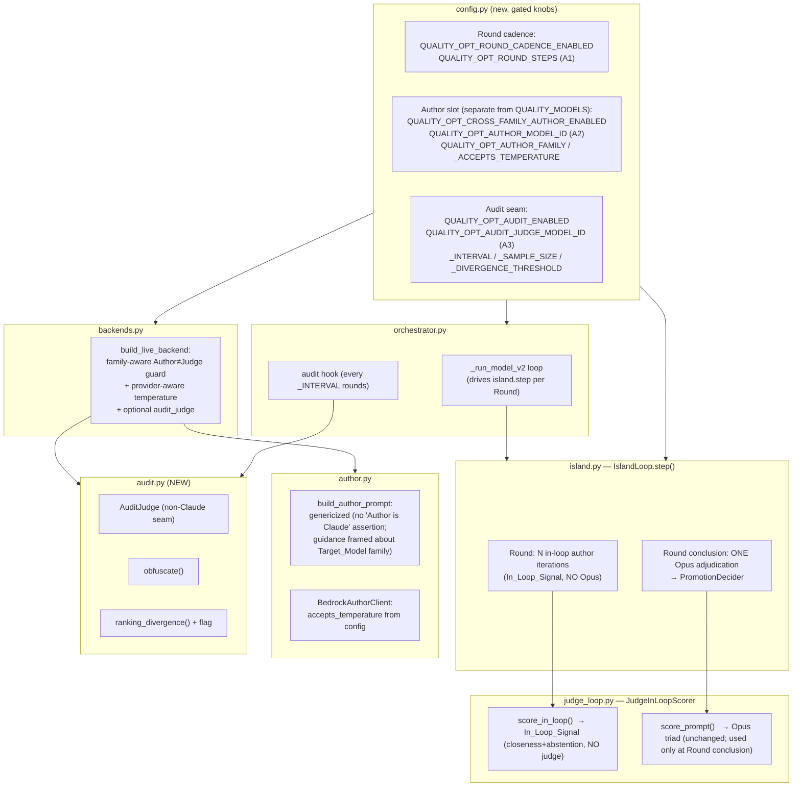
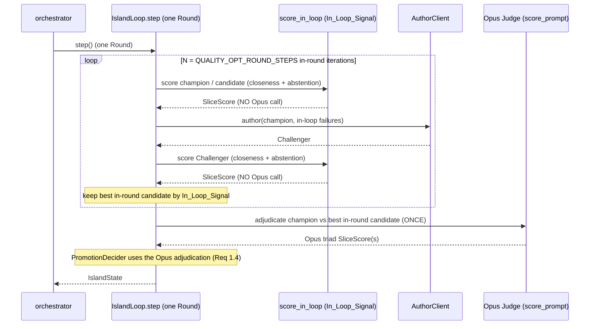

# Design Document

## Overview

This feature makes three coupled, additive, config-gated changes to the existing closed-loop
prompt optimizer under `bakeoff/quality/optimizer/`. It does **not** introduce a new
subsystem, replace the Opus Judge role, or touch the held-constant retrieval substrate, the
Phase A / Phase B boundary, the Bedrock credential chain, or any listener binding. Every new
behavior is reachable only when its configuration flag is on, so a run with the flags at their
defaults behaves exactly as today (Req 4.2).

The three changes, mapped to the requirements:

1. **Corrected loop cadence (Req 1).** Today `JudgeInLoopScorer.score_prompt`
   (`judge_loop.py`) calls the real Opus judge (`judge_scorer.score_detailed`) for *every turn
   of every conversation*, for *both* the Champion and the Challenger, on *every*
   `IslandLoop.step()`. Opus is in the per-iteration hot loop. The corrected cadence groups
   author self-iteration into a **Round**: within a Round the Author rewrites and is scored
   `QUALITY_OPT_ROUND_STEPS` times using a cheap **In_Loop_Signal** that never calls Opus, and
   the Opus Judge adjudicates **once**, at the Round's conclusion, to decide promotion.

2. **Non-Anthropic Author with family-aware separation (Req 2).** The Author model id is
   resolved from a configuration slot that is **separate** from `config.QUALITY_MODELS` (the
   deploy-target roster). The Author≠Judge guard in `backends.build_live_backend` is made
   **family-aware** (today it is identity-only and would happily pass a Sonnet author against
   an Opus judge — both Anthropic). `BedrockAuthorClient` temperature handling becomes
   **provider-aware** (driven by config, not the fixed `accepts_temperature=False` Claude
   assumption). `build_author_prompt` is genericized so it no longer asserts the Author is a
   Claude 4.x model and frames the embedded `PROMPTING_GUIDANCE` as guidance about the
   **Target_Model** family.

3. **Cross-family audit seam (Req 3).** A new, optional `audit.py` adds a periodic non-Claude
   **Audit_Judge** that re-scores the current winner on a sample of conversations at a
   configurable interval, applies light authorship/style **obfuscation** to the material before
   scoring, computes a **divergence** measure between the proxy (Opus) ranking and the audit
   ranking, and **flags a potential self-preference condition** when the divergence exceeds a
   configurable threshold. No such seam exists today.

### Scope and posture

This is a throwaway local research harness. The design deliberately prefers minimal, surgical
edits to the existing modules (`judge_loop.py`, `island.py`, `backends.py`, `author.py`,
`config.py`, `orchestrator.py`) plus one small new module (`audit.py`) over any new
subsystem. The work is sized to the three changes above and nothing more — GEPA,
Bradley-Terry ranking, and a sequestered holdout vault remain out of scope and live in other
specs.

### Sourcing and honesty

- The techniques this feature leans on — removing the expensive judge from the inner loop in
  favor of a cheap proxy signal, cross-family / cross-model evaluation, authorship
  obfuscation, and a proxy-vs-audit divergence check as a self-preference (Goodhart) detector
  — are grounded in **external / industry** sources (`docs/solo-model-prompt-iteration.md` and
  the GEPA / RAGAS / self-preference literature it cites). They are **not** Amazon-internal
  guidance, and **no Amazon-internal primary source applies** to this local harness. They are
  not presented here as Amazon-blessed.
- Bedrock model availability could **not** be verified in this session (a live
  `aws bedrock list-inference-profiles` against the `alpha` profile failed with
  `ExpiredTokenException`). Every specific non-Anthropic model id below — the Author (A2) and
  the Audit_Judge (A3) — is therefore treated as a **config-driven placeholder to confirm at
  implementation time**, never as a verified fact. The design does not hardcode any unverified
  id and does not assert any specific model is available on Bedrock.

## Architecture

### Where the changes land



### Round cadence (corrected) vs. today



The key inversion: the expensive Opus triad moves from "twice per iteration" to "once per
Round." The In_Loop_Signal drives the Author's fast self-iteration; Opus only adjudicates the
candidate the Round actually puts forward.

### The In_Loop_Signal

The cheap per-iteration signal reuses machinery already wired into the backend bundle: the
`closeness_scorer` (a `TurnClosenessScorer` over embeddings) and the pure `REFUSAL`
abstention heuristic already used in `judge_loop._judge_turn`. `score_in_loop` runs the same
generate → held-constant-retrieve → closeness path as `score_prompt` but **skips the
`judge_scorer.score_detailed` call entirely** (Req 1.2). Per-turn `overall` is derived from
the closeness composite blended with the same abstention reward term (the `REFUSAL` match on
insufficient/unanswerable turns) so that `select_failures` can still order the Author's
driving failures (answering-when-unsure first, then worst-first) without Opus.

Design decision — closeness as the in-round navigator, Opus as the adjudicator. The existing
sibling spec holds that the Opus triad is the sole **promotion-decision** metric and closeness
is a non-deciding secondary cross-check. This design preserves that: closeness/abstention
guides the Author's *within-Round* self-iteration and selects which candidate is put forward,
but the **promotion decision is still made by the Opus adjudication at the Round's conclusion**
(Req 1.3 / 1.4). Closeness never decides a promotion. The residual risk is that the cheap
proxy may put forward a candidate Opus then declines to promote — which is acceptable: that
Round simply yields no promotion, exactly as a non-improving iteration does today.

### Non-regression gating

Each change is behind its own flag, all defaulting off:

- `QUALITY_OPT_ROUND_CADENCE_ENABLED=False` → `IslandLoop.step()` keeps its current
  single-iteration, Opus-scored behavior. When on, a `step()` runs a full Round.
- `QUALITY_OPT_CROSS_FAMILY_AUTHOR_ENABLED=False` → the Author resolves to today's default
  (Sonnet 4.6 from `QUALITY_MODELS`) and the **identity-only** Author≠Judge guard remains. When
  on, the Author resolves from the separate slot and the **family-aware** guard applies.
- `QUALITY_OPT_AUDIT_ENABLED=False` → no Audit_Judge is built and the orchestrator audit hook
  is a no-op. When on, the audit seam runs at its configured interval.

This reconciles Req 2.4 (family guard) with Req 4.2 (non-regression): the family-aware guard is
part of the cross-family-author feature. With the feature on and a properly configured
non-Anthropic Author, the guard passes; if the feature is on but the configured Author is still
a Claude id (same family as the Opus Judge), the guard correctly halts startup — which is
exactly the safety this feature adds.

## Components and Interfaces

### 1. `judge_loop.py` — add the In_Loop_Signal scorer (Req 1.1, 1.2)

Add a sibling scoring method to `JudgeInLoopScorer` that produces a `SliceScore` of the same
shape as `score_prompt`, but computed **without invoking the judge**:

```python
async def score_in_loop(
    self,
    *,
    model: str,
    instruction: str,
    items: Sequence,
    prompt_role: str,
    max_concurrency: Optional[int] = None,
) -> SliceScore:
    """Score `instruction` using only the In_Loop_Signal — never the Judge (Req 1.2).

    Mirrors `score_prompt`'s generate + held-constant retrieval + closeness path, but
    derives each TurnVerdict.overall from the closeness composite blended with the same
    abstention reward used on the judge path, and does NOT call `judge_scorer`. Returns a
    SliceScore so `select_failures`, `PromotionDecider`, and aggregation are reused
    unchanged. The judge attribute on the backend is not touched on this path.
    """
```

Implementation notes:
- Factor the per-turn body so the only difference between the judge path and the in-loop path
  is whether `self._backend.judge_scorer.score_detailed(...)` is called. On the in-loop path,
  `TurnVerdict.dimensions` is populated from the closeness components (so `select_failures`
  ordering remains meaningful) and `overall` uses the existing abstention-weighting branch with
  the closeness composite standing in for the triad mean.
- Retrieval stays held-constant and memoized (Req 4.3): both the in-loop path and the
  concluding judge path call the same injected `retrieval` backend, so Champion and Challenger
  receive byte-identical fragments per `(turn-query)`.
- No change to the duck-typed backend contract; `score_in_loop` reads only
  `answer_adapter_factory`, `closeness_scorer`, and `retrieval`.

### 2. `island.py` — group iterations into a Round (Req 1.1, 1.3, 1.4, 1.5)

When `QUALITY_OPT_ROUND_CADENCE_ENABLED` is on, `IslandLoop.step()` runs one **Round** rather
than one author→Opus→Opus iteration, keeping its external contract (returns `IslandState`,
emits the same events) so the orchestrator is unchanged:

```
step():  # one Round when cadence enabled
  best_candidate = champion
  best_in_loop   = score_in_loop(champion)            # In_Loop_Signal baseline (NO Opus)
  for _ in range(QUALITY_OPT_ROUND_STEPS):            # Req 1.5: configurable count
      failures   = select_failures(best_in_loop)
      challenger = author(best_candidate, failures)    # Author self-iterates in-Round
      if usable:
          cand_in_loop = score_in_loop(challenger)     # In_Loop_Signal (NO Opus, Req 1.1/1.2)
          if cand_in_loop.triad_score > best_in_loop.triad_score:
              best_candidate, best_in_loop = challenger, cand_in_loop
  # --- Round conclusion: the ONE Opus adjudication (Req 1.3) ---
  champ_opus = score_prompt(champion)                  # Opus (cached across Round if unchanged)
  cand_opus  = score_prompt(best_candidate) if best_candidate != champion else champ_opus
  promoted   = PromotionDecider.decide(champ_opus, cand_opus, usable=...)  # Req 1.4
  update champion/counters; emit events
```

- `QUALITY_OPT_ROUND_STEPS` is the Author-iterations-per-Round knob (Assumption A1). The Round
  conclusion always performs exactly one Opus adjudication of the candidate put forward (plus
  the champion baseline, cached while the champion is unchanged within the Round).
- When the gate is off, `step()` is byte-for-byte the current behavior (legacy path retained).
- The per-island stance injection (`_augment_with_stance` / `_strip_stance`) is unchanged and
  wraps the in-Round author calls exactly as today.

### 3. `backends.py` — family-aware guard, provider-aware author, optional audit judge (Req 2.1, 2.3–2.7, 3.1)

Add a small family resolver and make the guard family-aware:

```python
def model_family(model_id: str, *, declared: Optional[str] = None) -> str:
    """Return the provider/lineage token for a Bedrock model id.

    Uses `declared` when provided (config-declared family, since A2/A3 ids are
    placeholders to confirm); otherwise infers from the id's provider segment in the
    Bedrock `[region.]provider.model` convention (e.g. `us.anthropic.claude-opus-4-8`
    → "anthropic"). Lower-cased; never raises.
    """


class AuthorJudgeFamilyConflictError(AuthorJudgeConflictError):
    """Author Family equals Judge Family (Req 2.4). Subclass of the existing identity
    conflict so existing callers that catch AuthorJudgeConflictError still catch this."""
```

`build_live_backend` changes (all gated on `QUALITY_OPT_CROSS_FAMILY_AUTHOR_ENABLED`):
- **Author resolution from a separate slot (Req 2.1):** when the gate is on, resolve the Author
  id from `config.QUALITY_OPT_AUTHOR_MODEL_ID` (A2) rather than from `QUALITY_MODELS`. When off,
  keep `_default_author_model()` (Sonnet from `QUALITY_MODELS`).
- **Family-aware guard (Req 2.3 / 2.4):** compute the Author family (from
  `QUALITY_OPT_AUTHOR_FAMILY` or inferred) and the Judge family (from `config.JUDGE_MODEL_ID`,
  i.e. "anthropic"). If equal, raise `AuthorJudgeFamilyConflictError` and refuse to start. When
  the cross-family gate is off, retain today's identity-only check (non-regression).
- **Provider-aware temperature (Req 2.5–2.7):** pass
  `accepts_temperature=config.QUALITY_OPT_AUTHOR_ACCEPTS_TEMPERATURE` and
  `temperature=config.QUALITY_OPT_AUTHOR_TEMPERATURE` into `BedrockAuthorClient` instead of
  relying on the fixed `False` default.
- **Optional audit judge (Req 3.1):** when `QUALITY_OPT_AUDIT_ENABLED` is on, build an
  `AuditJudge` (from `audit.py`) bound to `QUALITY_OPT_AUDIT_JUDGE_MODEL_ID` (A3) via the same
  lazy, injectable `client_factory` pattern, and expose it on the backend bundle as an optional
  `audit_judge` field. When off, the field is `None` and nothing is built.

`OptimizerBackend` gains one optional field:

```python
audit_judge: "Optional[AuditJudge]" = None   # non-Claude Audit_Judge seam (Req 3.1); None when disabled
```

The field is optional and defaults to `None`, so the duck-typed contract `JudgeInLoopScorer`
relies on is unaffected.

### 4. `author.py` — genericize the contract and temperature (Req 2.5–2.9)

- `build_author_prompt`: remove the framing that the Author is itself a Claude 4.x model. The
  task statement is written provider-neutrally (Req 2.8). The `PROMPTING_GUIDANCE` block is
  introduced explicitly as guidance about the **Target_Model** family — the family of the
  model whose prompt is being optimized — rather than as a description of the Author (Req 2.9).
  The docstring's "the Author is itself a Claude 4.x model" note is replaced with a
  provider-neutral statement; the calm/declarative phrasing guidance is reframed as a property
  of the Target_Model family.
- `BedrockAuthorClient`: no structural change — it already accepts `accepts_temperature` and
  omits `temperature` from `inferenceConfig` when false. The value is now supplied by
  `build_live_backend` from config (Req 2.7) rather than left at the Claude-specific default.

### 5. `audit.py` (NEW) — Audit_Judge, obfuscation, divergence (Req 3.1–3.5)

A single small module holding the audit seam. All functions that can be pure are pure (no I/O)
so they are exhaustively property-testable; the only I/O is the Audit_Judge Bedrock call, built
lazily through an injectable `client_factory` exactly like `BedrockAuthorClient`.

```python
class AuditJudge:
    """A non-Claude Bedrock judge used only for periodic auditing (Req 3.1).

    Mirrors BedrockAuthorClient's lazy client + credential-resilience posture (reuses the
    existing Bedrock credential chain; introduces no new secrets, Req 4.5). The model id is
    config-driven (QUALITY_OPT_AUDIT_JUDGE_MODEL_ID, A3) and treated as a placeholder to
    confirm at implementation time."""
    audit_model: str
    async def score_sample(self, samples: Sequence["AuditItem"]) -> list[float]: ...


def obfuscate(material: str) -> str:
    """Light authorship/style obfuscation applied to material BEFORE it reaches the
    Audit_Judge (Req 3.3): strip/neutralize authorship and house-style markers (e.g.
    model-name mentions, signature section headers, stance sentinels) so the Audit_Judge
    grades content, not provenance. Pure and idempotent: obfuscate(obfuscate(x)) ==
    obfuscate(x)."""


def ranking_divergence(proxy_scores: Sequence[float], audit_scores: Sequence[float]) -> float:
    """Normalized rank-disagreement between the proxy (Opus) ranking and the Audit ranking
    over the same N items (Req 3.4). Returns a value in [0.0, 1.0]: 0.0 when the two induce
    the same order, 1.0 when fully reversed. Pure; symmetric; identity-zero. Implemented as
    the normalized Kendall-tau distance (fraction of discordant pairs)."""


def evaluate_self_preference(
    proxy_scores: Sequence[float],
    audit_scores: Sequence[float],
    *,
    threshold: float = config.QUALITY_OPT_AUDIT_DIVERGENCE_THRESHOLD,
) -> "DivergenceReport":
    """Compute divergence and flag a potential self-preference condition iff it exceeds the
    configurable threshold (Req 3.5)."""


class AuditSeam:
    """Owns the interval cadence (Req 3.2). `maybe_run(round_index, winner, sample)` runs an
    audit when `round_index` lands on the configured QUALITY_OPT_AUDIT_INTERVAL, obfuscates
    each sampled conversation's material, scores it with the AuditJudge, and returns a
    DivergenceReport (or None when this round is not an audit round / the seam is disabled)."""
```

### 6. `orchestrator.py` — wire the audit hook (Req 3.2)

In `_run_model_v2`, after the Round/tournament bookkeeping, call the audit seam at the
configured interval when `QUALITY_OPT_AUDIT_ENABLED` is on:

```python
report = await self._audit_seam.maybe_run(
    round_index=budget.current_round,
    winner=best_island_state,
    sample=draw_audit_sample(tuning, k=config.QUALITY_OPT_AUDIT_SAMPLE_SIZE),
)
if report is not None and report.flagged:
    self._emitter.audit_flag(model=model, round=budget.current_round, report=report.to_dict())
```

The hook is a no-op when the seam is disabled. No new listener or network binding is
introduced (Req 4.6); the audit reuses the existing Bedrock credential chain (Req 4.5). The
Phase A tuning-slice / Phase B validation boundary is untouched — the audit samples only from
the Phase A tuning slice (Req 4.4).

## Data Models

New, additive config (in `config.py`; all gates default off so behavior is unchanged):

```python
# --- Req 1: corrected loop cadence ----------------------------------------
QUALITY_OPT_ROUND_CADENCE_ENABLED: bool = False   # gate; off → legacy per-step Opus behavior
QUALITY_OPT_ROUND_STEPS: int = 6                  # A1 PLACEHOLDER to confirm — Author iterations per Round

# --- Req 2: non-Anthropic Author, separate slot ---------------------------
QUALITY_OPT_CROSS_FAMILY_AUTHOR_ENABLED: bool = False   # gate; off → today's Sonnet author + identity guard
QUALITY_OPT_AUTHOR_MODEL_ID: Optional[str] = None       # A2 PLACEHOLDER (non-Anthropic Bedrock id) — confirm
QUALITY_OPT_AUTHOR_FAMILY: Optional[str] = None         # A2 declared family for the guard (e.g. "amazon"/"meta")
QUALITY_OPT_AUTHOR_ACCEPTS_TEMPERATURE: bool = False    # A2 provider temperature behavior — confirm
QUALITY_OPT_AUTHOR_TEMPERATURE: float = 0.2             # sent only when _ACCEPTS_TEMPERATURE is True

# --- Req 3: cross-family audit seam ---------------------------------------
QUALITY_OPT_AUDIT_ENABLED: bool = False                 # gate
QUALITY_OPT_AUDIT_JUDGE_MODEL_ID: Optional[str] = None  # A3 PLACEHOLDER (non-Claude Bedrock id) — confirm
QUALITY_OPT_AUDIT_JUDGE_FAMILY: Optional[str] = None    # A3 declared family
QUALITY_OPT_AUDIT_INTERVAL: int = 3                     # PLACEHOLDER — audit every N rounds — confirm
QUALITY_OPT_AUDIT_SAMPLE_SIZE: int = 12                 # PLACEHOLDER — conversations re-scored per audit — confirm
QUALITY_OPT_AUDIT_DIVERGENCE_THRESHOLD: float = 0.3     # PLACEHOLDER — flag above this — confirm
```

Notes on Assumption A1: `QUALITY_OPT_ROUND_STEPS` is introduced as a **new** knob rather than
reusing `QUALITY_OPT_ISLAND_RUNG_PATIENCE` (=2), because per-rung patience and
Author-iterations-per-Round are distinct concepts; the default `6` reflects the user's "six
terms" remark and the existing `QUALITY_OPT_TOURNAMENT_EVERY_ITERS=6`, but it is a placeholder
to confirm. All A2/A3 model ids are `None`/placeholder by default and must be confirmed against
a live Bedrock check at implementation time; nothing in the loop hardcodes an unverified id.

New result types (in `audit.py`):

```python
@dataclass(frozen=True)
class AuditItem:
    """One sampled conversation's material to audit (post-obfuscation), plus the proxy
    (Opus) score the in-loop study already assigned it."""
    item_id: str
    obfuscated_material: str
    proxy_score: float

@dataclass(frozen=True)
class DivergenceReport:
    """The outcome of one audit (Req 3.4 / 3.5)."""
    n_items: int
    proxy_scores: tuple[float, ...]
    audit_scores: tuple[float, ...]
    divergence: float          # ranking_divergence(...) in [0,1]
    threshold: float
    flagged: bool              # divergence > threshold (Req 3.5)
    def to_dict(self) -> dict: ...
```

The `OptimizerBackend` dataclass gains one optional field (`audit_judge: Optional[AuditJudge] =
None`); `TurnVerdict` / `SliceScore` are unchanged (the in-loop path reuses them).

## Correctness Properties

*A property is a characteristic or behavior that should hold true across all valid executions
of a system — essentially, a formal statement about what the system should do. Properties
serve as the bridge between human-readable specifications and machine-verifiable correctness
guarantees.*

The properties below are derived from the acceptance criteria prework. Several criteria were
classified as example, smoke, or non-regression checks rather than universal properties and
are covered in the Testing Strategy instead: Req 2.1 / 3.1 (config-slot wiring), Req 2.2
(unverified A2 availability), Req 2.8 / 2.9 (contract string-framing), Req 4.1 / 4.2
(gating / non-regression), Req 4.3 (held-constant retrieval on the in-loop path), Req 4.4
(phase boundary), and Req 4.5 / 4.6 / 4.7 (credential reuse, listener binding, JS tooling).

### Property 1: Round cadence keeps the Judge out of the in-round loop

*For any* configured number of Author iterations per Round `N >= 0` and any non-empty slice of
items, running one Round (`IslandLoop.step()` with the round cadence enabled) invokes the
Author exactly `N` times, scores every in-round candidate using only the In_Loop_Signal
(closeness + abstention) with **zero** Judge invocations during the in-round iterations, and
invokes the Judge only at the Round's conclusion, with a Judge-invocation count that is bounded
and independent of `N` (it does not grow as `N` grows).

**Validates: Requirements 1.1, 1.2, 1.3, 1.5**

### Property 2: Promotion is decided by the Round-conclusion Judge adjudication

*For any* champion and candidate whose In_Loop_Signal ordering is deliberately set to disagree
with their Opus (Round-conclusion) ordering, the Round's promotion outcome equals
`PromotionDecider.decide(champion_opus_score, candidate_opus_score, threshold, usable=...)` —
i.e. the decision follows the concluding Judge adjudication and never the In_Loop_Signal.

**Validates: Requirements 1.4**

### Property 3: Family-aware Author≠Judge guard

*For any* pair of (Author family, Judge family) tokens, building the live backend with the
cross-family Author feature enabled raises `AuthorJudgeFamilyConflictError` **iff** the two
families are equal, and otherwise constructs the backend without raising.

**Validates: Requirements 2.3, 2.4**

### Property 4: Provider-aware temperature handling

*For any* configured `accepts_temperature` flag, the Bedrock request the Author issues includes
the `temperature` field in its `inferenceConfig` **iff** the flag is `True`, and omits it
otherwise — the handling follows the configured provider flag for both values rather than a
fixed Claude assumption.

**Validates: Requirements 2.5, 2.6, 2.7**

### Property 5: Audit runs on the configured interval

*For any* audit interval `K >= 1` and any number of rounds, with the audit seam enabled
`AuditSeam.maybe_run(round_index, ...)` returns a `DivergenceReport` exactly on the rounds where
the configured cadence fires and `None` on every other round (and always `None` when the seam is
disabled).

**Validates: Requirements 3.2**

### Property 6: Material is obfuscated before it reaches the Audit_Judge

*For any* material string, `obfuscate` removes all known authorship/style markers (the result
contains none of them), is idempotent (`obfuscate(obfuscate(x)) == obfuscate(x)`), and the audit
path always submits obfuscated material to the Audit_Judge — the Audit_Judge never receives a
raw, un-obfuscated marker.

**Validates: Requirements 3.3**

### Property 7: Ranking-divergence measure is well-formed

*For any* two equal-length score vectors, `ranking_divergence` returns a value in `[0.0, 1.0]`,
returns `0.0` when the two vectors induce the same ordering (in particular
`ranking_divergence(x, x) == 0.0`), is symmetric (`divergence(a, b) == divergence(b, a)`), and
returns `1.0` for a fully reversed ordering.

**Validates: Requirements 3.4**

### Property 8: Self-preference flag fires iff divergence exceeds the threshold

*For any* two equal-length score vectors and any threshold, `evaluate_self_preference` flags a
potential self-preference condition **iff** the computed divergence is strictly greater than the
threshold (`report.flagged == (report.divergence > threshold)`).

**Validates: Requirements 3.5**

## Error Handling

- **Family conflict (Req 2.4).** With the cross-family Author feature enabled, if the resolved
  Author family equals the Judge family, `build_live_backend` raises
  `AuthorJudgeFamilyConflictError` (a subclass of the existing `AuthorJudgeConflictError`)
  **before** building any Bedrock client, so the run refuses to start rather than silently
  optimizing with a same-family Author and Judge. The error message names the resolved Author
  id/family and the Judge id/family and points at `QUALITY_OPT_AUTHOR_MODEL_ID` /
  `QUALITY_OPT_AUTHOR_FAMILY`.
- **Missing Author id when the feature is on.** If `QUALITY_OPT_CROSS_FAMILY_AUTHOR_ENABLED` is
  on but `QUALITY_OPT_AUTHOR_MODEL_ID` is unset, the builder raises a clear configuration error
  (the A2 id is a placeholder that must be confirmed); it does **not** silently fall back to the
  Claude default, since that would defeat the feature.
- **Audit_Judge call failures.** The `AuditJudge` reuses the same
  `bakeoff.resilience.call_with_resilience` posture as `BedrockAuthorClient`: an auth-expiry
  rebuilds the client from a fresh credential chain and retries; throttle/transient errors back
  off and retry; permanent errors propagate. Because the audit is an **observability** seam (it
  only flags), an unrecoverable audit failure is logged and the audit for that round is skipped
  (returning `None`) rather than aborting the optimizer run — the audit must never be able to
  fail the study it is observing.
- **Degenerate divergence inputs.** `ranking_divergence` over empty or single-element vectors
  (no pairs to compare) returns `0.0` (no disagreement), and `evaluate_self_preference`
  therefore does not flag — a degenerate sample never raises and never produces a spurious
  self-preference flag.
- **In_Loop_Signal degeneracy.** `score_in_loop` reuses the existing `_mean` "no resolvable
  signal → 0.0" discipline, so an empty slice or a conversation with no turns flows through to a
  well-defined `0.0` In_Loop_Signal rather than raising, exactly as `score_prompt` does today.
- **Non-usable Challenger within a Round.** An empty/whitespace or champion-identical Author
  output is `usable=False` and is never scored or put forward; if every in-round iteration is
  non-usable, the Round concludes with the champion as its own candidate and `PromotionDecider`
  returns no promotion (a non-improving Round), preserving today's Req 3.5 semantics.

## Testing Strategy

### Dual approach

- **Unit / example tests** cover the specific wiring, string-framing, and non-regression
  checks that are not universal properties.
- **Property-based tests** cover the eight universal properties above.

Both are necessary: the property tests verify the cadence, guard, temperature, audit cadence,
obfuscation, and divergence logic across the whole input space, while the example tests pin the
exact config seams and the genericized contract text.

### Property-based testing

PBT **is** appropriate for this feature: the divergence measure, obfuscation, family
resolution/guard, temperature request-shaping, audit-interval scheduling, and Round cadence are
pure functions or deterministic logic with clear input/output behavior and a large input space
(score vectors, family tokens, text, interval/round counts, round-step counts). The Round
cadence and "promotion follows the Judge" properties are made pure by injecting call-counting
**spy/fake** judge, closeness, and author clients (zero network), exactly as the existing
optimizer PBT suite injects fakes.

- **Library:** Hypothesis (already a project dependency, `requirements.txt`:
  `hypothesis>=6.100`), consistent with the existing
  `bakeoff/tests/test_quality_optimizer_pbt.py`. Property-based testing is **not** implemented
  from scratch.
- **Iterations:** each property test runs `@settings(max_examples=...)` at **>= 100** examples
  (the existing suite uses 100–200), matching the established convention.
- **Tagging:** each property test carries a comment tag referencing its design property, in the
  established format:
  `# Feature: optimizer-cross-family-eval, Property {number}: {property_text}`
  plus the `Validates: Requirements X.Y` reference.
- **One test per property:** each of the eight correctness properties is implemented by a single
  property-based test. The new tests live alongside the existing optimizer PBT suite (a new
  module, e.g. `bakeoff/tests/test_cross_family_eval_pbt.py`, so they do not disturb the
  existing numbered properties).

Mapping of properties to test targets:
- Property 1 / 2 → `IslandLoop.step()` (round cadence on) with spy judge/author/closeness over
  the offline backend.
- Property 3 → `backends.build_live_backend` with injected fakes and randomized author/judge
  family tokens.
- Property 4 → `BedrockAuthorClient._invoke_stream_sync` request capture via a fake client over
  randomized `accepts_temperature`.
- Property 5 → `audit.AuditSeam.maybe_run` over randomized interval and round counts.
- Property 6 → `audit.obfuscate` and the `AuditSeam` material path.
- Property 7 / 8 → `audit.ranking_divergence` and `audit.evaluate_self_preference` over
  randomized score vectors and thresholds.

### Example / unit and non-regression tests

- **Req 2.1 / 3.1 (config-slot wiring):** with the gates on and sentinel ids, assert the Author
  client and `backend.audit_judge` carry the ids from the separate slots (not from
  `QUALITY_MODELS`).
- **Req 2.8 / 2.9 (genericized contract):** render `build_author_prompt` and assert it contains
  no assertion that the Author is a Claude/Claude-4.x model and frames `PROMPTING_GUIDANCE` as
  guidance about the Target_Model family.
- **Req 4.2 / 4.1 (gating / non-regression):** with all gates off, assert `IslandLoop.step()`
  uses the legacy per-step Opus path, the Author resolves to the Sonnet default with the
  identity-only guard, and `backend.audit_judge is None`.
- **Req 4.3 (held-constant retrieval on the in-loop path):** assert two instructions scored via
  `score_in_loop` over the same items receive byte-identical fragments (the in-loop path uses
  the same memoized retrieval backend), reusing the existing held-constant-retrieval check.
- **Req 4.4 (phase boundary):** assert the audit sample is drawn only from the Phase A tuning
  slice and `phase_a_split` is unchanged.
- **Req 2.2 / 4.5 / 4.6 / 4.7 (smoke / confirm-at-implementation):** the A2/A3 model ids are
  confirmed against a live Bedrock check at implementation time (not asserted as fact here); the
  `AuditJudge` builds via the existing broker-backed credential chain with no new secret; no new
  network listener is introduced; no JavaScript tooling is involved.

### What is deliberately not property-tested

- The specific availability of the A2 Author id and the A3 Audit_Judge id on Bedrock (Req 2.2):
  these are unverified assumptions to confirm, not code logic — a single confirmation check at
  implementation time, not a 100-iteration property.
- The real Opus / Audit_Judge Bedrock responses: integration concerns covered by the existing
  live-path tests with injected fakes; this feature adds no new always-on network behavior.
