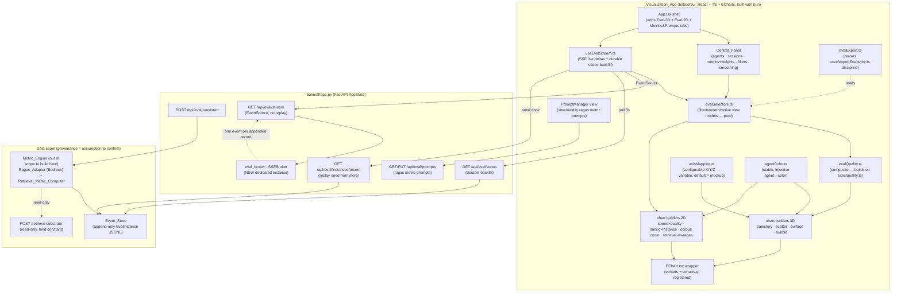

# Design Document: Ragas Eval Visualization Dashboard

## Relationship to the requirements document

This is a **design-first** artifact, but a thorough `requirements.md` already exists
for this spec (it was started requirements-first). Rather than discard that work, this
design is written to be **consistent with and traceable to** those requirements: every
Correctness Property below cites the requirement(s) it validates (Req 1–21, where Req
16–21 are the prompt-management / export / cross-cutting-invariant areas named in the
requirements introduction). Nothing in `requirements.md` is changed by this document.

The `.config.kiro` `workflowType` was set to `design-first` per the task that produced
this document; the pre-existing `specId` was preserved so no spec identity is churned.

---

## Sourcing & internal-guidance honesty (read first)

The global steering rule `prefer-rigor-and-internal-best-practices.md` requires that
non-trivial choices — here, library/pattern selection (ECharts vs. a dedicated 3D
library) and RAG-evaluation methodology (the ragas metric catalog, NDCG, the weighted
quality composite) — be grounded in current **Amazon-internal** primary sources
(BuilderHub `docs.hub.amazon.dev`, internal code search `code.amazon.com`, AWS
Prescriptive Guidance) consulted through the internal search tools.

**Those internal search tools are not available in this execution environment.** Per the
rule's "When Searches Return Nothing Authoritative" clause:

- The **3D-library decision** (`echarts-gl`) was grounded against the **external** Apache
  ECharts / echarts-gl project (`github.com/ecomfe/echarts-gl`; npm notes "ECharts GL 2.x
  is compatible with ECharts 5"). This is an external OSS source, not Amazon-internal
  guidance.
- The **evaluation methodology** (ragas metric families, precision@k / recall@k / NDCG,
  the weighted composite) is **general industry practice, not Amazon-internal guidance**,
  exactly as `requirements.md` already flags. Requirement 20 (sourcing honesty) makes
  this a product obligation: the dashboard must label these signals as external/industry
  methodology wherever a metric value is shown or exported. The existing
  `exec/exportSnapshot.ts` already carries this caveat in its exported footer, and this
  design reuses that discipline.

No internal source is cited as backing for any choice here, because none could be
consulted. Before any number from this dashboard defends a decision to an Amazon
audience, the metric and weighting choices should be re-validated against internal
guidance.

---

## Overview

The Ragas Eval Visualization Dashboard is a multi-tab, interactive web application whose
job is **visualization, not computation**: it renders a comparison of **N ≥ 3 agents**
(concretely four: A/B/C/D) across **two dimensions — latency (speed) and quality** — over
**many instances/sessions**, in both real-time 2D and real-time 3D. Quality is a
user-configurable **composite of ragas-style metrics**; latency matters, but the user has
stressed repeatedly that **correctness of the displayed data matters more**. That priority
is encoded directly into the Correctness Properties section (determinism, range-clamping,
point-record bijection, durable reconstruction) and mapped to requirements.

The dashboard is **built on the existing `bakeoff/ui` React 18.3 + TypeScript 5.6 + Vite
5.4 + ECharts 5.5.1 project**, managed exclusively with **bun** (`bun add`,
`bun run build`). It reuses, rather than reinvents, the established assets: the strictly
typed `EChart.tsx` wrapper, the SSE-hook + durable-backfill pattern proven in
`useOptimizerV2Stream.ts` / `useSnapshot.ts`, the typed `client.ts` / `types.ts` seam, the
multi-tab `App.tsx` shell, the existing composite-quality logic in `exec/quality.ts`, the
export logic in `exec/exportSnapshot.ts`, and the dark-console theme tokens in
`styles/theme.css`. On the backend it follows the **dedicated-broker discipline**
established by the optimizer-v2 work in `bakeoff/app.py`: a new feature gets its **own**
`SSEBroker` instance plus its own `/start`, `/status`, `/stream` endpoints, and the
**status endpoint provides durable backfill** so a reload never blanks the surface and
charts always reconstruct from the status poll rather than depending solely on the
no-replay stream.

The dashboard **visualizes eval data; it does not necessarily compute it**. The
"eval-instance" record is an explicit data contract (below). Where the per-instance ragas
and retrieval scores originate — the existing optimizer/judge stores, a new ragas eval
runner, or a fed JSONL file — is named as an **integration seam and an assumption to
confirm** (see Dependencies and Out of Scope), consistent with how the repo's other specs
treat provenance.

### Two discrepancies resolved explicitly in this design

1. **3D axis mapping.** The user's earlier prose mapped X=session, Y=latency, Z=quality;
   the authoritative refined mockup maps **X=Latency (ms, log), Y=Quality (0..1),
   Z=Instance Index / time**. This design makes the axis→variable assignment
   **configurable** and **defaults to the mockup's mapping**. See "Axis-mapping decision".
2. **3D library.** No 3D library is currently installed. ECharts 5.x renders 3D
   (`scatter3D`, `line3D`, `surface`) only via the separate `echarts-gl` extension. This
   design **recommends `echarts-gl`** and neutrally records the heavier alternatives. See
   "3D-library decision".

---

## Architecture

### Component map



The Visualization_App is a pure function of the recorded data: every value it shows is
derived from the Event_Store (seeded via `/api/eval/instances/recent`), the Status_Endpoint
(`/api/eval/status`, the durable-backfill authority), and incremental Stream_Channel deltas
(`/api/eval/stream`). The Metric_Engine / Ragas_Adapter / Retrieval_Metric_Computer that
populate the store are **named as a dependency and assumption**, not designed here.

### Real-time data flow (durable backfill + no-replay stream)

```mermaid
sequenceDiagram
    participant UI as Visualization_App
    participant ST as GET /api/eval/status
    participant RC as GET /api/eval/instances/recent
    participant SS as GET /api/eval/stream (SSE)
    participant BR as eval_broker (SSEBroker)
    participant STORE as Event_Store

    Note over UI: mount / reload / reconnect
    UI->>RC: seed buffer from durable log (once)
    RC->>STORE: read recent EvalInstance records
    RC-->>UI: { instances, total }
    UI->>ST: durable backfill poll (authoritative full reconstruction)
    ST->>STORE: read + roll up
    ST-->>UI: EvalStatus (lifecycle + reconstructable view state)
    UI->>SS: open EventSource (live deltas only)
    SS->>BR: subscribe()
    Note over STORE,BR: a new Instance lands during a run
    STORE-->>BR: publish("eval_instance_appended", payload)
    BR-->>SS: fan-out to each subscriber
    SS-->>UI: event: eval_instance_appended
    UI->>UI: merge delta into view model (dedupe by instance_id)
    Note over UI: every 3s, re-poll status; reconciled view == stream-built view (P6)
```

This mirrors `App.tsx` (seed once from `/api/trials/recent`, then live stream) and
`useOptimizerV2Stream.ts` (durable status poll every 3s + live SSE deltas merged with
dedupe). The stream is **delta-only and has no replay buffer** (the existing `SSEBroker`
explicitly does not replay to late joiners); the status endpoint is the reconstruction
authority. This is the v2 lesson made a hard property (P6).

---

## Axis-mapping decision (configurable; default = mockup)

The discrepancy between the early prose (X=session, Y=latency, Z=quality) and the
authoritative mockup (X=latency, Y=quality, Z=instance/time) is resolved by treating the
axis→variable assignment as **runtime configuration** with the **mockup as the default**.

| Axis | Default variable (mockup) | Scale | Direction |
| ---- | ------------------------- | ----- | --------- |
| X    | `latency_ms`              | log   | lower is better |
| Y    | `quality_score`           | linear 0..1 | higher is better |
| Z    | `instance_index`          | linear (ordinal) | forward/up = later |

The Control_Panel exposes an axis-mapping control so any of {latency, quality, instance
index, corpus size, a selected raw metric} can be bound to X/Y/Z. The default is fixed to
the mockup mapping so the out-of-the-box view matches the authoritative artifact (Req 10.1,
14.1). The log-scale latency axis defends against zero/negative values (P7).

---

## 3D-library decision (recommend `echarts-gl`)

No 3D library is installed today (`bakeoff/ui/package.json` lists only `echarts` 5.5.1).
ECharts 5.x renders 3D series (`scatter3D`, `line3D`, `surface`) **only** through the
separate `echarts-gl` extension. The options are presented with equal framing; the
recommendation follows, grounded in the only sources available (external/OSS).

- **`echarts-gl` (ECharts 3D extension).** A WebGL extension pack registered alongside
  the existing `echarts` import. Adds `grid3D`, `xAxis3D/yAxis3D/zAxis3D`, and the
  `scatter3D` / `line3D` / `surface` series this design needs. Integrates through the
  existing `EChart.tsx` wrapper with a single side-effect import; no new chart-runtime
  abstraction. npm states "ECharts GL 2.x is compatible with ECharts 5", so the pairing
  is `echarts@5.5.1` + `echarts-gl@^2.0.9`.
- **three.js.** A general-purpose WebGL engine. Maximum rendering control, but it is not a
  charting library: axes, ticks, log scales, tooltips, legends, and data-to-geometry
  mapping would all be hand-built, duplicating what ECharts already gives us.
- **plotly.js.** A charting library with first-class 3D (`scatter3d`, `surface`). Capable
  and ergonomic, but it is a second charting runtime alongside ECharts, a larger bundle,
  and a different option model from every existing chart in `bakeoff/ui`.
- **deck.gl.** A GPU framework for very large point/geo layers. Strong for massive point
  clouds, but oriented to geospatial layers and overkill for four-agent eval scatter; it
  too is a separate runtime and option model.

**Recommendation: `echarts-gl`.** It is the lowest-friction path because the project
already standardizes on ECharts and has the typed `EChart.tsx` wrapper; 3D becomes "more
ECharts series" rather than a second rendering stack, the `EChartsOption` typing keeps a
malformed 3D spec a compile error, and bundle/runtime cost is incremental. The heavier
alternatives (three.js / deck.gl) are justified only if requirements grow beyond charted
3D into bespoke GPU scenes or >100k-point clouds, which is not the case here. This is an
**external OSS** recommendation; no Amazon-internal source backs it (see Sourcing note).

Install (bun only): `bun add echarts-gl@^2.0.9`. Registration is a one-line side-effect
import in `EChart.tsx` (`import "echarts-gl";`) so `grid3D` and the 3D series resolve; no
wrapper API change.

---
## Components and Interfaces

All interfaces are TypeScript (the existing stack). Names follow the requirements glossary.
The data shapes that cross the HTTP seam are added to `bakeoff/ui/src/api/types.ts`; the
pure compute/builders live under a new `bakeoff/ui/src/eval/` directory alongside the
existing `exec/`.

### C1 — `EvalInstance`: the eval-instance data contract (Data Model + seam)

The atomic record. One per `(Agent_Under_Test, query, corpus_size)` execution (Req 5.2,
6.2, 7.1). Retrieval-quality and generation-quality metrics are **separate maps** so they
are never conflated in storage (Req 2.4, 9 / P9). Every metric value is unit-interval
(0..1) and validated/clamped at ingestion (Req 1.3, 2 / P3).

```typescript
// bakeoff/ui/src/api/types.ts (additions)

/** A ragas generation-quality metric name (open string; catalog is data, not a closed enum
 *  — judge-rework / catalog-growth insulation, mirroring the existing types.ts posture). */
export type RagasMetricName =
  | "faithfulness"
  | "answer_relevancy"          // ragas "Response Relevancy"
  | "context_precision"
  | "context_recall"
  | "context_entities_recall"
  | "noise_sensitivity"
  | "context_relevance"         // Nvidia family
  | "answer_accuracy"           // Nvidia family
  | "response_groundedness"     // Nvidia family
  | "factual_correctness"
  | "semantic_similarity"
  | (string & {});              // forward-compat: unknown catalog metrics still type

/** A retrieval-quality metric computed from gold links — kept DISTINCT from ragas. */
export type RetrievalMetricName = "precision_at_k" | "recall_at_k" | "ndcg_at_k";

/** A metric value plus the provenance that makes it reproducible (Req 1.2, 2.2). */
export interface MetricValue {
  /** Unit-interval score; null === unavailable for this instance (Req 1.4, 2.3, 3.5). */
  readonly value: number | null;
  /** True exactly when value === null (the explicit unavailable flag). */
  readonly unavailable: boolean;
  /** For retrieval metrics: the k used (Req 2.2). Absent for ragas metrics. */
  readonly k?: number;
  /** ragas version + Bedrock model id for ragas metrics (Req 1.2); absent for retrieval. */
  readonly ragas_version?: string;
  readonly bedrock_model_id?: string;
}

/** Per-stage timings, kept separate from end-to-end latency (Req 7.3). */
export interface StageTimings {
  readonly retrieval_ms: number | null;
  readonly generation_ms: number | null;
  /** Any additional named stages the runner records (embed, rerank, …). */
  readonly extra_ms?: Readonly<Record<string, number>>;
}

/** The atomic plotted unit. One Instance === exactly one of these (P4 bijection). */
export interface EvalInstance {
  /** Stable unique id — the dedupe + bijection key for rendered points (P4). */
  readonly instance_id: string;
  readonly agent_id: string;                 // Agent_Under_Test (N >= 3 supported)
  readonly session_id: string;               // Session (the progression group)
  readonly instance_index: number;           // strictly increasing within a Session (Req 7.4)
  readonly timestamp: string;                // ISO-8601 capture time
  /** End-to-end response time (ms); the X-axis (log) signal. Validated > 0 (P7). */
  readonly latency_ms: number;
  readonly stage_timings: StageTimings;
  readonly corpus_size: number;              // the Corpus_Size_Sweep axis (Req 6)
  readonly retrieval_cached: boolean;        // cold vs cached never conflated (Req 7.5)
  /** Generation-quality (ragas). Keyed by RagasMetricName; values validated 0..1. */
  readonly ragas: Readonly<Record<string, MetricValue>>;
  /** Retrieval-quality (gold-link). Kept DISTINCT from ragas (Req 2.4 / P9). */
  readonly retrieval: Readonly<Record<string, MetricValue>>;
  /** Bubble-size source candidates (Req 10.5): confidence/volume/cost. */
  readonly confidence: number | null;        // e.g. reranker relevanceScore proxy
  readonly volume: number | null;            // e.g. tokens / fragments
  readonly cost: number | null;              // e.g. estimated $ or token cost
  readonly prompt_id: string | null;         // Control_Panel filter (Req 12.4)
  readonly category: string | null;          // Control_Panel filter (Req 12.4)
  /** Failure status — a failed execution is still a recorded Instance (Req 5.5, 1.4). */
  readonly status: "ok" | "failed";
  readonly error: string | null;
}
```

**Provenance is an assumption to confirm.** The most likely source is the existing
optimizer/judge quality stores (the repo already has ragas/GEPA integration discussion in
the optimizer specs; quality scoring may be produced there) projected into `EvalInstance`
records, with a fed-JSONL path as the explicit fallback. The exact producer is named in
Dependencies and must be confirmed before the producing side is built — but the contract
above is the seam either way.

### C2 — `evalQuality.ts`: the configurable composite (builds on `exec/quality.ts`)

This **extends, not duplicates**, the existing `exec/quality.ts`. That module already
implements the load-bearing discipline: a transparent weighted sum over whatever component
metrics are present, missing-component handling, "insufficient" rather than a confident
bare number, and a display CI band. `evalQuality.ts` reuses that shape but keys on the
ragas/retrieval metric names and adds weight-set identity, weight normalization, and
range-clamping required by the Correctness Properties.

```typescript
// bakeoff/ui/src/eval/evalQuality.ts

import type { EvalInstance } from "../api/types";

/** A named, persisted weight set (Req 3.2, 3.6). Keys are metric names, values weights. */
export interface CompositeWeightSet {
  readonly id: string;                              // recorded alongside each score (Req 3.6)
  readonly weights: Readonly<Record<string, number>>;
}

/** The documented default (mockup), summing to 1.0 (Req 3.7). Reproduced verbatim. */
export const DEFAULT_WEIGHT_SET: CompositeWeightSet = {
  id: "mockup-default-v1",
  weights: {
    faithfulness: 0.30,
    answer_relevancy: 0.25,
    context_precision: 0.15,
    context_recall: 0.15,
    context_entities_recall: 0.10,
    others: 0.05,                                   // catch-all for remaining enabled metrics
  },
};

/** Outcome of composing one instance — score plus exactly what produced it (Req 3.5, 3.6). */
export interface CompositeResult {
  readonly score: number | null;                   // 0..1, null === no usable component
  readonly weightSetId: string;                     // which weights produced it (Req 3.6)
  readonly missingComponents: readonly string[];    // components weighted but unavailable (Req 3.5)
  readonly usedComponents: readonly string[];
}

/** Clamp any metric to its declared range. ragas/retrieval metrics are 0..1 (P3). */
export function clampUnit(x: number): number {
  if (!Number.isFinite(x)) return 0;
  return x < 0 ? 0 : x > 1 ? 1 : x;
}

/**
 * Normalize weights to sum to 1.0 over the components actually present, or reject.
 * Determinism + the sum-to-1 invariant are Property 1. A weight set whose positive
 * weights sum to <= 0 is rejected (returns null), never silently treated as uniform.
 */
export function normalizeWeights(
  weights: Readonly<Record<string, number>>,
  presentComponents: readonly string[],
): Readonly<Record<string, number>> | null {
  let sum = 0;
  const kept: Record<string, number> = {};
  for (const c of presentComponents) {
    const w = weights[c];
    if (w === undefined || w <= 0) continue;
    kept[c] = w;
    sum += w;
  }
  if (sum <= 0) return null;
  for (const c of Object.keys(kept)) kept[c] = kept[c]! / sum;   // renormalize to 1.0
  return kept;
}

/**
 * Compose one instance's quality from its recorded metric values + a weight set.
 *
 * Pure and deterministic (Property 1): identical (instance, weightSet) always yields an
 * identical CompositeResult. NEVER mutates the recorded metric values — it only reads them
 * and recomputes (Req 3.3, 12.7 / P8). Missing weighted components are recorded, and the
 * score is computed from the available weighted components renormalized to 1.0 (Req 3.5).
 */
export function compositeQuality(
  instance: EvalInstance,
  weightSet: CompositeWeightSet,
  /** Which metric names are eligible; "others" expands to enabled-but-unlisted metrics. */
  enabledComponents: readonly string[],
): CompositeResult {
  const present: string[] = [];
  const missing: string[] = [];
  const valueOf = (name: string): number | null => {
    const mv = instance.ragas[name] ?? instance.retrieval[name];
    return mv && !mv.unavailable && mv.value != null ? clampUnit(mv.value) : null;
  };
  for (const c of enabledComponents) {
    if (weightSet.weights[c] === undefined && weightSet.weights["others"] === undefined) continue;
    (valueOf(c) == null ? missing : present).push(c);
  }
  const norm = normalizeWeights(expandOthers(weightSet.weights, enabledComponents), present);
  if (!norm) {
    return { score: null, weightSetId: weightSet.id, missingComponents: missing, usedComponents: [] };
  }
  let score = 0;
  for (const c of present) score += norm[c]! * (valueOf(c) as number);
  return {
    score: clampUnit(score),
    weightSetId: weightSet.id,
    missingComponents: missing,
    usedComponents: present,
  };
}

/** Expand an "others" catch-all weight evenly across enabled-but-unlisted metrics. */
export function expandOthers(
  weights: Readonly<Record<string, number>>,
  enabled: readonly string[],
): Readonly<Record<string, number>> { /* deterministic expansion; see Data Models */ return weights; }
```

The composite is **monotonic** in each non-negative-weighted component (raising one
available component's value, others fixed, never lowers the score) — Property 2.

### C3 — `axisMapping.ts`: configurable axis→variable binding

```typescript
// bakeoff/ui/src/eval/axisMapping.ts
import type { EvalInstance } from "../api/types";

export type AxisVariable =
  | "latency_ms" | "quality_score" | "instance_index" | "corpus_size"
  | { readonly metric: string };                    // bind a raw metric to an axis

export type AxisScale = "log" | "linear";

export interface AxisBinding {
  readonly variable: AxisVariable;
  readonly scale: AxisScale;
  readonly betterDirection: "higher" | "lower";     // drives the "how to read" labels (Req 14.1)
}

export interface AxisMapping { readonly x: AxisBinding; readonly y: AxisBinding; readonly z: AxisBinding; }

/** Default = the authoritative mockup mapping (X=latency log, Y=quality, Z=instance index). */
export const DEFAULT_AXIS_MAPPING: AxisMapping = {
  x: { variable: "latency_ms",     scale: "log",    betterDirection: "lower"  },
  y: { variable: "quality_score",  scale: "linear", betterDirection: "higher" },
  z: { variable: "instance_index", scale: "linear", betterDirection: "higher" },
};

/** Defensive log handling (P7): floor non-positive latency to a positive epsilon so a 0/neg
 *  value can never produce log(<=0); such values are also flagged at ingestion validation. */
export const LOG_FLOOR_MS = 1;
export function logSafe(ms: number): number { return ms > 0 ? ms : LOG_FLOOR_MS; }

/** Project an instance onto an axis variable (quality requires the composite, passed in). */
export function axisValue(inst: EvalInstance, b: AxisBinding, quality: number | null): number | null {
  const raw =
    b.variable === "latency_ms" ? inst.latency_ms :
    b.variable === "quality_score" ? quality :
    b.variable === "instance_index" ? inst.instance_index :
    b.variable === "corpus_size" ? inst.corpus_size :
    (inst.ragas[b.variable.metric]?.value ?? inst.retrieval[b.variable.metric]?.value ?? null);
  if (raw == null) return null;
  return b.scale === "log" ? logSafe(raw) : raw;     // ECharts 3D log axis also guards, belt+braces
}
```

### C4 — `agentColor.ts`: stable, injective agent→color (Req 10.7 / P5)

The existing `lib/format.ts::modelColor` is deterministic but hash-based, so it is not
guaranteed injective across a small set (two agents could collide). For the headline
four-agent comparison the mapping must be **stable across renders/tabs AND injective**.
This module assigns from a fixed palette in stable agent-id sort order and falls back to
the hashed `modelColor` only beyond the palette, guaranteeing injectivity for N ≤ palette
size.

```typescript
// bakeoff/ui/src/eval/agentColor.ts
import { modelColor } from "../lib/format";

/** Fixed categorical palette (theme-aligned). Distinct, accessible on the dark console. */
const PALETTE: readonly string[] = [
  "#f7a14b", // accent (A)
  "#4cc38a", // good   (B)
  "#5aa9f7", // blue   (C)
  "#e5688b", // bad/pink (D)
  "#c08bf0", "#ffc684", "#5fd0c8", "#d7e36b",
];

/** Build a stable, injective agent→color map for a given agent set (sorted for stability). */
export function buildAgentColorMap(agentIds: readonly string[]): ReadonlyMap<string, string> {
  const sorted = [...new Set(agentIds)].sort();           // stable regardless of arrival order
  const map = new Map<string, string>();
  sorted.forEach((id, i) => map.set(id, i < PALETTE.length ? PALETTE[i]! : modelColor(id)));
  return map;
}
```

The map is built once per agent selection and threaded into **every** 2D and 3D builder so
a given agent is the same color in all charts and tabs (Req 10.7).

### C5 — 3D chart-option builders (one per archetype)

Each builder is a pure function returning a typed `EChartsOption` consumed by the existing
`EChart.tsx`. All take the resolved view model (instances already filtered/smoothed by the
selectors), the `AxisMapping`, the agent-color map, and the per-instance composite. All
emit a `grid3D` + `xAxis3D/yAxis3D/zAxis3D` (with the log latency axis) and per-agent
series, plus axis-name strings encoding "higher Y better / lower X better / forward Z is
later" (Req 14.1) and a hover tooltip exposing agent/latency/quality/session/index/corpus
(Req 14.3).

```typescript
// bakeoff/ui/src/eval/charts3d.ts
import type { EChartsOption } from "echarts";
import type { EvalInstance } from "../api/types";
import type { AxisMapping } from "./axisMapping";

export interface ChartView {
  readonly instances: readonly EvalInstance[];          // already filtered/smoothed
  readonly qualityByInstanceId: ReadonlyMap<string, number | null>;
  readonly agentColors: ReadonlyMap<string, string>;
  readonly axes: AxisMapping;
  readonly idealRegion: boolean;                         // draw sweet-spot marker (Req 13.1)
}

/** Shared grid3D + 3 axes (log on whichever axis is bound to latency). */
export function build3DBase(view: ChartView): Pick<EChartsOption, "grid3D"> & Record<string, unknown>;

/** 1) Trajectory (line3D): one connected path per agent, ordered by instance_index (Req 10.2). */
export function buildTrajectory3DOption(view: ChartView): EChartsOption;

/** 2) Scatter / point cloud (scatter3D): one point per Instance (Req 10.3). P4 bijection holds. */
export function buildScatter3DOption(view: ChartView): EChartsOption;

/** 3) Surface (surface): per-agent interpolated quality landscape over (X,Z) grid (Req 10.4). */
export function buildSurface3DOption(view: ChartView, grid: SurfaceGridSpec): EChartsOption;

/** 4) Bubble (scatter3D + variable symbolSize): size encodes confidence|volume|cost (Req 10.5). */
export type BubbleSizeSource = "confidence" | "volume" | "cost";
export function buildBubble3DOption(view: ChartView, sizeBy: BubbleSizeSource): EChartsOption;

/** Surface interpolation grid: bilinear/nearest interpolation of quality over a lattice. */
export interface SurfaceGridSpec {
  readonly xBuckets: number;       // latency buckets (log-spaced)
  readonly zBuckets: number;       // instance-index / time buckets
  readonly method: "bilinear" | "nearest";
}
```

Representative option shape (scatter3D), showing the log latency axis and per-agent series:

```typescript
// inside buildScatter3DOption — illustrative, not exhaustive
const option: EChartsOption = {
  backgroundColor: "transparent",
  tooltip: {},                                            // per-point formatter wired below
  grid3D: { viewControl: { autoRotate: false }, axisLine: {}, axisPointer: {} },
  xAxis3D: { type: "log", name: "latency ms — lower is better", min: 1 },   // P7 defended
  yAxis3D: { type: "value", name: "quality 0..1 — higher is better", min: 0, max: 1 },
  zAxis3D: { type: "value", name: "instance index — forward is later" },
  series: agents.map((agentId) => ({
    type: "scatter3D",
    name: agentId,
    itemStyle: { color: view.agentColors.get(agentId) },  // stable injective color (P5)
    symbolSize: 8,
    data: instancesFor(agentId).map((i) => ({
      // [x, y, z] per the AxisMapping; value carries instance_id for the P4 bijection check
      value: [axisX(i), axisY(i), axisZ(i)],
      instance_id: i.instance_id,
    })),
  })),
} as EChartsOption;   // echarts-gl augments the option types at import; cast mirrors existing builders
```

`grid3D`, `xAxis3D`, `scatter3D`, `line3D`, and `surface` are provided by `echarts-gl`
(registered by the side-effect import in `EChart.tsx`). The `as EChartsOption` cast mirrors
the documented escape hatch already used in `FrontierChart.tsx` for custom series.

### C6 — 2D chart-option builders

The 2D views reuse the existing live-frontier / exec-frontier patterns and the same color
map and composite.

```typescript
// bakeoff/ui/src/eval/charts2d.ts
import type { EChartsOption } from "echarts";

/** Speed × quality scatter for selected agents, with the Ideal_Region quadrant (Req 11.1, 13.1). */
export function buildSpeedQuality2DOption(view: ChartView): EChartsOption;

/** A selected metric (or composite) vs instance_index, one line per agent (Req 11.2). */
export function buildMetricOverInstances2DOption(view: ChartView, metric: string | "composite"): EChartsOption;

/** Latency AND quality vs corpus_size — the Corpus_Size_Sweep performance curve (Req 11.3, 6). */
export function buildCorpusCurve2DOption(view: ChartView): EChartsOption;

/** Retrieval metrics vs ragas metrics as DISTINCT labeled series — never conflated (Req 11.4 / P9). */
export function buildRetrievalVsRagas2DOption(view: ChartView): EChartsOption;
```

### C7 — SSE event shapes (Stream_Channel) and the dedicated broker

Following the optimizer-v2 discipline in `bakeoff/app.py`, the eval feature gets its **own**
`SSEBroker` instance (`AppState.eval_broker`) so its events never share the bake-off
`/api/stream` or the optimizer streams. Events are delta-only (no replay).

```typescript
// bakeoff/ui/src/api/types.ts (additions)

/** event: eval_instance_appended — exactly one per appended EvalInstance (Req 15.1). */
export interface EvalInstanceAppended {
  /** The full record (or a compact projection sufficient to plot) — keyed by instance_id. */
  readonly instance: EvalInstance;
}

/** event: eval_run_status — lifecycle transitions (idle/running/completed/failed). */
export interface EvalRunStatusEvent {
  readonly status: "idle" | "running" | "completed" | "failed";
  readonly error: string | null;
}

/** event: eval_sweep_progress — corpus-size-sweep progress (optional, for the curve view). */
export interface EvalSweepProgress {
  readonly corpus_size: number;
  readonly completed_instances: number;
  readonly planned_instances: number;
  readonly unavailable: boolean;                 // a corpus size that could not be prepared (Req 6.5)
}
```

Wire framing matches the existing `_format_sse` (`event:` name + JSON `data:`), and the
client adds listeners exactly as `useEventStream.ts` / `useOptimizerV2Stream.ts` do.

### C8 — New backend endpoints (`bakeoff/app.py`, additive)

All additive; no existing route changes. Loopback-only, no-auth posture inherited from the
app (Req 21 / Security Considerations).

- `POST /api/eval/runs/start` — start (or trigger) an eval run / corpus-size sweep over a
  configured agent set (N ≥ 3) and metric catalog selection. Returns 202 + the eval status
  snapshot, or 409 if a run is already active. Validates unknown agents/metrics with 422.
  (The producer behind this is the Metric_Engine seam — see Dependencies.)
- `GET /api/eval/status` — the **durable backfill authority**: lifecycle + the reconstructable
  view state derived from the Event_Store (per-agent instance series, per-corpus-size rollups,
  sweep progress). Empty-but-well-formed before any run (Req 8.3, 15.2).
- `GET /api/eval/stream` — `StreamingResponse` over `eval_broker.subscribe()`; delta-only,
  no replay (Req 15.5).
- `GET /api/eval/instances/recent?limit=N` — replay seed from the durable Event_Store, shape
  identical to the `eval_instance_appended` payload so seeded records flow the same code path
  (mirrors `/api/trials/recent`).
- `GET /api/eval/prompts` / `PUT /api/eval/prompts/{metric}` — read and override the ragas
  metric prompts (instruction + examples) for a customizable Ragas_Metric (Req 16 /
  "modifying prompts in metrics"). PUT persists a prompt override; never mutates retrieval.
- `GET /api/eval/export` (or client-side `evalExport.ts`) — export recorded results +
  active weight-set + prompt overrides, carrying the external-methodology provenance caveat.

```python
# bakeoff/app.py (AppState additions — mirrors optimizer_v2_broker discipline)
self.eval_broker = SSEBroker()                       # NEW dedicated fan-out (no sharing)
self.eval_status: str = "idle"                       # idle|running|completed|failed
self.eval_error: Optional[str] = None
self.eval_request: Optional[dict] = None
self._eval_task: Optional[asyncio.Task] = None

def eval_snapshot(self) -> dict:
    """Durable backfill: lifecycle + reconstructable view state from the Event_Store.
    Empty-but-well-formed before any run; never 500s (defensive try/except like the
    existing optimizer_snapshot)."""
    ...
```

### C9 — `useEvalStream.ts`: the SSE hook (durable backfill + live deltas)

Direct analog of `useOptimizerV2Stream.ts`: poll `/api/eval/status` every 3s for durable
backfill, open `/api/eval/stream` for live deltas, merge deltas into the accumulated view
model with **dedupe by `instance_id`** (so a record that arrives both via seed/backfill and
via the live stream is counted once — this is what makes the reconstructed view equal to the
stream-built view, P6).

```typescript
// bakeoff/ui/src/api/useEvalStream.ts
export interface EvalStreamState {
  readonly instances: ReadonlyMap<string, EvalInstance>;   // keyed by instance_id (dedupe)
  readonly status: "idle" | "running" | "completed" | "failed";
  readonly streamStatus: "connecting" | "open" | "closed";
  readonly received: number;
  readonly backfill: EvalStatus | null;                    // last durable status poll
}
export function useEvalStream(): EvalStreamState;           // mounts seed + poll + EventSource
```

### C10 — Multi-tab view structure (extends `App.tsx`)

The existing shell's `Tab` union and tab strip are extended additively. Req 9.3 (at least
one 3D tab and at least one 2D tab) is satisfied by two new tabs; a third hosts metric/prompt
management and export. Existing tabs (Live, Bake-Off, Judge, Quality, Opt v2, Exec) are
untouched.

```typescript
// bakeoff/ui/src/App.tsx — Tab union extension
type Tab = "live" | "bakeoff" | "judge" | "quality" | "optimizer-v2" | "exec"
         | "eval-3d"        // 3D tab: archetype sub-selector (trajectory|scatter|surface|bubble)
         | "eval-2d"        // 2D tab: speed×quality, metric×instance, corpus curve, retrieval-vs-ragas
         | "eval-metrics";  // metric catalog + weights + prompt management + export
```

New views under `bakeoff/ui/src/views/`:
- `Eval3D.tsx` — hosts the Control_Panel + the active 3D archetype (mode sub-selector), the
  "how to read" legend (quality/latency bands, Req 13.5), the Ideal_Region toggle (Req 13.1),
  and Watch_For cues (Req 13.2–13.4). Uses `grid3D.viewControl` for rotate/zoom (Req 14.2).
- `Eval2D.tsx` — the four 2D views, sharing the same Control_Panel selection.
- `EvalMetrics.tsx` — metric catalog (in-scope vs out-of-scope labeling, Req 4), the weight
  editor (Req 12.3, 3.2/3.7), the Prompt_Manager (Req 16), and the export button (Req 17).

### C11 — `Control_Panel` and pure selectors

```typescript
// bakeoff/ui/src/eval/evalSelectors.ts  (pure; unit-tested)
export interface EvalSelection {
  readonly agentIds: readonly string[];                 // >= 3 supported (Req 12.1)
  readonly sessionIds: readonly string[] | "all";       // sessions / time range (Req 12.2)
  readonly enabledMetrics: readonly string[];           // composite components (Req 12.3)
  readonly weightSet: CompositeWeightSet;               // weights (Req 12.3, 12.7)
  readonly promptFilter: string | null;                 // (Req 12.4)
  readonly categoryFilter: string | null;               // (Req 12.4)
  readonly smoothingWindow: number;                     // trend smoothing (Req 12.5)
  readonly axes: AxisMapping;                            // configurable; default = mockup
}

/** Filter + smooth + compute per-instance composite → the ChartView every builder consumes.
 *  Pure: same (instances, selection) always yields the same ChartView. */
export function deriveChartView(
  instances: readonly EvalInstance[],
  selection: EvalSelection,
): ChartView;

/** Detect a downward quality trend across consecutive sessions (drift cue, Req 13.3). */
export function detectDrift(view: ChartView, agentId: string): boolean;
/** Detect high quality variance across an agent's instances (inconsistency cue, Req 13.4). */
export function detectInconsistency(view: ChartView, agentId: string): boolean;
```

### C12 — Prompt management and export

- **Prompt_Manager** (`EvalMetrics.tsx` + `/api/eval/prompts`): ragas metric prompts are
  customizable by subclassing `BasePrompt` / overriding `instruction` + `examples` ("modifying
  prompts in metrics"). The UI lists each customizable Ragas_Metric, shows its current
  instruction + examples, and lets a user edit and persist an override via PUT. This is a
  configuration surface only; it never touches retrieval or the recorded metric values.
- **Export_Service** (`evalExport.ts`): reuses the `exec/exportSnapshot.ts` discipline — a
  self-contained download that carries provenance (agent set, weight-set id + weights, ragas
  version + Bedrock model ids, enabled metrics, prompt overrides, generation date) **and the
  external/industry-methodology caveat** (Req 17, Req 20 / sourcing honesty). Exports recorded
  results and the active configuration.

---
## Data Models

### EvalInstance (the durable record)

Defined in C1. Validation rules enforced at ingestion (the producing seam) and re-asserted
defensively in the client:

- `instance_id` is unique across the Event_Store (the dedupe + bijection key, P4).
- `latency_ms > 0` (records with non-positive latency are flagged; the log axis floors to
  `LOG_FLOOR_MS` as belt-and-braces, P7).
- Every `MetricValue.value` is either `null` (with `unavailable === true`) or a finite number
  in `[0, 1]` after `clampUnit` (P3). `value === null ⟺ unavailable === true` (the P10
  exclusive-or, mirroring the existing `Aggregate.insufficient_data` invariant).
- `instance_index` is strictly increasing within a `session_id` (Req 7.4).
- `ragas` and `retrieval` are disjoint maps; a metric name appears in exactly one of them
  (Req 2.4 / P9).

### CompositeWeightSet

Defined in C2. Invariants:

- A weight set is valid iff its positive weights over present components sum to `> 0`
  (otherwise the composite returns `null`, never a silent uniform fallback).
- After `normalizeWeights`, the effective weights over present components sum to exactly
  `1.0` (Property 1). The documented default set's raw weights also sum to `1.0` (Req 3.7).
- `expandOthers` distributes the `others` weight deterministically (even split) across
  enabled metrics not otherwise named, so "Others 0.05" has a precise, reproducible meaning.

### MetricCatalogEntry

Backs the metric menu (Req 4). The in-scope/out-of-scope marking is **data**, so the catalog
can grow without code changes.

```typescript
export interface MetricCatalogEntry {
  readonly name: string;                 // RagasMetricName | RetrievalMetricName
  readonly family: "rag" | "nvidia" | "nl-comparison" | "traditional" | "general"
                 | "retrieval" | "multimodal" | "agentic" | "sql";
  readonly scope: "in" | "out";          // out-of-scope excluded from default enabled set (Req 4.4)
  readonly priority: number;             // prioritized menu ordering (Req 4.1, 4.2)
  readonly customizablePrompt: boolean;  // surfaced by the Prompt_Manager (Req 16)
  readonly external: true;               // every catalog metric is external methodology (Req 4.6 / P13)
}
```

### AxisMapping / EvalSelection / ChartView

Defined in C3/C11/C5. `ChartView` is the single derived view model every builder consumes,
so 2D and 3D views are guaranteed consistent for a given selection (Req 9.4, 11.5).

### EvalStatus (Status_Endpoint payload — durable backfill)

```typescript
export interface EvalStatus {
  readonly status: "idle" | "running" | "completed" | "failed";
  readonly error: string | null;
  readonly started_at: string | null;
  readonly finished_at: string | null;
  /** Enough to fully reconstruct every view without the stream (Req 8.3, 15.2). */
  readonly agents: readonly string[];
  readonly sessions: readonly string[];
  readonly corpus_sizes: readonly number[];
  readonly instance_count: number;
  /** Either the instances themselves (windowed) or per-agent/per-corpus rollups. */
  readonly instances?: readonly EvalInstance[];
  readonly sweep_progress?: readonly EvalSweepProgress[];
}
```

---

## Correctness Properties

Correctness is the headline. Each property is stated as an executable-style assertion (a
unit or property-based test target) and mapped to the requirement(s) it validates. These
are the load-bearing checks; the user has stated correctness outranks latency.

### Property 1: Composite determinism + weights sum to 1.0
For all instances `i` and weight sets `w`: `compositeQuality(i, w, e)` is pure and
deterministic (equal inputs ⟹ equal output), and the effective weights it applies over the
present components sum to exactly `1.0` (after normalization). A weight set whose positive
weights sum to `≤ 0` is rejected (`score === null`), never silently uniform.
```
∀ i,w,e: compositeQuality(i,w,e) === compositeQuality(i,w,e)
∀ present≠∅:  Σ normalizeWeights(w, present)[c]  === 1.0   (±epsilon)
```
**Validates: Requirements 3.1, 3.2, 3.4, 3.7**

### Property 2: Composite monotonic in each non-negative-weighted metric
Raising one available component's value while holding all others fixed never decreases the
Quality_Score (weights are non-negative).
```
∀ c ∈ used, v' ≥ v:  score(i[c:=v'], w) ≥ score(i[c:=v], w)
```
**Validates: Requirements 3.1**

### Property 3: Every metric value is clamped/validated to its declared range
After ingestion + `clampUnit`, every consumed ragas/retrieval metric value is in `[0,1]`;
non-finite or out-of-range inputs are coerced to the range, never propagated.
```
∀ metric value v consumed:  0 ≤ clampUnit(v) ≤ 1
```
**Validates: Requirements 1.3, 2.1, 3.4**

### Property 4: Rendered-point to record bijection (no phantom / dropped points)
For a given `ChartView`, the multiset of `instance_id`s in the rendered 3D/2D series equals
the multiset of `instance_id`s of the view's instances. No point exists without a backing
record, and no in-view record is silently dropped (instances filtered out by the selection
or lacking a plottable axis value are accounted for explicitly, not dropped silently).
```
∀ view:  { p.instance_id | p ∈ renderedPoints(view) } === { i.instance_id | i ∈ view.instances, plottable(i) }
```
**Validates: Requirements 8.4, 10.2, 10.3**

### Property 5: Agent-to-color mapping is stable and injective
`buildAgentColorMap` returns the same color for the same agent id across renders and tabs,
and is injective for `N ≤ PALETTE.length` (no two agents share a color).
```
∀ ids, a≠b ∈ ids (|ids| ≤ |PALETTE|):  color(a) ≠ color(b)
∀ a:  color(a) is independent of arrival order (sorted assignment)
```
**Validates: Requirements 10.7**

### Property 6: View fully reconstructs from durable status backfill (no blanking)
The view built purely from the Status_Endpoint backfill is equal in displayed content to the
view built by applying the live Stream_Channel deltas, for the same underlying set of
instance records (dedupe by `instance_id` makes seed/backfill/stream idempotent). A reload
or reconnect never blanks the surface.
```
∀ record set R:  deriveChartView(fromStatus(R)) ≡ deriveChartView(fromStream(R))
```
**Validates: Requirements 8.5, 15.2, 15.3, 15.4, 15.5**

### Property 7: Log-scale latency axis handles zero/negative defensively
`logSafe(ms)` is strictly positive for every input (floors non-positive to `LOG_FLOOR_MS`),
and the 3D/2D latency axis bound to a log scale never receives a value `≤ 0`.
```
∀ ms ∈ ℝ:  logSafe(ms) ≥ LOG_FLOOR_MS > 0
```
**Validates: Requirements 10.1, 14.4**

### Property 8: Recorded metric values are never altered by weight changes
Changing the active `CompositeWeightSet` recomputes the Quality_Score from the unchanged
recorded metric values; no `EvalInstance.ragas`/`retrieval` value is mutated.
```
∀ i, w1, w2:  recordedMetrics(i) unchanged after compositeQuality(i, w1) then compositeQuality(i, w2)
```
**Validates: Requirements 3.3, 12.7**

### Property 9: Retrieval and ragas metrics are never conflated
A metric name resides in exactly one of `ragas` / `retrieval`; the retrieval-vs-ragas 2D
view renders them as distinct labeled series and never sums one into the other.
```
∀ name:  ¬(name ∈ keys(i.ragas) ∧ name ∈ keys(i.retrieval))
```
**Validates: Requirements 2.4, 2.6, 11.4**

### Property 10: Composite records its weight-set id and missing components
Every `CompositeResult` carries the `weightSetId` that produced it and the exact set of
weighted-but-unavailable components for that instance.
```
∀ result:  result.weightSetId set ∧ result.missingComponents = weighted ∧ unavailable
```
**Validates: Requirements 3.5, 3.6**

### Property 11: Axis mapping is configurable and defaults to the mockup mapping
`DEFAULT_AXIS_MAPPING` binds X→latency (log, lower better), Y→quality (0..1, higher better),
Z→instance index; any binding can be reconfigured at runtime; the default equals the
authoritative mockup.
```
DEFAULT_AXIS_MAPPING.x === {latency_ms, log, lower}
DEFAULT_AXIS_MAPPING.y === {quality_score, linear, higher}
DEFAULT_AXIS_MAPPING.z === {instance_index, linear, higher}
```
**Validates: Requirements 10.1, 14.1**

### Property 12: Out-of-scope metrics excluded from default enabled set and labeled
A catalog metric marked `scope: "out"` is never in the default enabled set and is displayed
as out-of-scope.
```
∀ m: m.scope === "out" ⟹ m ∉ defaultEnabled ∧ m rendered "out of scope"
```
**Validates: Requirements 4.3, 4.4**

### Property 13: External-methodology labeling is present wherever a metric is shown/exported
Every metric display and every export carries the "external/industry methodology, not
Amazon-internal guidance" label.
```
∀ surface S showing or exporting a metric:  S carries the external-methodology caveat
```
**Validates: Requirements 4.6, 20.1**

---

## Error Handling

| Scenario | Condition | Response | Recovery |
| -------- | --------- | -------- | -------- |
| Ragas metric fails for an instance | computation error / no value (Req 1.4) | record that metric `unavailable: true`, retain other metrics for the same instance | composite computes from available components, records the miss (P10) |
| No resolvable gold link | query has no `Gold_Link` (Req 2.3) | record each retrieval metric `unavailable` | retrieval-vs-ragas view shows ragas only for that instance |
| Agent execution fails | one agent/query fails (Req 5.5) | record `EvalInstance` with `status: "failed"`, continue other agents/queries | failed instances are visible (flagged), not dropped |
| Corpus size unprepareable | a sweep size can't be built (Req 6.5) | record that size unavailable (`EvalSweepProgress.unavailable`), continue remaining sizes | corpus curve shows a gap, not a crash |
| All composite components missing | weighted components all unavailable | `score: null` (insufficient), point not plotted but counted in P4 accounting | view shows the instance as "insufficient", never a fabricated 0 |
| Non-positive / non-finite latency | bad `latency_ms` | flag at ingestion; `logSafe` floors for the axis (P7) | point still placed at the floor, flagged in tooltip |
| Stream drop / reload | EventSource closes (Req 15.3) | reconnect; first reconstruct from `/api/eval/status`, then resume deltas | no blanking (P6); dedupe prevents double counts |
| Status endpoint read error | malformed/unreadable store | degrade to "no progress yet"; never 500 (mirrors existing `optimizer_snapshot` try/except) | next poll recovers |
| Start while running | second `POST /api/eval/runs/start` | 409, start nothing new | existing run unaffected |
| Unknown agent/metric in start body | validation | 422 with detail | caller corrects request |

---

## Testing Strategy

### Build / typecheck gate (bun only)
`bun run build` in `bakeoff/ui` (runs `tsc --noEmit && vite build`) is the green gate after
every change. `bun add echarts-gl@^2.0.9` adds the only new dependency; the side-effect
import in `EChart.tsx` must typecheck and build. No npm/npx/yarn.

### Unit tests (pure modules — highest value, correctness-first)
A test runner is added with `bun add -d` (the project currently ships no JS test runner;
**Vitest** is the conventional choice for a Vite project — flag: this is general practice,
confirm before adding). Targets:
- `evalQuality.ts`: determinism (P1), weight normalization to 1.0 and rejection of
  ≤0-sum sets (P1), monotonicity (P2), `clampUnit` range (P3), missing-component recording
  and weight-set-id (P10), recorded-values-unchanged across reweighting (P8). Property-based
  tests (via `fast-check`, `bun add -d fast-check`) are the right tool for P1/P2/P3.
- `agentColor.ts`: stability across calls and injectivity for N ≤ palette (P5).
- `axisMapping.ts`: `logSafe` positivity (P7) and `DEFAULT_AXIS_MAPPING` equals the mockup
  mapping (P11).
- `charts3d.ts` / `charts2d.ts` builders: rendered-point ↔ record bijection over the option
  series `data` (P4); retrieval and ragas emitted as distinct series, never summed (P9);
  ordering by `instance_index` for the trajectory builder (Req 10.2). Builders are pure
  functions returning `EChartsOption`, so they are asserted on the returned option object
  without a DOM or a GL context.
- `evalSelectors.ts`: filter/smooth determinism, drift detection (Req 13.3), inconsistency
  detection (Req 13.4), and reconstruction equality `fromStatus ≡ fromStream` (P6).

### Backend route tests (FastAPI `TestClient`, following the existing pattern)
Mirror `test_app_optimizer_v2` discipline with an offline/fake producer (network-free):
- `POST /api/eval/runs/start` returns 202 and flips status to `running`; a second start
  returns 409; unknown agent/metric → 422.
- `GET /api/eval/status` is well-formed before and after a run (empty-but-well-formed),
  and never 500s on a malformed store.
- `GET /api/eval/stream` opens; `GET /api/eval/instances/recent` replays seed records with
  the `eval_instance_appended` payload shape.
- Stream isolation: an eval event never appears on the bake-off `/api/stream` or the
  optimizer streams, and vice versa (separate broker instances).
- `GET/PUT /api/eval/prompts` round-trips a prompt override and never mutates retrieval or
  recorded metric values.

### Property-based testing library
`fast-check` for the TypeScript pure-function properties (P1–P3, P5, P7). This is the
JS/TS analog of the Hypothesis suite the repo already uses on the Python side.

---

## Performance Considerations

- **3D rendering scale.** `echarts-gl` (WebGL) handles thousands of points comfortably;
  four agents × many sessions × instances is well within budget. If a point cloud grows
  large, `scatter3D` supports a `large`/progressive path; the surface builder downsamples to
  a fixed `SurfaceGridSpec` lattice (interpolated), so surface cost is bounded by grid size,
  not raw instance count.
- **Recompute locality.** The composite and view derivation are pure and memoized on
  `(instances, selection)`; a weight-slider change recomputes only the composite + builders,
  not a backend round-trip (the existing `exec/quality.ts` re-weighting model).
- **Stream + poll cadence.** Live deltas via SSE; durable status poll every 3s (the v2
  cadence). Dedupe by `instance_id` keeps merges O(1) per event.
- **Dashboard latency vs correctness.** Dashboard responsiveness matters, but per the user's
  explicit priority, no rendering optimization may compromise a Correctness Property — e.g.
  point decimation for display must never violate the P4 bijection accounting (decimated
  points are explicitly summarized, not silently dropped).

---

## Security Considerations

The dashboard inherits the existing app posture (Req 21): **loopback-only, no
authentication**, a conscious documented choice for a local operator tool (`bakeoff/app.py`
enforces loopback unless auth is explicitly added). The new eval endpoints are additive
under the same posture. If this app is ever bound to a non-loopback interface, authentication
must be added first — the existing `serve` precondition already enforces this and the new
routes do not weaken it. The synthetic dataset carries no real PII; model/judge/ragas outputs
are treated as data, never executed. Prompt overrides (Prompt_Manager) are configuration
data persisted locally, not executed.

---

## Out of Scope

- **Building the Metric_Engine / Ragas_Adapter / Retrieval_Metric_Computer.** This feature is
  the **visualization surface**. The producer that computes ragas (via Bedrock) and retrieval
  metrics and appends `EvalInstance` records is named as a dependency/seam (below) and is not
  designed here. The `EvalInstance` contract (C1) is the boundary.
- **Changing retrieval.** The `POST /retrieve` substrate is read-only and held constant
  (Req 19); nothing here modifies it or its corpus.
- **Replacing the Authoritative_Judge.** The existing Opus judge triad remains the promotion
  decision signal (Req 18); ragas is the visualization backbone, not a promotion replacement.
- **Optimizer algorithm / GEPA mechanics.** Supporting context only; not part of this feature.
- **Auth / non-loopback hardening, multi-user, persistence beyond the local Event_Store.**
- **A second charting runtime** (three.js / plotly / deck.gl); `echarts-gl` is the chosen path.

---

## Dependencies

- **New library:** `echarts-gl@^2.0.9` (via `bun add`), the ECharts 5.x 3D extension —
  external OSS.
- **Test tooling (to confirm):** `vitest` + `fast-check` via `bun add -d` — general practice,
  not currently in the repo; confirm before adding.
- **Existing reused assets (no reinvention):** `components/EChart.tsx`,
  `api/useEventStream.ts` / `useSnapshot.ts` / `useOptimizerV2Stream.ts`, `api/client.ts` /
  `api/types.ts`, `App.tsx` + `views/*`, `exec/quality.ts`, `exec/exportSnapshot.ts`,
  `lib/format.ts`, `styles/theme.css`; backend `bakeoff/app.py` (`SSEBroker`, dedicated-broker
  + durable-status discipline).
- **Data-source seam (ASSUMPTION TO CONFIRM):** the producer of `EvalInstance` records. Most
  likely the existing optimizer/judge quality stores projected into the contract, or a new
  ragas eval runner, or a fed JSONL. The repo's optimizer specs already discuss ragas/GEPA
  integration, so quality scoring may be produced there. **The exact provenance must be
  confirmed before the producing side is built**; this design depends only on the
  `EvalInstance` contract, not on a specific producer.
- **ragas + Bedrock adapter** and **NDCG / precision@k / recall@k**: external OSS / standard
  IR methodology, not Amazon-internal guidance (see Sourcing note).

---

## Sourcing honesty (restated)

The internal search tools required by the rigor steering rule are unavailable in this
environment, so no Amazon-internal primary source backs any choice here. The `echarts-gl`
recommendation is grounded only in the external Apache ECharts / echarts-gl project. The
ragas metric families, NDCG, and the weighted composite are **general industry practice, not
Amazon-internal guidance**, and the product itself must label them as such wherever a metric
is shown or exported (Req 4.6 / Req 20 / Property 13) — the same posture `requirements.md` and
`exec/exportSnapshot.ts` already take. Re-validate against internal guidance before any number
from this dashboard defends a decision upward.
